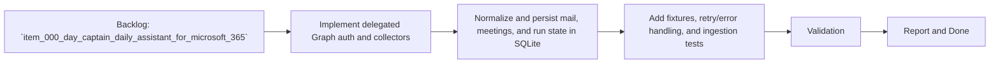

## task_001_day_captain_graph_ingestion_and_storage - Implement Microsoft Graph ingestion and SQLite persistence
> From version: 0.1.0
> Status: Ready
> Understanding: 95%
> Confidence: 92%
> Progress: 0%
> Complexity: High
> Theme: Productivity
> Reminder: Update status/understanding/confidence/progress and dependencies/references when you edit this doc.

# Context
- Derived from backlog item `item_000_day_captain_daily_assistant_for_microsoft_365`.
- Source file: `logics/backlog/item_000_day_captain_daily_assistant_for_microsoft_365.md`.
- Related request(s): `req_000_day_captain_daily_assistant_for_microsoft_365`.
- Supporting spec: `spec_000_day_captain_v1_digest_contract`.
- Depends on: `task_000_day_captain_daily_assistant_for_microsoft_365`.
- Delivery target: implement delegated Graph collection and idempotent `SQLite` persistence for normalized mail, meetings, digest runs, and feedback primitives.

# Plan
- [ ] 1. Implement delegated Graph auth/config plus mail and calendar collectors for the frozen V1 time window.
- [ ] 2. Normalize Graph payloads and persist messages, meetings, digest runs, digest items, and preference/feedback primitives in `SQLite` with idempotent writes.
- [ ] 3. Add fixtures, pagination/error handling, and tests for normalization, deduplication, repeated runs, and stored run metadata.
- [ ] FINAL: Update related Logics docs

# AC Traceability
- AC1 -> This task implements the selected Graph auth mode. Proof: Plan step 1 adds delegated auth/config handling.
- AC2 -> This task implements morning collection and persisted run state. Proof: Plan steps 1 and 2 collect the fixed window and write normalized records to `SQLite`.
- AC6 -> This task establishes the system of record. Proof: Plan step 2 persists source entities, run metadata, and feedback primitives.
- AC7 -> This task respects the agreed architecture boundary. Proof: Plan step 1 keeps Graph access in Python and leaves orchestration external.

# Links
- Backlog item: `item_000_day_captain_daily_assistant_for_microsoft_365`
- Request(s): `req_000_day_captain_daily_assistant_for_microsoft_365`
- Spec: `spec_000_day_captain_v1_digest_contract`

# Validation
- python3 -m pytest tests/test_graph_client.py tests/test_storage.py tests/test_morning_run.py
- python3 logics/skills/logics-doc-linter/scripts/logics_lint.py --require-status
- python3 logics/skills/logics-flow-manager/scripts/workflow_audit.py --group-by-doc

# Definition of Done (DoD)
- [ ] Scope implemented and acceptance criteria covered.
- [ ] Validation commands executed and results captured.
- [ ] Linked request/backlog/task docs updated.
- [ ] Status is `Done` and progress is `100%`.

# Report
