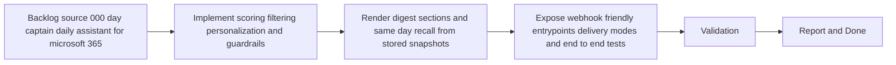

## task_002_day_captain_digest_scoring_recall_and_delivery - Implement scoring, digest rendering, recall, and webhook/Graph-send delivery
> From version: 0.1.0
> Status: In Progress
> Understanding: 100%
> Confidence: 98%
> Progress: 99%
> Complexity: High
> Theme: Productivity
> Reminder: Update status/understanding/confidence/progress and dependencies/references when you edit this doc.

# Context
- Derived from backlog item `item_000_day_captain_daily_assistant_for_microsoft_365`.
- Source file: `logics/backlog/item_000_day_captain_daily_assistant_for_microsoft_365.md`.
- Related request(s): `req_000_day_captain_daily_assistant_for_microsoft_365`.
- Supporting spec: `spec_000_day_captain_v1_digest_contract`.
- Depends on: `task_000_day_captain_daily_assistant_for_microsoft_365`, `task_001_day_captain_graph_ingestion_and_storage`.
- Delivery target: implement deterministic prioritization, digest rendering, same-day recall, feedback capture, and a delivery surface that a hosted webhook or CLI trigger can invoke without owning business logic.

# Plan
- [x] 1. Implement deterministic scoring, anti-noise filters, explicit sender/topic preference weights, and critical-topic guardrails.
- [x] 2. Render the morning digest and same-day recall outputs from persisted snapshots, and record useful/not-useful feedback without replaying full message history.
- [x] 3. Expose `json` and optional Graph-send delivery modes through CLI/webhook-friendly entrypoints, then validate the end-to-end path for a hosted service trigger.
- [x] FINAL: Update related Logics docs

# AC Traceability
- AC3 -> This task implements the digest contract. Proof: Plan step 2 renders the four required digest sections.
- AC4 -> This task implements inspectable filtering. Proof: Plan step 1 adds anti-noise rules and scored reason codes.
- AC5 -> This task implements personalization with guardrails. Proof: Plan step 1 combines explicit preference weights with non-bypassable critical-topic checks.
- AC6 -> This task implements same-day recall from persisted state. Proof: Plan step 2 reuses stored snapshots instead of replaying full history.
- AC8 -> This task implements the first delivery path. Proof: Plan step 3 exposes webhook-friendly entrypoints and delivery modes.

# Links
- Backlog item: `item_000_day_captain_daily_assistant_for_microsoft_365`
- Request(s): `req_000_day_captain_daily_assistant_for_microsoft_365`
- Spec: `spec_000_day_captain_v1_digest_contract`

# Validation
- python3 -m unittest tests.test_scoring tests.test_digest_renderer tests.test_recall tests.test_delivery_contract tests.test_feedback
- python3 -m unittest discover -s tests
- PYTHONPATH=src python3 -m day_captain morning-digest --now 2026-03-07T08:00:00+00:00 --force
- python3 logics/skills/logics-doc-linter/scripts/logics_lint.py --require-status
- python3 logics/skills/logics-flow-manager/scripts/workflow_audit.py --group-by-doc

# Definition of Done (DoD)
- [x] Scope implemented and acceptance criteria covered.
- [x] Validation commands executed and results captured.
- [x] Linked request/backlog/task docs updated.
- [ ] Status is `Done` and progress is `100%`.

# Report
- Added deterministic prioritization with anti-noise rules, sender/domain/keyword preference weights, critical-topic guardrails, and meeting proximity scoring in `src/day_captain/services.py`.
- Added structured digest rendering with stable section grouping, delivery subject/body generation, and `graph_send`-compatible payload shaping.
- Added snapshot-based recall reconstruction and feedback-driven preference updates, including persisted sender/domain/keyword weights through the storage adapters.
- Wired the application defaults to use the real scoring, rendering, recall, and feedback processors instead of placeholder stubs.
- Added focused tests in `tests/test_scoring.py`, `tests/test_digest_renderer.py`, `tests/test_recall.py`, `tests/test_delivery_contract.py`, and `tests/test_feedback.py`.
- Added digest refinements after first live Graph runs: DMARC/cold-outreach suppression, thread collapsing, preview cleanup, Inbox-only ingestion alignment, and better action classification for review/feedback emails.
- Workflow note: the implementation slice is complete, but the task remains `In Progress` until the parent backlog/request chain and hosted deployment slice are explicitly closed.
- Validation results:
  - `python3 -m unittest discover -s tests` -> `OK` (`19` tests)
  - `PYTHONPATH=src python3 -m day_captain morning-digest --now 2026-03-07T08:00:00+00:00 --force` -> returned a valid digest payload with delivery subject/body and sectioned output
