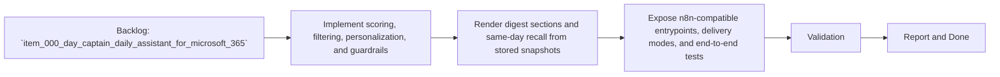

## task_002_day_captain_digest_scoring_recall_and_delivery - Implement scoring, digest rendering, recall, and n8n-compatible delivery
> From version: 0.1.0
> Status: Ready
> Understanding: 95%
> Confidence: 92%
> Progress: 0%
> Complexity: High
> Theme: Productivity
> Reminder: Update status/understanding/confidence/progress and dependencies/references when you edit this doc.

# Context
- Derived from backlog item `item_000_day_captain_daily_assistant_for_microsoft_365`.
- Source file: `logics/backlog/item_000_day_captain_daily_assistant_for_microsoft_365.md`.
- Related request(s): `req_000_day_captain_daily_assistant_for_microsoft_365`.
- Supporting spec: `spec_000_day_captain_v1_digest_contract`.
- Depends on: `task_000_day_captain_daily_assistant_for_microsoft_365`, `task_001_day_captain_graph_ingestion_and_storage`.
- Delivery target: implement deterministic prioritization, digest rendering, same-day recall, feedback capture, and a delivery surface that `n8n` can trigger without owning business logic.

# Plan
- [ ] 1. Implement deterministic scoring, anti-noise filters, explicit sender/topic preference weights, and critical-topic guardrails.
- [ ] 2. Render the morning digest and same-day recall outputs from persisted snapshots, and record useful/not-useful feedback without replaying full message history.
- [ ] 3. Expose `json` and optional Graph-send delivery modes through CLI/webhook-friendly entrypoints, then validate the end-to-end path for hosted `n8n`.
- [ ] FINAL: Update related Logics docs

# AC Traceability
- AC3 -> This task implements the digest contract. Proof: Plan step 2 renders the four required digest sections.
- AC4 -> This task implements inspectable filtering. Proof: Plan step 1 adds anti-noise rules and scored reason codes.
- AC5 -> This task implements personalization with guardrails. Proof: Plan step 1 combines explicit preference weights with non-bypassable critical-topic checks.
- AC6 -> This task implements same-day recall from persisted state. Proof: Plan step 2 reuses stored snapshots instead of replaying full history.
- AC8 -> This task implements the first delivery path. Proof: Plan step 3 exposes `n8n`-compatible entrypoints and delivery modes.

# Links
- Backlog item: `item_000_day_captain_daily_assistant_for_microsoft_365`
- Request(s): `req_000_day_captain_daily_assistant_for_microsoft_365`
- Spec: `spec_000_day_captain_v1_digest_contract`

# Validation
- python3 -m pytest tests/test_scoring.py tests/test_digest_renderer.py tests/test_recall.py tests/test_delivery_contract.py
- python3 logics/skills/logics-doc-linter/scripts/logics_lint.py --require-status
- python3 logics/skills/logics-flow-manager/scripts/workflow_audit.py --group-by-doc

# Definition of Done (DoD)
- [ ] Scope implemented and acceptance criteria covered.
- [ ] Validation commands executed and results captured.
- [ ] Linked request/backlog/task docs updated.
- [ ] Status is `Done` and progress is `100%`.

# Report
