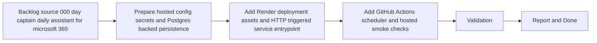

## task_003_day_captain_render_deployment_and_scheduler - Deploy Day Captain on Render with GitHub Actions scheduling
> From version: 0.1.0
> Status: In Progress
> Understanding: 100%
> Confidence: 97%
> Progress: 88%
> Complexity: High
> Theme: Productivity
> Reminder: Update status/understanding/confidence/progress and dependencies/references when you edit this doc.

# Context
- Derived from backlog item `item_000_day_captain_daily_assistant_for_microsoft_365`.
- Source file: `logics/backlog/item_000_day_captain_daily_assistant_for_microsoft_365.md`.
- Related request(s): `req_000_day_captain_daily_assistant_for_microsoft_365`.
- Supporting spec: `spec_000_day_captain_v1_digest_contract`.
- Depends on: `task_000_day_captain_daily_assistant_for_microsoft_365`, `task_001_day_captain_graph_ingestion_and_storage`, `task_002_day_captain_digest_scoring_recall_and_delivery`.
- Delivery target: make the current single-user Day Captain implementation operable as a hosted V1 using Render for runtime, GitHub Actions for the morning trigger, Microsoft Graph for ingestion/send, and Postgres-backed persistence in hosted mode.

# Plan
- [x] 1. Add hosted configuration boundaries for Render deployment, including env-var contracts, secret expectations, and a Postgres-backed persistence path that preserves current run/digest/feedback behavior.
- [x] 2. Add deployment assets and a hosted trigger surface for Render, such as a `render.yaml`, web-service entrypoint, and authenticated webhook/job endpoint for morning digest execution.
- [x] 3. Add a GitHub Actions scheduled workflow that securely triggers the hosted service and records success/failure without exposing mailbox payloads.
- [x] FINAL: Update related Logics docs

# AC Traceability
- AC2 -> This task makes the hosted morning run executable. Proof: Plan steps 1 and 2 wire the existing collection window and storage behavior into a hosted service.
- AC6 -> This task hardens hosted persistence. Proof: Plan step 1 adds a Postgres-backed persistence path compatible with local `SQLite` contracts.
- AC7 -> This task fixes the deployment boundary. Proof: Plan step 2 defines Render-owned runtime concerns while Python keeps business logic.
- AC8 -> This task implements the selected first deployment path. Proof: Plan steps 2 and 3 add Render hosting plus GitHub Actions scheduling.

# Links
- Backlog item: `item_000_day_captain_daily_assistant_for_microsoft_365`
- Request(s): `req_000_day_captain_daily_assistant_for_microsoft_365`
- Spec: `spec_000_day_captain_v1_digest_contract`

# Validation
- python3 -m unittest discover -s tests
- PYTHONPATH=src python3 -m day_captain morning-digest --now 2026-03-07T08:00:00+00:00 --force
- render blueprint validation or equivalent config check
- GitHub Actions workflow lint or dry-run validation
- python3 logics/skills/logics-doc-linter/scripts/logics_lint.py --require-status
- python3 logics/skills/logics-flow-manager/scripts/workflow_audit.py --group-by-doc

# Definition of Done (DoD)
- [ ] Scope implemented and acceptance criteria covered.
- [ ] Validation commands executed and results captured.
- [ ] Linked request/backlog/task docs updated.
- [ ] Status is `Done` and progress is `100%`.

# Report
- Added hosted configuration seams in `src/day_captain/config.py` and `.env.example` for `DAY_CAPTAIN_DATABASE_URL`, HTTP bind settings, and a protected job secret.
- Added `PostgresStorage` in `src/day_captain/adapters/storage.py` and automatic `SQLite` vs Postgres storage selection in `src/day_captain/app.py`.
- Added a minimal hosted HTTP surface in `src/day_captain/web.py` with `/healthz`, a protected `/jobs/morning-digest` endpoint, and a protected `/jobs/recall-digest` endpoint, then exposed it through `day-captain serve`.
- Added `render.yaml` for a Render web service plus managed Postgres and `.github/workflows/morning-digest-scheduler.yml` as an example scheduled GitHub Actions trigger.
- Added reusable hosted trigger tooling (`scripts/trigger_hosted_digest.py` and `day-captain trigger-hosted-job`) so the real production scheduler can live in a private `day-captain-ops` repo without duplicating HTTP trigger logic.
- Added reusable hosted validation tooling (`scripts/validate_hosted_service.py` and `day-captain validate-hosted-service`) so the private ops repo can validate `/healthz`, morning digest, and recall without reimplementing request logic.
- Added cold-start-aware hosted readiness tooling (`scripts/check_hosted_health.py` and `day-captain check-hosted-health`) plus an example scheduler split that warms the hosted service once before per-user trigger fan-out.
- Added coverage in `tests/test_app.py`, `tests/test_settings.py`, and `tests/test_web.py`.
- Validation results:
  - `python3 -m unittest tests.test_settings tests.test_app tests.test_web` -> `OK` (`8` tests)
  - `python3 -m unittest discover -s tests` -> `OK` (`34` tests)
- Remaining work before closure:
  - validate the Render blueprint and hosted service against a real Render environment
  - validate the private ops scheduler path against the hosted endpoint and secrets in a non-local run
