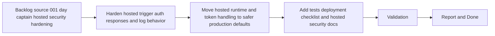

## task_004_day_captain_hosted_security_hardening - Harden the hosted Render deployment and scheduled trigger path
> From version: 0.1.0
> Status: Done
> Understanding: 99%
> Confidence: 97%
> Progress: 100%
> Complexity: High
> Theme: Security
> Reminder: Update status/understanding/confidence/progress and dependencies/references when you edit this doc.

# Context
- Derived from backlog item `item_001_day_captain_hosted_security_hardening`.
- Source file: `logics/backlog/item_001_day_captain_hosted_security_hardening.md`.
- Related request(s): `req_001_day_captain_hosted_security_hardening`.
- Depends on: `task_003_day_captain_render_deployment_and_scheduler`.
- Delivery target: harden the current hosted Render + GitHub Actions path so the scheduled trigger, webhook surface, runtime, and token/secrets handling are safe enough for a serious single-user hosted rollout.

# Plan
- [x] 1. Harden the hosted trigger path by removing digest-body leakage from the scheduler flow, making job protection fail closed in hosted mode, and returning minimal non-sensitive HTTP acknowledgements.
- [x] 2. Move the hosted runtime and token handling to safer defaults, including a production-serving process model and a hosted-safe delegated token persistence strategy distinct from the local file cache.
- [x] 3. Add automated coverage plus a concrete hosted deployment checklist for secrets, TLS/SSL database expectations, and Render/GitHub Actions configuration.
- [x] FINAL: Update related Logics docs

# AC Traceability
- AC1 -> Plan step 1 removes digest leakage from scheduled runs. Proof: the task explicitly hardens scheduler logging and trigger-response behavior.
- AC2 -> Plan step 1 makes trigger protection mandatory in hosted mode. Proof: the task requires fail-closed auth behavior for hosted job endpoints.
- AC3 -> Plan step 1 hardens hosted HTTP responses. Proof: the task explicitly requires minimal non-sensitive acknowledgements and reduced error detail.
- AC4 -> Plan step 2 upgrades the serving model. Proof: the task explicitly replaces the current development-grade runtime with production-serving defaults.
- AC5 -> Plan step 2 separates hosted token persistence from the local file-cache default. Proof: the task explicitly calls for a hosted-safe delegated token persistence strategy.
- AC6 -> Plan step 3 defines secure hosted configuration expectations. Proof: the task explicitly requires TLS/SSL and secret/deployment checklist coverage.
- AC7 -> Plan steps 1 and 2 preserve the current local development path while hardening hosted mode. Proof: the task keeps local development compatibility in scope while changing only hosted defaults.
- AC8 -> Plan step 3 adds automated validation and deployment checklist coverage. Proof: the task explicitly requires tests plus a concrete hosted deployment checklist.

# Links
- Backlog item: `item_001_day_captain_hosted_security_hardening`
- Request(s): `req_001_day_captain_hosted_security_hardening`
- Hosted deployment checklist: `docs/hosted_deployment_checklist.md`

# Validation
- python3 -m unittest discover -s tests
- python3 logics/skills/logics-doc-linter/scripts/logics_lint.py --require-status
- python3 logics/skills/logics-flow-manager/scripts/workflow_audit.py --group-by-doc
- hosted deployment checklist review for Render + GitHub Actions + Postgres TLS (`docs/hosted_deployment_checklist.md`)

# Definition of Done (DoD)
- [x] Scope implemented and acceptance criteria covered.
- [x] Validation commands executed and results captured.
- [x] Linked request/backlog/task docs updated.
- [x] Status is `Done` and progress is `100%`.

# Report
- Scheduler hardening implemented in `.github/workflows/morning-digest-scheduler.yml` by checking only the HTTP status code and suppressing hosted digest bodies from workflow logs.
- Hosted job endpoints now fail closed in non-development environments through `DayCaptainSettings.validate_hosted()` and return only minimal acknowledgement metadata from `src/day_captain/web.py`.
- Hosted runtime defaults now use `gunicorn` in `render.yaml`, while local development keeps the stdlib server path through `python -m day_captain serve`.
- Hosted delegated token persistence now uses database-backed cache storage via `DatabaseTokenCache` in `src/day_captain/adapters/auth.py`, seeded from hosted settings when required.
- Hosted Postgres configuration now resolves explicit TLS/SSL expectations through `DAY_CAPTAIN_DATABASE_SSL_MODE` and `resolved_database_url()` in `src/day_captain/config.py`.
- Deployment hardening guidance is captured in `docs/hosted_deployment_checklist.md`.
