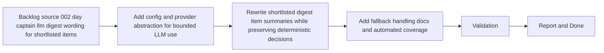

## task_005_day_captain_llm_digest_wording_for_shortlisted_items - Implement provider-configurable LLM wording for shortlisted digest items
> From version: 0.2.0
> Status: Done
> Understanding: 99%
> Confidence: 98%
> Progress: 100%
> Complexity: High
> Theme: AI
> Reminder: Update status/understanding/confidence/progress and dependencies/references when you edit this doc.

# Context
- Derived from backlog item `item_002_day_captain_llm_digest_wording_for_shortlisted_items`.
- Source file: `logics/backlog/item_002_day_captain_llm_digest_wording_for_shortlisted_items.md`.
- Related request(s): `req_002_day_captain_llm_digest_wording_for_shortlisted_items`.
- Depends on: `task_002_day_captain_digest_scoring_recall_and_delivery`, `task_004_day_captain_hosted_security_hardening`.
- Delivery target: add a low-cost LLM wording pass that rewrites only shortlisted digest items, preserves deterministic prioritization decisions, and falls back cleanly when the provider is unavailable.

# Plan
- [x] 1. Add explicit settings and a provider abstraction for the LLM wording path, including provider name, model, API key, timeout, and shortlist/completion limits.
- [x] 2. Implement a first OpenAI-compatible HTTP adapter and wire it into the application so only shortlisted digest items are rewritten before rendering.
- [x] 3. Preserve deterministic fallback behavior when the AI layer is disabled, misconfigured, rate-limited, or returns malformed output.
- [x] 4. Add docs and focused tests for config loading, adapter parsing, and end-to-end fallback behavior.
- [x] FINAL: Update related Logics docs

# AC Traceability
- AC1 -> Plan step 2 constrains the LLM input surface. Proof: task rewrites only shortlisted digest items after scoring.
- AC2 -> Plan step 3 preserves digest completion. Proof: task explicitly requires deterministic fallback on failure.
- AC3 -> Plan step 1 adds explicit settings. Proof: task defines provider/model/key/timeout/limit configuration.
- AC4 -> Plan step 2 preserves ownership of decisions. Proof: task keeps deterministic section/source/guardrail data intact while rewriting wording only.
- AC5 -> Plan steps 1 and 2 keep usage bounded. Proof: task explicitly includes shortlist and completion limits.
- AC6 -> Plan step 3 covers malformed provider output. Proof: task explicitly requires graceful fallback on invalid model responses.
- AC7 -> Plan steps 1 and 2 preserve deployability. Proof: task keeps local and hosted compatibility in scope.
- AC8 -> Plan step 4 adds validation and docs. Proof: task explicitly requires tests and documentation updates.

# Links
- Backlog item: `item_002_day_captain_llm_digest_wording_for_shortlisted_items`
- Request(s): `req_002_day_captain_llm_digest_wording_for_shortlisted_items`

# Validation
- python3 -m unittest tests.test_app tests.test_settings tests.test_llm
- python3 -m unittest discover -s tests
- python3 logics/skills/logics-doc-linter/scripts/logics_lint.py --require-status
- python3 logics/skills/logics-flow-manager/scripts/workflow_audit.py --group-by-doc

# Definition of Done (DoD)
- [x] Scope implemented and acceptance criteria covered.
- [x] Validation commands executed and results captured.
- [x] Linked request/backlog/task docs updated.
- [x] Status is `Done` and progress is `100%`.

# Report
- Added explicit LLM settings in `src/day_captain/config.py` and `.env.example` for provider selection, API key, model, timeout, shortlist size, token cap, and temperature.
- Added `src/day_captain/adapters/llm.py` with an OpenAI-compatible chat-completions HTTP adapter that requests strict JSON rewrites keyed by digest-item identity.
- Added `LlmDigestWordingEngine` in `src/day_captain/services.py` and wired it into `src/day_captain/app.py` so wording runs only after deterministic prioritization and falls back to existing summaries on provider failure or misconfiguration.
- Preserved deterministic ownership of section placement, source identifiers, score, reason codes, and guardrail flags while allowing only the item summary text to change.
- Added coverage in `tests/test_settings.py`, `tests/test_app.py`, and `tests/test_llm.py`, and updated `README.md` with the new AI-layer behavior and configuration surface.
- Validation results:
  - `python3 -m unittest tests.test_app tests.test_settings tests.test_llm` -> `OK` (`14` tests)
  - `python3 -m unittest discover -s tests` -> `OK` (`46` tests)
  - `python3 logics/skills/logics-doc-linter/scripts/logics_lint.py --require-status` -> `Logics lint: OK`
  - `python3 logics/skills/logics-flow-manager/scripts/workflow_audit.py --group-by-doc` -> `Workflow audit: OK`
