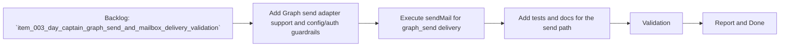

## task_006_day_captain_graph_send_delivery_execution - Implement real Graph sendMail execution for digest delivery
> From version: 0.3.0
> Status: In Progress
> Understanding: 99%
> Confidence: 98%
> Progress: 96%
> Complexity: High
> Theme: Delivery
> Reminder: Update status/understanding/confidence/progress and dependencies/references when you edit this doc.

# Context
- Derived from backlog item `item_003_day_captain_graph_send_and_mailbox_delivery_validation`.
- Source file: `logics/backlog/item_003_day_captain_graph_send_and_mailbox_delivery_validation.md`.
- Related request(s): `req_003_day_captain_graph_send_and_mailbox_delivery_validation`.
- Depends on: `task_001_day_captain_graph_ingestion_and_storage`, `task_002_day_captain_digest_scoring_recall_and_delivery`, `task_005_day_captain_llm_digest_wording_for_shortlisted_items`.
- Delivery target: change `graph_send` from a rendered payload-only mode into a real delegated Graph delivery path with explicit send prerequisites and automated coverage.

# Plan
- [x] 1. Extend the Graph adapter layer with a POST/send capability suitable for delegated `sendMail`.
- [x] 2. Wire `graph_send` delivery mode to execute the real send operation when explicitly enabled and correctly authorized.
- [x] 3. Add clear failure behavior for missing `Mail.Send`, disabled send mode, or provider errors without breaking `json` mode.
- [x] 4. Add focused tests plus README/config updates for the send flow.
- [x] FINAL: Update related Logics docs

# AC Traceability
- AC1 -> Plan step 2 implements real delivery. Proof: task explicitly executes delegated `sendMail`.
- AC2 -> Plan steps 1 and 3 enforce prerequisites. Proof: task explicitly covers send-mode and auth guardrails.
- AC3 -> Plan step 3 preserves existing behavior. Proof: task explicitly protects `json` mode and non-send flows.
- AC4 -> Plan step 4 adds automated coverage. Proof: task explicitly requires tests for the send path.
- AC6 -> Plan steps 1 and 2 preserve deployment fit. Proof: task keeps current local and hosted flows in scope.
- AC7 -> Plan step 4 updates docs. Proof: task explicitly requires README/config updates.

# Links
- Backlog item: `item_003_day_captain_graph_send_and_mailbox_delivery_validation`
- Request(s): `req_003_day_captain_graph_send_and_mailbox_delivery_validation`

# Validation
- python3 -m unittest tests.test_graph_client tests.test_app tests.test_delivery_contract
- python3 -m unittest discover -s tests
- python3 logics/skills/logics-doc-linter/scripts/logics_lint.py --require-status
- python3 logics/skills/logics-flow-manager/scripts/workflow_audit.py --group-by-doc

# Definition of Done (DoD)
- [x] Scope implemented and acceptance criteria covered.
- [x] Validation commands executed and results captured.
- [x] Linked request/backlog/task docs updated.
- [ ] Status is `Done` and progress is `100%`.

# Report
- Added POST support in `src/day_captain/adapters/graph.py` plus `GraphDigestDelivery` to execute delegated `POST /me/sendMail` requests from the existing rendered `graph_message` payload.
- Wired `graph_send` in `src/day_captain/app.py` so real delivery happens only after digest rendering and only when `DAY_CAPTAIN_GRAPH_SEND_ENABLED=true` and `Mail.Send` is present in the configured delegated scope set.
- Preserved existing `json` behavior and added explicit failures for missing send-mode enablement or missing `Mail.Send` scope instead of silently pretending to send.
- Updated `.env.example` and `README.md` so the send path documents `Mail.Send`, explicit send enablement, and the need to rerun delegated login when scopes change.
- Added coverage in `tests/test_graph_client.py`, `tests/test_app.py`, and `tests/test_delivery_contract.py` for send request shaping and guardrail behavior.
- Workflow note: the implementation slice is complete, but the task remains `In Progress` until the parent backlog item can close after `task_007` validates real mailbox receipt.
- Validation results:
  - `python3 -m unittest tests.test_graph_client tests.test_app tests.test_delivery_contract` -> `OK` (`16` tests)
  - `python3 -m unittest discover -s tests` -> `OK` (`49` tests)
