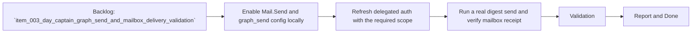

## task_007_day_captain_mailbox_delivery_end_to_end_validation - Validate delegated Outlook delivery end to end in the real mailbox
> From version: 0.3.0
> Status: Done
> Understanding: 99%
> Confidence: 98%
> Progress: 100%
> Complexity: Medium
> Theme: Delivery
> Reminder: Update status/understanding/confidence/progress and dependencies/references when you edit this doc.

# Context
- Derived from backlog item `item_003_day_captain_graph_send_and_mailbox_delivery_validation`.
- Source file: `logics/backlog/item_003_day_captain_graph_send_and_mailbox_delivery_validation.md`.
- Related request(s): `req_003_day_captain_graph_send_and_mailbox_delivery_validation`.
- Depends on: `task_006_day_captain_graph_send_delivery_execution`.
- Delivery target: confirm that the local delegated Graph send flow can produce a real message in the intended Outlook mailbox with the required scope and runtime configuration.

# Plan
- [x] 1. Update local config to enable `graph_send`, explicit send mode, and `Mail.Send` in delegated scopes.
- [x] 2. Re-run delegated auth login so the local token cache contains the required send scope.
- [x] 3. Execute a real local digest send and confirm the message is received in the target mailbox.
- [x] 4. Capture the exact validation outcome, observed constraints, and any follow-up gaps.
- [x] FINAL: Update related Logics docs

# AC Traceability
- AC2 -> Plan steps 1 and 2 validate prerequisites. Proof: task explicitly requires send-mode config and refreshed delegated auth.
- AC5 -> Plan step 3 validates real-world delivery. Proof: task explicitly requires mailbox receipt confirmation.
- AC7 -> Plan steps 1 and 4 update the operational path. Proof: task explicitly captures config/auth/validation reality.
- AC8 -> Plan steps 1 through 4 keep external proof separate from code implementation. Proof: this task is exclusively about end-to-end validation.

# Links
- Backlog item: `item_003_day_captain_graph_send_and_mailbox_delivery_validation`
- Request(s): `req_003_day_captain_graph_send_and_mailbox_delivery_validation`

# Validation
- set -a && source .env && set +a
- PYTHONPATH=src python3 -m day_captain auth login
- PYTHONPATH=src python3 -m day_captain morning-digest --delivery-mode graph_send --force
- mailbox receipt check via Microsoft Graph mailbox readback (`SentItems` and `Inbox`)
- python3 logics/skills/logics-doc-linter/scripts/logics_lint.py --require-status
- python3 logics/skills/logics-flow-manager/scripts/workflow_audit.py --group-by-doc

# Definition of Done (DoD)
- [x] Scope implemented and acceptance criteria covered.
- [x] Validation commands executed and results captured.
- [x] Linked request/backlog/task docs updated.
- [x] Status is `Done` and progress is `100%`.

# Report
- Updated local validation config to `DAY_CAPTAIN_DELIVERY_MODE=graph_send`, `DAY_CAPTAIN_GRAPH_SEND_ENABLED=true`, and delegated scopes including `Mail.Send`.
- Re-ran delegated `auth login` and confirmed the refreshed cache contained `Mail.Send`.
- Executed a real local `morning-digest --delivery-mode graph_send --force` run successfully against Microsoft Graph.
- Verified the delivered message subject `Day Captain digest for 2026-03-07` in both `SentItems` and `Inbox` via Graph mailbox readback, confirming end-to-end receipt in the authenticated mailbox.
- Observed follow-up detail: the first live send attempt failed with `ErrorInvalidRecipients` until the send path defaulted missing recipients to the authenticated mailbox profile; that fix is now implemented in `task_006`.
