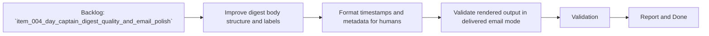

## task_008_day_captain_email_rendering_and_formatting_upgrade - Upgrade delivered digest rendering for Outlook readability
> From version: 0.4.0
> Status: Ready
> Understanding: 98%
> Confidence: 96%
> Progress: 0%
> Complexity: Medium
> Theme: Quality
> Reminder: Update status/understanding/confidence/progress and dependencies/references when you edit this doc.

# Context
- Derived from backlog item `item_004_day_captain_digest_quality_and_email_polish`.
- Source file: `logics/backlog/item_004_day_captain_digest_quality_and_email_polish.md`.
- Related request(s): `req_004_day_captain_digest_quality_and_email_polish`.
- Depends on: `task_006_day_captain_graph_send_delivery_execution`.
- Delivery target: replace the current raw plain-text feel with a clearer delivered digest format that reads well in Outlook and uses human-friendly timestamps.

# Plan
- [ ] 1. Improve the rendered digest structure and section formatting for email readability.
- [ ] 2. Replace raw timestamps/metadata with user-friendly display formatting.
- [ ] 3. Ensure the upgraded render works cleanly for both `json` and `graph_send`.
- [ ] 4. Validate the rendering against real delivered email output.
- [ ] FINAL: Update related Logics docs

# AC Traceability
- AC1 -> Plan step 1 upgrades rendering quality. Proof: task explicitly targets delivered email readability.
- AC2 -> Plan step 2 upgrades presentation. Proof: task explicitly replaces raw timestamps with human-friendly formatting.
- AC5 -> Plan step 4 validates real output. Proof: task explicitly requires mailbox-delivered review.
- AC6 -> Plan step 3 preserves compatibility. Proof: task explicitly keeps `json` and `graph_send` aligned.
- AC8 -> This task is one part of the quality decomposition. Proof: the request explicitly breaks the quality slice into rendering, signal tuning, and wording tuning tasks, including this rendering task.

# Links
- Backlog item: `item_004_day_captain_digest_quality_and_email_polish`
- Request(s): `req_004_day_captain_digest_quality_and_email_polish`

# Validation
- python3 -m unittest tests.test_digest_renderer tests.test_delivery_contract
- python3 -m unittest discover -s tests
- PYTHONPATH=src python3 -m day_captain morning-digest --delivery-mode graph_send --force
- delivered email review in Outlook
- python3 logics/skills/logics-doc-linter/scripts/logics_lint.py --require-status
- python3 logics/skills/logics-flow-manager/scripts/workflow_audit.py --group-by-doc

# Definition of Done (DoD)
- [ ] Scope implemented and acceptance criteria covered.
- [ ] Validation commands executed and results captured.
- [ ] Linked request/backlog/task docs updated.
- [ ] Status is `Done` and progress is `100%`.

# Report
- Pending implementation.
