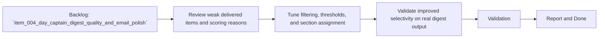

## task_009_day_captain_digest_signal_quality_tuning - Refine digest prioritization and filtering to reduce weak items
> From version: 0.4.0
> Status: In Progress
> Understanding: 99%
> Confidence: 98%
> Progress: 95%
> Complexity: High
> Theme: Quality
> Reminder: Update status/understanding/confidence/progress and dependencies/references when you edit this doc.

# Context
- Derived from backlog item `item_004_day_captain_digest_quality_and_email_polish`.
- Source file: `logics/backlog/item_004_day_captain_digest_quality_and_email_polish.md`.
- Related request(s): `req_004_day_captain_digest_quality_and_email_polish`.
- Depends on: `task_002_day_captain_digest_scoring_recall_and_delivery`, `task_007_day_captain_mailbox_delivery_end_to_end_validation`.
- Delivery target: make the digest more selective by reducing weak watch items and improving the threshold between “worth seeing” and “noise”.

# Plan
- [x] 1. Review the weak delivered items and the scoring/filter reasons that allowed them through.
- [x] 2. Tighten scoring/filtering/section thresholds to reduce low-value watch items without hiding real signal.
- [x] 3. Add tests covering the tuned rules and expected digest output.
- [x] 4. Validate the tuned digest against a real delivered run.
- [x] FINAL: Update related Logics docs

# AC Traceability
- AC3 -> Plan steps 1 and 2 improve signal quality. Proof: task explicitly targets weak watch items and low-value digest noise.
- AC5 -> Plan step 4 validates against delivered output. Proof: task explicitly requires real digest review.
- AC6 -> Plan steps 2 and 3 preserve compatibility. Proof: task improves scoring without changing delivery-mode compatibility.
- AC7 -> Plan step 2 preserves bounded architecture. Proof: task tunes deterministic rules rather than expanding model scope.

# Links
- Backlog item: `item_004_day_captain_digest_quality_and_email_polish`
- Request(s): `req_004_day_captain_digest_quality_and_email_polish`

# Validation
- python3 -m unittest tests.test_scoring tests.test_app tests.test_delivery_contract
- python3 -m unittest discover -s tests
- PYTHONPATH=src python3 -m day_captain morning-digest --delivery-mode graph_send --force
- delivered email review in Outlook
- python3 logics/skills/logics-doc-linter/scripts/logics_lint.py --require-status
- python3 logics/skills/logics-flow-manager/scripts/workflow_audit.py --group-by-doc

# Definition of Done (DoD)
- [x] Scope implemented and acceptance criteria covered.
- [x] Validation commands executed and results captured.
- [x] Linked request/backlog/task docs updated.
- [ ] Status is `Done` and progress is `100%`.

# Report
- Scoring/filtering was tightened to better classify shared deliverables as `actions_to_take`, reduce weak watch items, and reject self-generated Day Captain digests from re-entering the digest.
- Added regression coverage for print/download deliverables and self-digest filtering.
- Validation executed:
  - `python3 -m unittest tests.test_scoring tests.test_app tests.test_delivery_contract`
  - `python3 -m unittest discover -s tests`
  - `PYTHONPATH=src python3 -m day_captain morning-digest --delivery-mode graph_send --force`
- Real delivered output now surfaces only the two meaningful action items seen in the mailbox sample, with the prior self-digest leakage removed.
- Signal tuning and delivered validation are complete. Status remains `In Progress` only because the parent backlog item stays open until the live LLM wording slice is also validated end to end.
