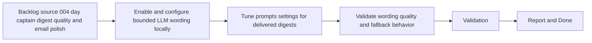

## task_010_day_captain_llm_digest_wording_activation_and_tuning - Activate and tune bounded LLM wording for delivered digests
> From version: 0.4.0
> Status: In Progress
> Understanding: 100%
> Confidence: 96%
> Progress: 80%
> Complexity: High
> Theme: Quality
> Reminder: Update status/understanding/confidence/progress and dependencies/references when you edit this doc.

# Context
- Derived from backlog item `item_004_day_captain_digest_quality_and_email_polish`.
- Source file: `logics/backlog/item_004_day_captain_digest_quality_and_email_polish.md`.
- Related request(s): `req_004_day_captain_digest_quality_and_email_polish`.
- Depends on: `task_005_day_captain_llm_digest_wording_for_shortlisted_items`, `task_007_day_captain_mailbox_delivery_end_to_end_validation`.
- Delivery target: move the LLM wording layer from “implemented in code” to “configured and tuned in real delivered digests” while preserving deterministic fallback and bounded cost.

# Plan
- [x] 1. Configure the bounded LLM wording path for real delivered digest runs.
- [x] 2. Tune the wording behavior so summaries sound more assistant-like while staying factual and concise.
- [x] 3. Validate that fallback behavior remains safe when the LLM path is disabled or fails.
- [ ] 4. Validate the wording quality on a real delivered digest with funded provider quota.
- [x] FINAL: Update related Logics docs

# AC Traceability
- AC3 -> Plan step 1 activates the existing LLM path. Proof: task explicitly configures bounded LLM wording for delivered digests.
- AC4 -> Plan step 2 improves assistant-like wording. Proof: task explicitly tunes summary tone and quality.
- AC5 -> Plan step 4 validates mailbox output. Proof: task explicitly requires a real delivered digest review.
- AC7 -> Plan steps 1 through 3 preserve bounded operation. Proof: task explicitly keeps fallback and bounded-cost behavior in scope.

# Links
- Backlog item: `item_004_day_captain_digest_quality_and_email_polish`
- Request(s): `req_004_day_captain_digest_quality_and_email_polish`

# Validation
- python3 -m unittest tests.test_llm tests.test_app tests.test_settings
- python3 -m unittest discover -s tests
- PYTHONPATH=src python3 -m day_captain morning-digest --delivery-mode graph_send --force
- delivered email review in Outlook
- python3 logics/skills/logics-doc-linter/scripts/logics_lint.py --require-status
- python3 logics/skills/logics-flow-manager/scripts/workflow_audit.py --group-by-doc

# Definition of Done (DoD)
- [ ] Scope implemented and acceptance criteria covered.
- [x] Validation commands executed and results captured.
- [x] Linked request/backlog/task docs updated.
- [ ] Status is `Done` and progress is `100%`.

# Report
- The bounded wording path is now configurable for real digest runs with provider-specific settings, enabled sections, and a style prompt. Fallback behavior remains covered by tests and still returns deterministic wording when disabled or unavailable.
- Validation executed:
  - `python3 -m unittest tests.test_llm tests.test_app tests.test_settings`
  - `python3 -m unittest discover -s tests`
- A provider key is now configured locally and the bounded wording path is active in configuration.
- Validation executed in live mode:
  - `PYTHONPATH=src python3 -m day_captain morning-digest --delivery-mode json --force`
  - `PYTHONPATH=src python3 -m day_captain morning-digest --delivery-mode graph_send --force`
- Current blocker: the OpenAI request returns `429 insufficient_quota`, so the live run falls back safely to deterministic wording instead of producing verifiable LLM rewrites. Final mailbox validation of wording quality remains open until provider quota or billing is enabled.
