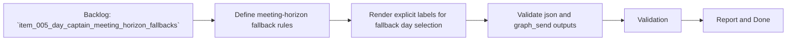

## task_011_day_captain_meeting_horizon_fallbacks - Implement weekend and next-day meeting horizon fallbacks
> From version: 0.5.0
> Status: Ready
> Understanding: 99%
> Confidence: 97%
> Progress: 0%
> Complexity: Medium
> Theme: Productivity
> Reminder: Update status/understanding/confidence/progress and dependencies/references when you edit this doc.

# Context
- Derived from backlog item `item_005_day_captain_meeting_horizon_fallbacks`.
- Source file: `logics/backlog/item_005_day_captain_meeting_horizon_fallbacks.md`.
- Related request(s): `req_005_day_captain_meeting_horizon_fallbacks`.
- Depends on: `task_002_day_captain_digest_scoring_recall_and_delivery`.
- Delivery target: make the `Upcoming meetings` section choose a more useful near-term day when the current digest day would otherwise provide poor calendar context.

# Plan
- [ ] 1. Implement weekend fallback so Saturday and Sunday digests display Monday meetings.
- [ ] 2. Implement next-day fallback when the current digest day contains no meetings.
- [ ] 3. Update rendered output so the section explicitly states when Monday or next-day fallback is being shown.
- [ ] 4. Add focused tests for weekend fallback, empty-day fallback, and unchanged same-day behavior.
- [ ] 5. Validate the updated digest contract for both `json` and `graph_send`.
- [ ] FINAL: Update related Logics docs

# AC Traceability
- AC1 -> Plan step 1 implements weekend behavior. Proof: task explicitly requires Saturday/Sunday fallback to Monday.
- AC2 -> Plan step 3 implements explicit weekend labeling. Proof: task explicitly requires rendered wording for Monday fallback.
- AC3 -> Plan step 2 implements empty-day fallback. Proof: task explicitly requires choosing the next day when same-day meetings are absent.
- AC4 -> Plan step 3 implements explicit next-day labeling. Proof: task explicitly requires rendered wording for fallback day selection.
- AC5 -> Plan step 4 preserves unchanged same-day behavior. Proof: task explicitly requires coverage for the no-op case.
- AC6 -> Plan step 5 preserves delivery compatibility. Proof: task explicitly validates both supported delivery modes.
- AC7 -> Plan step 4 adds automated proof. Proof: task explicitly requires focused tests for each scenario.

# Links
- Backlog item: `item_005_day_captain_meeting_horizon_fallbacks`
- Request(s): `req_005_day_captain_meeting_horizon_fallbacks`

# Validation
- python3 -m unittest tests.test_scoring tests.test_digest_renderer tests.test_delivery_contract
- python3 -m unittest discover -s tests
- PYTHONPATH=src python3 -m day_captain morning-digest --now 2026-03-08T08:00:00+00:00 --force
- python3 logics/skills/logics-doc-linter/scripts/logics_lint.py --require-status
- python3 logics/skills/logics-flow-manager/scripts/workflow_audit.py --group-by-doc

# Definition of Done (DoD)
- [ ] Scope implemented and acceptance criteria covered.
- [ ] Validation commands executed and results captured.
- [ ] Linked request/backlog/task docs updated.
- [ ] Status is `Done` and progress is `100%`.

# Report
- Pending implementation.
