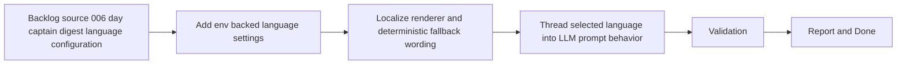

## task_012_day_captain_digest_language_configuration - Implement env-driven digest and LLM language selection
> From version: 0.5.0
> Status: Done
> Understanding: 100%
> Confidence: 98%
> Progress: 100%
> Complexity: Medium
> Theme: Localization
> Reminder: Update status/understanding/confidence/progress and dependencies/references when you edit this doc.

# Context
- Derived from backlog item `item_006_day_captain_digest_language_configuration`.
- Source file: `logics/backlog/item_006_day_captain_digest_language_configuration.md`.
- Related request(s): `req_006_day_captain_digest_language_configuration`.
- Depends on: `task_002_day_captain_digest_scoring_recall_and_delivery`, `task_005_day_captain_llm_digest_wording_for_shortlisted_items`.
- Delivery target: let the product output its own digest in the configured language, with English as the safe default and French as a first alternate option.

# Plan
- [x] 1. Add environment-backed language configuration with English default and documented French support.
- [x] 2. Update digest rendering labels and deterministic wording to honor the configured language.
- [x] 3. Update the LLM wording path so prompts and wording behavior honor the configured language.
- [x] 4. Add focused tests for default English, configured French, and deterministic fallback safety.
- [x] 5. Validate the updated behavior for both `json` and `graph_send`.
- [x] FINAL: Update related Logics docs

# AC Traceability
- AC1 -> Plan step 1 implements env-backed configuration. Proof: task explicitly adds runtime language settings.
- AC2 -> Plan step 4 preserves default English behavior. Proof: task explicitly requires coverage for the default path.
- AC3 -> Plan steps 1 and 4 implement and validate French support. Proof: task explicitly requires documented French configuration and tests.
- AC4 -> Plan step 2 localizes digest labels and fallback wording. Proof: task explicitly requires deterministic output to honor the selected language.
- AC5 -> Plan step 3 localizes the LLM path. Proof: task explicitly requires prompt behavior to honor the selected language.
- AC6 -> Plan step 5 preserves delivery compatibility. Proof: task explicitly validates both supported delivery modes.
- AC7 -> Plan steps 2 through 4 preserve safe deterministic fallback. Proof: task explicitly localizes fallback wording and tests safety when the LLM path is unavailable.
- AC8 -> Plan step 4 adds automated proof. Proof: task explicitly requires focused automated coverage.

# Links
- Backlog item: `item_006_day_captain_digest_language_configuration`
- Request(s): `req_006_day_captain_digest_language_configuration`

# Validation
- python3 -m unittest tests.test_settings tests.test_digest_renderer tests.test_llm tests.test_delivery_contract
- python3 -m unittest discover -s tests
- PYTHONPATH=src python3 -m day_captain morning-digest --delivery-mode json --force
- python3 logics/skills/logics-doc-linter/scripts/logics_lint.py --require-status
- python3 logics/skills/logics-flow-manager/scripts/workflow_audit.py --group-by-doc

# Definition of Done (DoD)
- [x] Scope implemented and acceptance criteria covered.
- [x] Validation commands executed and results captured.
- [x] Linked request/backlog/task docs updated.
- [x] Status is `Done` and progress is `100%`.

# Report
- Added env-backed `digest_language` and `llm_language` settings in `src/day_captain/config.py`, plus new `.env.example` and `README.md` guidance.
- Updated `src/day_captain/services.py` so section labels, header copy, empty states, deterministic summaries, and meeting phrasing honor the selected digest language.
- Updated `src/day_captain/adapters/llm.py` and `src/day_captain/app.py` so the bounded LLM prompt path explicitly writes in the configured language.
- Added focused coverage in `tests/test_settings.py`, `tests/test_llm.py`, `tests/test_digest_renderer.py`, `tests/test_app.py`, and `tests/test_scoring.py`.
- Validation executed:
  - `python3 -m unittest tests.test_settings tests.test_digest_renderer tests.test_llm tests.test_delivery_contract`
  - `python3 -m unittest discover -s tests`
  - `PYTHONPATH=src python3 -m day_captain morning-digest --delivery-mode graph_send --force`
  - `DAY_CAPTAIN_DIGEST_LANGUAGE=fr DAY_CAPTAIN_LLM_LANGUAGE=fr PYTHONPATH=src python3 -m day_captain morning-digest --delivery-mode json --force`
- Validation confirmed default English delivery remains intact and French output can be produced through environment-only configuration.
