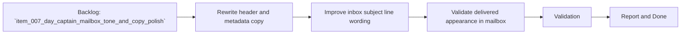

## task_013_day_captain_digest_header_and_subject_polish - Improve digest header copy and inbox subject wording
> From version: 0.5.0
> Status: Ready
> Understanding: 99%
> Confidence: 98%
> Progress: 0%
> Complexity: Medium
> Theme: Quality
> Reminder: Update status/understanding/confidence/progress and dependencies/references when you edit this doc.

# Context
- Derived from backlog item `item_007_day_captain_mailbox_tone_and_copy_polish`.
- Source file: `logics/backlog/item_007_day_captain_mailbox_tone_and_copy_polish.md`.
- Related request(s): `req_007_day_captain_mailbox_tone_and_copy_polish`.
- Depends on: `task_008_day_captain_email_rendering_and_formatting_upgrade`, `task_006_day_captain_graph_send_delivery_execution`.
- Delivery target: make the first impression of the digest feel less like a report export and more like a user-facing morning brief.

# Plan
- [ ] 1. Replace technical header labels and metadata phrasing with more natural assistant-style copy.
- [ ] 2. Improve the email subject line so it reads naturally in the inbox while remaining stable and clear.
- [ ] 3. Ensure the updated subject and header behave consistently in both `json` and `graph_send`.
- [ ] 4. Validate the updated output on a real delivered digest.
- [ ] FINAL: Update related Logics docs

# AC Traceability
- AC1 -> Plan step 1 improves header and metadata tone. Proof: task explicitly rewrites technical phrasing.
- AC2 -> Plan step 2 improves inbox subject wording. Proof: task explicitly upgrades the delivered subject line.
- AC5 -> Plan step 4 validates mailbox quality. Proof: task explicitly requires real delivered review.
- AC6 -> Plan step 3 preserves delivery compatibility. Proof: task explicitly keeps both supported delivery modes aligned.
- AC8 -> This task is one part of the mailbox tone decomposition. Proof: the request explicitly splits the polish slice into header/subject and copy/empty-state tasks, including this one.

# Links
- Backlog item: `item_007_day_captain_mailbox_tone_and_copy_polish`
- Request(s): `req_007_day_captain_mailbox_tone_and_copy_polish`

# Validation
- python3 -m unittest tests.test_digest_renderer tests.test_delivery_contract
- python3 -m unittest discover -s tests
- PYTHONPATH=src python3 -m day_captain morning-digest --delivery-mode graph_send --force
- python3 logics/skills/logics-doc-linter/scripts/logics_lint.py --require-status
- python3 logics/skills/logics-flow-manager/scripts/workflow_audit.py --group-by-doc

# Definition of Done (DoD)
- [ ] Scope implemented and acceptance criteria covered.
- [ ] Validation commands executed and results captured.
- [ ] Linked request/backlog/task docs updated.
- [ ] Status is `Done` and progress is `100%`.

# Report
- Pending implementation.
