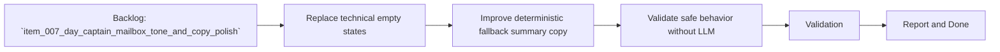

## task_014_day_captain_digest_empty_states_and_fallback_copy_polish - Replace technical empty states and improve deterministic assistant copy
> From version: 0.5.0
> Status: Done
> Understanding: 100%
> Confidence: 98%
> Progress: 100%
> Complexity: Medium
> Theme: Quality
> Reminder: Update status/understanding/confidence/progress and dependencies/references when you edit this doc.

# Context
- Derived from backlog item `item_007_day_captain_mailbox_tone_and_copy_polish`.
- Source file: `logics/backlog/item_007_day_captain_mailbox_tone_and_copy_polish.md`.
- Related request(s): `req_007_day_captain_mailbox_tone_and_copy_polish`.
- Depends on: `task_009_day_captain_digest_signal_quality_tuning`, `task_010_day_captain_llm_digest_wording_activation_and_tuning`.
- Delivery target: make the digest read more like a concise assistant update even when the LLM path is not active, especially in empty sections and fallback summaries.

# Plan
- [x] 1. Replace `None`-style empty states with assistant-like section copy.
- [x] 2. Improve deterministic fallback summaries so they are concise, factual, and more user-facing.
- [x] 3. Preserve safe behavior when the LLM wording path is disabled or unavailable.
- [x] 4. Validate the updated wording on local payloads and a real delivered digest.
- [x] FINAL: Update related Logics docs

# AC Traceability
- AC3 -> Plan step 1 replaces technical empty states. Proof: task explicitly removes `None`-style output.
- AC4 -> Plan step 2 improves deterministic assistant copy. Proof: task explicitly rewrites fallback summaries.
- AC5 -> Plan step 4 validates real digest quality. Proof: task explicitly includes real delivered validation.
- AC6 -> Plan step 4 preserves delivery compatibility. Proof: task explicitly validates both local payloads and delivered output.
- AC7 -> Plan step 3 preserves deterministic safety. Proof: task explicitly keeps behavior coherent without LLM availability.
- AC8 -> This task is one part of the mailbox tone decomposition. Proof: the request explicitly splits the polish slice into header/subject and copy/empty-state tasks, including this one.

# Links
- Backlog item: `item_007_day_captain_mailbox_tone_and_copy_polish`
- Request(s): `req_007_day_captain_mailbox_tone_and_copy_polish`

# Validation
- python3 -m unittest tests.test_digest_renderer tests.test_llm tests.test_delivery_contract
- python3 -m unittest discover -s tests
- PYTHONPATH=src python3 -m day_captain morning-digest --delivery-mode graph_send --force
- python3 logics/skills/logics-doc-linter/scripts/logics_lint.py --require-status
- python3 logics/skills/logics-flow-manager/scripts/workflow_audit.py --group-by-doc

# Definition of Done (DoD)
- [x] Scope implemented and acceptance criteria covered.
- [x] Validation commands executed and results captured.
- [x] Linked request/backlog/task docs updated.
- [x] Status is `Done` and progress is `100%`.

# Report
- Replaced `None`-style empty states with assistant-style copy in `src/day_captain/services.py`.
- Improved deterministic fallback summaries so shared files and download links are rewritten into concise assistant-friendly wording even with the LLM path disabled.
- Preserved safe fallback behavior and extended coverage in `tests/test_scoring.py`, `tests/test_digest_renderer.py`, and `tests/test_llm.py`.
- Validation executed:
  - `python3 -m unittest tests.test_digest_renderer tests.test_llm tests.test_delivery_contract`
  - `python3 -m unittest discover -s tests`
  - `PYTHONPATH=src python3 -m day_captain morning-digest --delivery-mode graph_send --force`
- Real delivered validation confirmed cleaner empty states and more polished deterministic summaries in the mailbox output.
