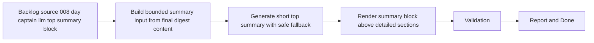

## task_015_day_captain_llm_top_summary_block - Implement bounded top-of-digest LLM synthesis with safe fallback
> From version: 0.6.0
> Status: Done
> Understanding: 100%
> Confidence: 98%
> Progress: 100%
> Complexity: Medium
> Theme: Quality
> Reminder: Update status/understanding/confidence/progress and dependencies/references when you edit this doc.

# Context
- Derived from backlog item `item_008_day_captain_llm_top_summary_block`.
- Source file: `logics/backlog/item_008_day_captain_llm_top_summary_block.md`.
- Related request(s): `req_008_day_captain_llm_top_summary_block`.
- Depends on: `task_010_day_captain_llm_digest_wording_activation_and_tuning`, `task_013_day_captain_digest_header_and_subject_polish`, `task_014_day_captain_digest_empty_states_and_fallback_copy_polish`.
- Delivery target: add a short assistant-style summary block at the top of the digest while keeping the deterministic sections below intact and authoritative.

# Plan
- [x] 1. Build the LLM summary input only from the final digest sections and metadata.
- [x] 2. Add a bounded top summary generation path with strict output limits and safe fallback.
- [x] 3. Render the summary block above the detailed sections for both `json` and `graph_send`.
- [x] 4. Add focused tests for enabled behavior, fallback behavior, and rendered placement.
- [x] 5. Validate the result on local output and a real delivered digest.
- [x] FINAL: Update related Logics docs

# AC Traceability
- AC1 -> Plan step 3 adds the rendered top block. Proof: task explicitly renders the overview above the detailed sections.
- AC2 -> Plan step 1 bounds the input. Proof: task explicitly derives the summary prompt from final digest content only.
- AC3 -> Plan step 2 bounds the output. Proof: task explicitly requires strict output limits.
- AC4 -> Plan step 3 preserves the sections. Proof: task explicitly renders the summary above unchanged detailed sections.
- AC5 -> Plan step 2 preserves safe fallback. Proof: task explicitly requires deterministic-safe behavior on failure or disablement.
- AC6 -> Plan step 3 preserves delivery compatibility. Proof: task explicitly supports both `json` and `graph_send`.
- AC7 -> Plan step 2 preserves bounded operation. Proof: task explicitly limits prompt scope and output size.
- AC8 -> Plan steps 4 and 5 add automated and delivered validation. Proof: task explicitly requires tests and real validation.

# Links
- Backlog item: `item_008_day_captain_llm_top_summary_block`
- Request(s): `req_008_day_captain_llm_top_summary_block`

# Validation
- python3 -m unittest tests.test_llm tests.test_digest_renderer tests.test_app tests.test_delivery_contract
- python3 -m unittest discover -s tests
- PYTHONPATH=src python3 -m day_captain morning-digest --delivery-mode json --force
- PYTHONPATH=src python3 -m day_captain morning-digest --delivery-mode graph_send --force
- python3 logics/skills/logics-doc-linter/scripts/logics_lint.py --require-status
- python3 logics/skills/logics-flow-manager/scripts/workflow_audit.py --group-by-doc

# Definition of Done (DoD)
- [x] Scope implemented and acceptance criteria covered.
- [x] Validation commands executed and results captured.
- [x] Linked request/backlog/task docs updated.
- [x] Status is `Done` and progress is `100%`.

# Report
- Implemented a top-of-digest summary block that is generated from the final structured digest content only, rendered in both plain text and HTML, and stored in the payload for recall and persistence.
- Added bounded LLM summary generation on top of the existing provider, plus deterministic fallback when the provider is disabled or fails.
- Validation executed:
  - `python3 -m unittest tests.test_llm tests.test_digest_renderer tests.test_app tests.test_delivery_contract`
  - `python3 -m unittest discover -s tests`
  - `PYTHONPATH=src python3 -m day_captain morning-digest --delivery-mode json --force`
  - `PYTHONPATH=src python3 -m day_captain morning-digest --delivery-mode graph_send --force`
- Real delivered validation confirmed the summary block renders at the top of the mail. The live provider currently falls back to the deterministic overview because the configured OpenAI account returns `429 insufficient_quota`, but enabled-path behavior is covered by automated tests.
