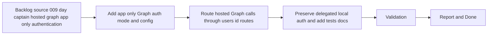

## task_016_day_captain_hosted_graph_app_only_authentication_implementation - Implement hosted Graph app-only auth and explicit mailbox routes
> From version: 0.7.0
> Status: Done
> Understanding: 100%
> Confidence: 98%
> Progress: 100%
> Complexity: High
> Theme: Delivery
> Reminder: Update status/understanding/confidence/progress and dependencies/references when you edit this doc.

# Context
- Derived from backlog item `item_009_day_captain_hosted_graph_app_only_authentication`.
- Source file: `logics/backlog/item_009_day_captain_hosted_graph_app_only_authentication.md`.
- Related request(s): `req_009_day_captain_hosted_graph_app_only_authentication`.
- Depends on: `task_003_day_captain_render_deployment_and_scheduler`, `task_006_day_captain_graph_send_delivery_execution`.
- Delivery target: make the hosted service authenticate to Microsoft Graph through app-only client credentials and target an explicit mailbox identity for reads and sends.

# Plan
- [x] 1. Add a hosted Graph app-only authentication mode using client credentials.
- [x] 2. Add explicit mailbox targeting for hosted mail, calendar, and send operations through `/users/{id}` routes.
- [x] 3. Preserve delegated local auth behavior and select the correct auth mode from config.
- [x] 4. Add focused tests and docs for hosted app-only auth, route selection, and config requirements.
- [x] FINAL: Update related Logics docs

# AC Traceability
- AC1 -> Plan step 1 replaces hosted delegated refresh handling. Proof: task explicitly adds client-credentials auth.
- AC2 -> Plan step 2 adds explicit mailbox targeting. Proof: task explicitly uses `/users/{id}` routes.
- AC3 -> Plan step 3 preserves local delegated auth. Proof: task explicitly keeps local behavior intact.
- AC4 -> Plan step 4 documents hosted setup. Proof: task explicitly updates env-var and permission docs.
- AC5 -> Plan step 4 adds automated coverage. Proof: task explicitly requires auth-mode and route-selection tests.
- AC7 -> Plan steps 1 through 3 preserve the current digest contract. Proof: task changes hosted auth plumbing without redefining digest behavior.

# Links
- Backlog item: `item_009_day_captain_hosted_graph_app_only_authentication`
- Request(s): `req_009_day_captain_hosted_graph_app_only_authentication`

# Validation
- python3 -m unittest tests.test_auth tests.test_graph_client tests.test_app tests.test_delivery_contract
- python3 -m unittest discover -s tests
- python3 logics/skills/logics-doc-linter/scripts/logics_lint.py --require-status
- python3 logics/skills/logics-flow-manager/scripts/workflow_audit.py --group-by-doc

# Definition of Done (DoD)
- [x] Scope implemented and acceptance criteria covered.
- [x] Validation commands executed and results captured.
- [x] Linked request/backlog/task docs updated.
- [x] Status is `Done` and progress is `100%`.

# Report
- Added hosted client-credentials authentication through `ClientCredentialsAuthenticator`, plus `GraphAppOnlyAuthProvider` so hosted runs can authenticate without delegated refresh-token handling.
- Routed hosted mailbox reads, calendar reads, and `sendMail` through explicit `/users/{id}` roots while preserving delegated `/me` behavior for local auth and local CLI workflows.
- Updated config and operator docs so hosted app-only setup is explicit in `.env.example`, `README.md`, and the hosted deployment checklist.
- Implementation is complete and the deployed Render validation task `task_017_day_captain_hosted_graph_app_only_authentication_validation` has now succeeded, so this slice is fully closed.
- Validation executed:
  - `python3 -m unittest tests.test_auth tests.test_graph_client tests.test_app tests.test_delivery_contract`
  - `python3 -m unittest discover -s tests`
  - `python3 logics/skills/logics-doc-linter/scripts/logics_lint.py --require-status`
  - `python3 logics/skills/logics-flow-manager/scripts/workflow_audit.py --group-by-doc`
