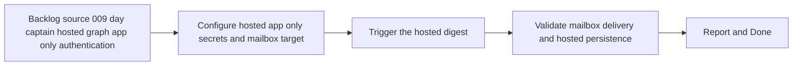

## task_017_day_captain_hosted_graph_app_only_authentication_validation - Validate Render-hosted Graph app-only digest execution end to end
> From version: 0.7.0
> Status: Done
> Understanding: 100%
> Confidence: 99%
> Progress: 100%
> Complexity: Medium
> Theme: Delivery
> Reminder: Update status/understanding/confidence/progress and dependencies/references when you edit this doc.

# Context
- Derived from backlog item `item_009_day_captain_hosted_graph_app_only_authentication`.
- Source file: `logics/backlog/item_009_day_captain_hosted_graph_app_only_authentication.md`.
- Related request(s): `req_009_day_captain_hosted_graph_app_only_authentication`.
- Depends on: `task_016_day_captain_hosted_graph_app_only_authentication_implementation`.
- Delivery target: prove that the hosted Render service can execute the real morning digest flow with app-only Graph auth and no delegated refresh token dependency.

# Plan
- [x] 1. Configure Render with hosted app-only Graph credentials and explicit mailbox target settings.
- [x] 2. Trigger the hosted morning digest and verify the HTTP job path succeeds.
- [x] 3. Validate mail delivery or payload outcome, hosted persistence, and safe failure behavior.
- [x] FINAL: Update related Logics docs

# AC Traceability
- AC4 -> Plan step 1 validates hosted setup clarity. Proof: task explicitly configures the documented hosted app-only vars.
- AC6 -> Plan steps 2 and 3 prove deployed execution. Proof: task explicitly validates the Render-hosted digest path end to end.
- AC8 -> This task is the deployed-validation half of the slice. Proof: the chain explicitly separates implementation from hosted proof.

# Links
- Backlog item: `item_009_day_captain_hosted_graph_app_only_authentication`
- Request(s): `req_009_day_captain_hosted_graph_app_only_authentication`

# Validation
- Render deploy succeeds with hosted app-only settings
- `GET /healthz`
- `POST /jobs/morning-digest`
- real mailbox or delivery-mode validation, depending on deployed configuration
- hosted Postgres validation in schema `day_captain`
- python3 logics/skills/logics-doc-linter/scripts/logics_lint.py --require-status
- python3 logics/skills/logics-flow-manager/scripts/workflow_audit.py --group-by-doc

# Definition of Done (DoD)
- [x] Scope implemented and acceptance criteria covered.
- [x] Validation commands executed and results captured.
- [x] Linked request/backlog/task docs updated.
- [x] Status is `Done` and progress is `100%`.

# Report
- Added hosted-validation support in the repo before Render proof: a `day-captain validate-config` preflight command, explicit hosted target-user checks at the HTTP boundary, scheduler support for explicit `target_user_id` fan-out, and a reusable `day-captain validate-hosted-service` path that checks `/healthz`, validates protected runtime config summary, validates job acknowledgement shape, triggers the morning digest, and validates recall coherence.
- Added operator-facing docs plus reusable hosted trigger tooling so Render and private `day-captain-ops` scheduling setup can be validated locally before the deployed proof step.
- Added sleeping-service fallback support around the hosted path: bounded warm-up checks, standalone readiness probing, and an example scheduler split that warms the service once before routine trigger-only fan-out.
- Real Render-hosted proof is now complete on `https://day-captain.onrender.com`: the service booted with app-only Graph auth and Postgres-backed storage, `GET /healthz` returned the protected runtime summary with `graph_auth_mode=app_only` and `storage_backend=postgres`, and `validate-hosted-service` completed successfully for `target.user@company.com`.
- The first live validation failed with `Graph request failed with 403: ErrorAccessDenied`; diagnosis showed the Entra client-credentials token had `roles=null`. After adding Microsoft Graph `Application` permissions (`Calendars.Read`, `Mail.Read`, `Mail.Send`, `User.Read.All`) and granting admin consent, the issued token exposed the expected roles and the hosted digest flow succeeded end to end.
- Validation executed:
  - `PYTHONPATH=src python3 -m day_captain check-hosted-health --wake-service --wake-timeout-seconds 90 --wake-max-attempts 6 --wake-delay-seconds 10 --expect-graph-auth-mode app_only --expect-storage-backend postgres`
  - `PYTHONPATH=src python3 -m day_captain validate-hosted-service --target-user target.user@company.com --timeout-seconds 120 --expect-graph-auth-mode app_only --expect-storage-backend postgres`
  - hosted result: `morning-digest` and `recall-digest` both returned `200`, with coherent `run_id` `be77081a1e4748f794d4e9cb92d9028d`
