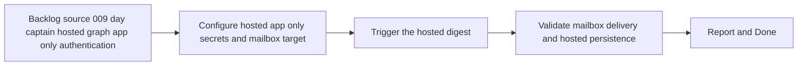

## task_017_day_captain_hosted_graph_app_only_authentication_validation - Validate Render-hosted Graph app-only digest execution end to end
> From version: 0.7.0
> Status: In Progress
> Understanding: 100%
> Confidence: 99%
> Progress: 35%
> Complexity: Medium
> Theme: Delivery
> Reminder: Update status/understanding/confidence/progress and dependencies/references when you edit this doc.

# Context
- Derived from backlog item `item_009_day_captain_hosted_graph_app_only_authentication`.
- Source file: `logics/backlog/item_009_day_captain_hosted_graph_app_only_authentication.md`.
- Related request(s): `req_009_day_captain_hosted_graph_app_only_authentication`.
- Depends on: `task_016_day_captain_hosted_graph_app_only_authentication_implementation`.
- Delivery target: prove that the hosted Render service can execute the real morning digest flow with app-only Graph auth and no delegated refresh token dependency.

# Plan
- [ ] 1. Configure Render with hosted app-only Graph credentials and explicit mailbox target settings.
- [ ] 2. Trigger the hosted morning digest and verify the HTTP job path succeeds.
- [ ] 3. Validate mail delivery or payload outcome, hosted persistence, and safe failure behavior.
- [ ] FINAL: Update related Logics docs

# AC Traceability
- AC4 -> Plan step 1 validates hosted setup clarity. Proof: task explicitly configures the documented hosted app-only vars.
- AC6 -> Plan steps 2 and 3 prove deployed execution. Proof: task explicitly validates the Render-hosted digest path end to end.
- AC8 -> This task is the deployed-validation half of the slice. Proof: the chain explicitly separates implementation from hosted proof.

# Links
- Backlog item: `item_009_day_captain_hosted_graph_app_only_authentication`
- Request(s): `req_009_day_captain_hosted_graph_app_only_authentication`

# Validation
- Render deploy succeeds with hosted app-only settings
- `GET /healthz`
- `POST /jobs/morning-digest`
- real mailbox or delivery-mode validation, depending on deployed configuration
- hosted Postgres validation in schema `day_captain`
- python3 logics/skills/logics-doc-linter/scripts/logics_lint.py --require-status
- python3 logics/skills/logics-flow-manager/scripts/workflow_audit.py --group-by-doc

# Definition of Done (DoD)
- [ ] Scope implemented and acceptance criteria covered.
- [ ] Validation commands executed and results captured.
- [ ] Linked request/backlog/task docs updated.
- [ ] Status is `Done` and progress is `100%`.

# Report
- Added hosted-validation support in the repo before Render proof: a `day-captain validate-config` preflight command, explicit hosted target-user checks at the HTTP boundary, and scheduler support for explicit `target_user_id` fan-out.
- Added operator-facing docs so Render and GitHub Actions setup can be validated locally before the deployed proof step.
- Remaining work is still the real Render-hosted proof: deploy with app-only secrets, trigger `/jobs/morning-digest`, and confirm mailbox/delivery plus hosted Postgres persistence.
