## task_018_day_captain_tenant_scoped_multi_user_foundations_and_execution - Implement tenant-scoped storage, config, and per-user digest execution
> From version: 0.7.0
> Status: Ready
> Understanding: 99%
> Confidence: 97%
> Progress: 0%
> Complexity: High
> Theme: Product
> Reminder: Update status/understanding/confidence/progress and dependencies/references when you edit this doc.

# Context
- Derived from backlog item `item_010_day_captain_tenant_scoped_multi_user_digests`.
- Source file: `logics/backlog/item_010_day_captain_tenant_scoped_multi_user_digests.md`.
- Related request(s): `req_010_day_captain_tenant_scoped_multi_user_digests`.
- Depends on: `task_001_day_captain_graph_ingestion_and_storage`, `task_002_day_captain_digest_scoring_recall_and_delivery`, `task_016_day_captain_hosted_graph_app_only_authentication_implementation`.
- Delivery target: make the application execute and persist digests on a tenant-scoped and user-scoped basis so one deployment can serve several configured users within one tenant safely.

```mermaid
flowchart LR
    Backlog[Backlog: `item_010_day_captain_tenant_scoped_multi_user_digests`] --> Step1[Add stable tenant and user scopes to domain and storage]
    Step1 --> Step2[Add operator-managed tenant configuration and explicit target users]
    Step2 --> Step3[Execute digest and delivery per selected user]
    Step3 --> Step4[Clean up env and config surface]
    Step4 --> Step5[Add isolation tests and migration/docs]
    Step5 --> Validation[Validation]
    Validation --> Report[Report and Done]
```

# Plan
- [ ] 1. Add stable tenant and user/account scopes to persisted data and domain models.
- [ ] 2. Add operator-managed tenant-scoped multi-user configuration and explicit target-user selection plumbing.
- [ ] 3. Execute ingestion, digest generation, recall, and delivery per selected tenant and user scope.
- [ ] 4. Clean up `.env*`, config parsing, and related docs so obsolete single-user settings are removed or deprecated clearly.
- [ ] 5. Add focused tests, migration handling, and docs for isolation behavior.
- [ ] FINAL: Update related Logics docs

# AC Traceability
- AC1 -> Plan step 1 partitions persisted data. Proof: task explicitly adds tenant and user scopes to storage and domain models.
- AC2 -> Plan step 3 isolates runs. Proof: task explicitly executes digest and delivery per selected user inside the selected tenant.
- AC3 -> Plan step 2 supports several configured users. Proof: task explicitly adds operator-managed tenant-scoped multi-user configuration with explicit target-user selection.
- AC4 -> Plan step 3 keeps delivery and recall tenant-aware and user-aware. Proof: task explicitly scopes both flows to the active tenant and user.
- AC5 -> Plan step 5 adds coverage. Proof: task explicitly requires isolation-focused tests.
- AC6 -> Plan step 5 adds docs. Proof: task explicitly updates operational and migration docs.
- AC7 -> Plan steps 2 and 3 preserve compatibility with hosted auth evolution. Proof: task explicitly depends on hosted app-only auth direction rather than a permanent single identity.
- AC9 -> Plan step 4 cleans the config surface. Proof: task explicitly updates `.env*`, config parsing, and related docs for the tenant-scoped model.

# Links
- Backlog item: `item_010_day_captain_tenant_scoped_multi_user_digests`
- Request(s): `req_010_day_captain_tenant_scoped_multi_user_digests`

# Validation
- python3 -m unittest tests.test_storage tests.test_app tests.test_delivery_contract
- python3 -m unittest discover -s tests
- python3 logics/skills/logics-doc-linter/scripts/logics_lint.py --require-status
- python3 logics/skills/logics-flow-manager/scripts/workflow_audit.py --group-by-doc

# Definition of Done (DoD)
- [ ] Scope implemented and acceptance criteria covered.
- [ ] Validation commands executed and results captured.
- [ ] Linked request/backlog/task docs updated.
- [ ] Status is `Done` and progress is `100%`.

# Report
- Pending implementation.
