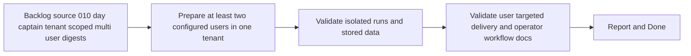

## task_019_day_captain_tenant_scoped_multi_user_validation_and_ops_documentation - Validate tenant-scoped multi-user isolation and document the operator workflow
> From version: 0.7.0
> Status: Done
> Understanding: 100%
> Confidence: 99%
> Progress: 100%
> Complexity: Medium
> Theme: Product
> Reminder: Update status/understanding/confidence/progress and dependencies/references when you edit this doc.

# Context
- Derived from backlog item `item_010_day_captain_tenant_scoped_multi_user_digests`.
- Source file: `logics/backlog/item_010_day_captain_tenant_scoped_multi_user_digests.md`.
- Related request(s): `req_010_day_captain_tenant_scoped_multi_user_digests`.
- Depends on: `task_018_day_captain_tenant_scoped_multi_user_foundations_and_execution`.
- Delivery target: prove that one tenant-scoped deployment can execute isolated digest runs for multiple configured users and document how operators add and validate users.

# Plan
- [x] 1. Prepare a bounded tenant-scoped multi-user validation setup with at least two distinct user scopes.
- [x] 2. Validate that runs, stored data, and outputs remain isolated across users inside one tenant.
- [x] 3. Document the operator workflow for adding target users and running or scheduling per-user digests.
- [x] FINAL: Update related Logics docs

# AC Traceability
- AC2 -> Plan step 2 validates isolated user runs. Proof: task explicitly verifies execution by selected user without cross-user leakage inside one tenant.
- AC3 -> Plan step 3 documents operator-managed setup. Proof: task explicitly explains how several users are configured in one tenant deployment and how recipient users are selected explicitly.
- AC4 -> Plan step 2 validates user-targeted outputs. Proof: task explicitly verifies delivery and recall behavior by tenant and user scope.
- AC6 -> Plan step 3 updates docs. Proof: task explicitly documents the bounded operating model.
- AC8 -> This task is the separated proof step. Proof: request and item explicitly split implementation from validation.
- AC9 -> Plan step 3 validates docs cleanup. Proof: task explicitly documents the target-user model and the operator-facing config surface.

# Links
- Backlog item: `item_010_day_captain_tenant_scoped_multi_user_digests`
- Request(s): `req_010_day_captain_tenant_scoped_multi_user_digests`

# Validation
- python3 -m unittest discover -s tests
- python3 logics/skills/logics-doc-linter/scripts/logics_lint.py --require-status
- python3 logics/skills/logics-flow-manager/scripts/workflow_audit.py --group-by-doc

# Definition of Done (DoD)
- [x] Validation executed and results captured.
- [x] Tenant-scoped multi-user operator workflow documented.
- [x] Linked request/backlog/task docs updated.
- [x] Status is `Done` and progress is `100%`.

# Report
- Added local proof for tenant-scoped multi-user isolation across runs, recall, and feedback so two configured users inside one tenant can execute independently without state leakage.
- Added an operator guide covering explicit target-user onboarding, manual per-user validation, hosted trigger payloads, and scheduling expectations.
- Updated the GitHub Actions hosted scheduler so operators can run one explicit `target_user_id` manually or fan out scheduled calls across `DAY_CAPTAIN_TARGET_USERS_JSON`.
- Validation executed:
  - `python3 -m unittest tests.test_app tests.test_feedback tests.test_storage tests.test_web`
  - `python3 -m unittest discover -s tests`
  - `python3 logics/skills/logics-doc-linter/scripts/logics_lint.py --require-status`
  - `python3 logics/skills/logics-flow-manager/scripts/workflow_audit.py --group-by-doc`
