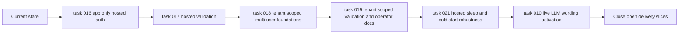

## task_020_day_captain_open_roadmap_orchestration - Orchestrate the remaining hosted, multi-user, and live-quality delivery slices
> From version: 0.8.0
> Status: Done
> Understanding: 100%
> Confidence: 100%
> Progress: 100%
> Complexity: Medium
> Theme: Product
> Reminder: Update status/understanding/confidence/progress and dependencies/references when you edit this doc.

# Context
- Derived from backlog item `item_000_day_captain_daily_assistant_for_microsoft_365`.
- Source file: `logics/backlog/item_000_day_captain_daily_assistant_for_microsoft_365.md`.
- Related request(s): `req_000_day_captain_daily_assistant_for_microsoft_365`.
- Depends on: `task_003_day_captain_render_deployment_and_scheduler`, `task_010_day_captain_llm_digest_wording_activation_and_tuning`, `task_016_day_captain_hosted_graph_app_only_authentication_implementation`, `task_017_day_captain_hosted_graph_app_only_authentication_validation`, `task_018_day_captain_tenant_scoped_multi_user_foundations_and_execution`, `task_019_day_captain_tenant_scoped_multi_user_validation_and_ops_documentation`, `task_021_day_captain_hosted_sleep_and_cold_start_trigger_robustness`.
- Delivery target: give the remaining open work one explicit execution order and one closure path so the repository can move from the current local-first single-mailbox implementation to a tenant-scoped hosted product without leaving half-finished slices drifting independently.

# Plan
- [x] 1. Freeze the execution order and dependency rules for the remaining open slices.
- [x] 2. Drive hosted readiness first: complete app-only Graph auth, then complete hosted validation and cold-start-tolerant trigger behavior.
- [x] 3. Drive tenant-scoped multi-user work next: foundations first, then isolation and operator validation.
- [x] 4. Close the remaining live-quality validation work for bounded LLM wording once the deployment path is stable enough to validate it properly.
- [x] 5. Update the parent request/backlog statuses so the remaining open work has one coherent closure path instead of several disconnected partial tracks.
- [x] FINAL: Update related Logics docs

# AC Traceability
- AC7 -> Plan steps 1 and 2 keep the hosted architecture explicit. Proof: task explicitly sequences hosted auth and hosted validation before later expansion.
- AC8 -> Plan steps 2 through 5 give the first deployment path one closure path. Proof: task explicitly coordinates Render, Graph auth, and validation slices.
- Open-slice coherence -> Plan steps 1 through 5 prevent backlog drift. Proof: task explicitly sequences the remaining `Ready` and `In Progress` work under one orchestration task.

# Links
- Backlog item: `item_000_day_captain_daily_assistant_for_microsoft_365`
- Request(s): `req_000_day_captain_daily_assistant_for_microsoft_365`
- Coordinated task(s): `task_003_day_captain_render_deployment_and_scheduler`, `task_010_day_captain_llm_digest_wording_activation_and_tuning`, `task_016_day_captain_hosted_graph_app_only_authentication_implementation`, `task_017_day_captain_hosted_graph_app_only_authentication_validation`, `task_018_day_captain_tenant_scoped_multi_user_foundations_and_execution`, `task_019_day_captain_tenant_scoped_multi_user_validation_and_ops_documentation`, `task_021_day_captain_hosted_sleep_and_cold_start_trigger_robustness`

# Validation
- python3 logics/skills/logics-doc-linter/scripts/logics_lint.py --require-status
- python3 logics/skills/logics-flow-manager/scripts/workflow_audit.py --group-by-doc

# Definition of Done (DoD)
- [x] Remaining open slices have an explicit documented execution order.
- [x] Dependencies and closure conditions are aligned across linked docs.
- [x] Parent request/backlog/task docs updated.
- [x] Status is `Done` and progress is `100%`.

# Report
- The open-slice order is now materially enforced in the repo: multi-user foundations and operator validation are complete, hosted Render proof for app-only auth is complete, and private-ops scheduler proof with cold-start-tolerant wake-up behavior is now also complete.
- Scheduler, operator docs, target-user validation, private-ops bootstrap tooling, and hosted validation helpers now align with that order, so the remaining closure path is narrower and explicit.
- Live validation on Sunday, March 8, 2026 resolved the last closure blocker: the provider now returns successful live wording output, and both `json` and `graph_send` validation runs can produce `top_summary_source=llm`.
- The last remaining work in this orchestration slice is now purely workflow closure: mark the completed quality task chain as done and let the parent backlog/request chain close cleanly.
