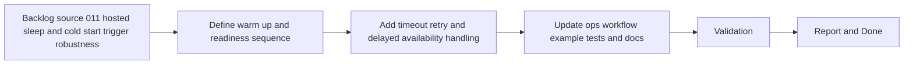

## task_021_day_captain_hosted_sleep_and_cold_start_trigger_robustness - Harden hosted trigger flow for sleeping or cold-starting services
> From version: 0.8.0
> Status: In Progress
> Understanding: 99%
> Confidence: 98%
> Progress: 92%
> Complexity: Medium
> Theme: Reliability
> Reminder: Update status/understanding/confidence/progress and dependencies/references when you edit this doc.

# Context
- Derived from backlog item `item_011_day_captain_hosted_sleep_and_cold_start_trigger_robustness`.
- Source file: `logics/backlog/item_011_day_captain_hosted_sleep_and_cold_start_trigger_robustness.md`.
- Related request(s): `req_011_day_captain_hosted_sleep_and_cold_start_trigger_robustness`.
- Depends on: `task_003_day_captain_render_deployment_and_scheduler`, `task_017_day_captain_hosted_graph_app_only_authentication_validation`.
- Delivery target: make the private ops trigger path materially more tolerant of sleeping or cold-starting hosted services without exposing digest content or creating ambiguous operator behavior.

# Plan
- [ ] 1. Add a wake-up-aware hosted validation and trigger sequence that can probe or warm the sleeping service before the real job call.
- [ ] 2. Add configurable timeout and bounded retry behavior for cold-start scenarios, while keeping logs and responses minimal.
- [ ] 3. Update tests and operator docs, including the example scheduler posture and private ops guidance.
- [ ] FINAL: Update related Logics docs

# AC Traceability
- AC1 -> Plan step 1 adds explicit warm-up behavior. Proof: task explicitly requires a wake-up-aware sequence before the real job trigger.
- AC2 -> Plan step 2 adds bounded timeout/retry handling. Proof: task explicitly requires configurable cold-start tolerance.
- AC3 -> Plan steps 1 and 2 preserve minimal outputs. Proof: task explicitly keeps logs and responses minimal while reducing false failures.
- AC4 -> Plan step 3 adds operator guidance. Proof: task explicitly updates docs for always-on vs sleeping-service operation.
- AC5 -> Plan step 3 adds delayed-availability coverage. Proof: task explicitly requires tests for wake-up and timeout behavior.
- AC6 -> Plan steps 1 through 3 preserve current hosted direction. Proof: task explicitly keeps private ops, app-only auth, and target-user fan-out in scope.
- AC7 -> The slice remains operational. Proof: task explicitly improves trigger resilience without redefining digest logic.

# Links
- Backlog item: `item_011_day_captain_hosted_sleep_and_cold_start_trigger_robustness`
- Request(s): `req_011_day_captain_hosted_sleep_and_cold_start_trigger_robustness`

# Validation
- python3 -m unittest tests.test_hosted_jobs tests.test_cli
- python3 -m unittest discover -s tests
- python3 logics/skills/logics-doc-linter/scripts/logics_lint.py --require-status
- python3 logics/skills/logics-flow-manager/scripts/workflow_audit.py --group-by-doc

# Definition of Done (DoD)
- [ ] Scope implemented and acceptance criteria covered.
- [ ] Validation commands executed and results captured.
- [ ] Linked request/backlog/task docs updated.
- [ ] Status is `Done` and progress is `100%`.

# Report
- Added wake-up-aware hosted trigger support in `src/day_captain/hosted_jobs.py` through bounded `/healthz` probing before the real job trigger or validation path, with configurable wake timeout, attempt count, and retry delay.
- Exposed that control surface through `day-captain trigger-hosted-job`, `day-captain validate-hosted-service`, and a new standalone `day-captain check-hosted-health` readiness command, then updated the example scheduler workflow to warm the service once before multi-user fan-out and use lightweight trigger-only calls for routine scheduled runs.
- Added automated coverage for delayed availability and retry behavior, and updated operator docs so the private `day-captain-ops` repo has one explicit fallback pattern for sleeping services.
- Remaining work is mainly closure and deployed proof: validate the warm-up strategy against the real hosted service behavior and then close the slice if it proves stable enough operationally.
