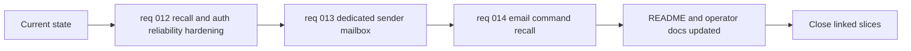

## task_022_day_captain_recall_and_delivery_evolution_orchestration - Orchestrate recall hardening, dedicated sender delivery, and email-command recall
> From version: 0.9.0
> Status: Done
> Understanding: 100%
> Confidence: 98%
> Progress: 99%
> Complexity: High
> Theme: Product
> Reminder: Update status/understanding/confidence/progress and dependencies/references when you edit this doc.

# Context
- Derived from backlog items `item_012_day_captain_recall_and_auth_reliability_hardening`, `item_013_day_captain_dedicated_sender_mailbox_for_digest_delivery`, and `item_014_day_captain_email_command_triggered_recall`.
- Source files:
  - `logics/backlog/item_012_day_captain_recall_and_auth_reliability_hardening.md`
  - `logics/backlog/item_013_day_captain_dedicated_sender_mailbox_for_digest_delivery.md`
  - `logics/backlog/item_014_day_captain_email_command_triggered_recall.md`
- Related request(s): `req_012_day_captain_recall_and_auth_reliability_hardening`, `req_013_day_captain_dedicated_sender_mailbox_for_digest_delivery`, `req_014_day_captain_email_command_triggered_recall`.
- Depends on: `task_016_day_captain_hosted_graph_app_only_authentication_implementation`, `task_017_day_captain_hosted_graph_app_only_authentication_validation`, `task_018_day_captain_tenant_scoped_multi_user_foundations_and_execution`, `task_019_day_captain_tenant_scoped_multi_user_validation_and_ops_documentation`, `task_021_day_captain_hosted_sleep_and_cold_start_trigger_robustness`.
- Delivery target: give the next recall and delivery evolution work one explicit closure path, covering correctness hardening first, then dedicated sender mailbox support, then inbound email-command recall, without leaving README and operator docs behind the implementation.

# Plan
- [x] 1. Fix the recall and auth reliability defects first so explicit run recall, day recall, delegated scope validation, and collection boundaries are trustworthy before adding new recall surfaces.
- [x] 2. Introduce dedicated sender mailbox support so Day Captain can read from a target mailbox while sending from `daycaptain@...`, with explicit recipients and hosted app-only compatibility.
- [x] 3. Add inbound email-command recall on top of that foundation, supporting `recall`, `recall-today`, and `recall-week` with sender validation and duplicate suppression.
- [x] 4. Validate the combined behavior through automated tests and at least one realistic hosted/mailbox proof path.
- [x] 5. Update the README and the relevant operator/setup docs before closing the task; do not mark this task `Done` while implementation details are missing from user-facing docs.
- [x] FINAL: Update related Logics docs, statuses, and closure links across the linked requests/backlog items.

# AC Traceability
- Req012 AC1 -> Plan step 1. Proof: task explicitly fixes explicit run recall correctness before new recall surfaces are added.
- Req012 AC2 -> Plan step 1. Proof: task explicitly sequences day-recall timezone semantics into the first hardening step.
- Req012 AC3 -> Plan step 1. Proof: task explicitly sequences delegated-scope truthfulness into the first hardening step.
- Req012 AC4 -> Plan step 1. Proof: task explicitly sequences collection-boundary hardening into the first hardening step.
- Req012 AC5 -> Plan steps 1 and 4. Proof: task explicitly requires the reliability fixes plus automated validation of the combined behavior.
- Req012 AC6 -> Plan steps 1 and 4. Proof: task explicitly hardens recall on top of the existing tenant-scoped foundations and requires combined validation.
- Req012 AC7 -> Plan step 6. Proof: task explicitly closes the slice as workflow-controlled hardening rather than as a new product line.
- Req013 AC1 -> Plan step 2. Proof: task explicitly introduces reading from a target mailbox while sending from `daycaptain@...`.
- Req013 AC2 -> Plan step 2. Proof: task explicitly introduces dedicated sender mailbox support as a configuration-backed capability.
- Req013 AC3 -> Plan step 2. Proof: task explicitly separates source mailbox reads from sender mailbox `sendMail` routing.
- Req013 AC4 -> Plan step 2. Proof: task explicitly requires explicit recipients when the dedicated sender mailbox is introduced.
- Req013 AC5 -> Plan step 4. Proof: task explicitly requires automated validation of the combined sender/source split behavior.
- Req013 AC6 -> Plan step 5. Proof: task explicitly blocks closure until README and setup or operator docs are updated.
- Req013 AC7 -> Plan step 4. Proof: task explicitly requires at least one realistic hosted or mailbox proof path before closure.
- Req013 AC8 -> Plan steps 2 and 4. Proof: task explicitly keeps dedicated sender support compatible with hosted app-only and tenant-scoped execution, then validates that combined behavior.
- Req014 AC1 -> Plan step 3. Proof: task explicitly adds inbound email-command recall as a non-CLI, non-manual trigger surface.
- Req014 AC2 -> Plan step 3. Proof: task explicitly supports `recall` and `recall-today` as part of the bounded command set.
- Req014 AC3 -> Plan step 3. Proof: task explicitly supports `recall-week` as part of the bounded command set.
- Req014 AC4 -> Plan step 3. Proof: task explicitly places `recall-week` on the dedicated sender and recall foundation, with window logic added in the same step.
- Req014 AC5 -> Plan step 3. Proof: task explicitly requires sender validation before processing inbound commands.
- Req014 AC6 -> Plan steps 3 and 4. Proof: task explicitly adds email-command recall and requires validation of the resulting reply path.
- Req014 AC7 -> Plan step 3. Proof: task explicitly requires duplicate suppression for inbound email commands.
- Req014 AC8 -> Plan step 4. Proof: task explicitly requires automated validation of command parsing, sender validation, and duplicate-safe behavior.
- Req014 AC9 -> Plan step 5. Proof: task explicitly blocks completion until README and relevant operator docs describe the shipped command surface.
- Req014 AC10 -> Plan steps 2 through 4. Proof: task sequences dedicated sender support before inbound recall and validates the combined tenant-scoped hosted behavior.
- Documentation closure -> Plan step 5. Proof: task explicitly blocks completion until README and operator/setup docs are updated.
- Workflow coherence -> Plan step 6. Proof: task explicitly requires linked Logics docs and statuses to be updated before closure.

# Links
- Backlog item(s): `item_012_day_captain_recall_and_auth_reliability_hardening`, `item_013_day_captain_dedicated_sender_mailbox_for_digest_delivery`, `item_014_day_captain_email_command_triggered_recall`
- Request(s): `req_012_day_captain_recall_and_auth_reliability_hardening`, `req_013_day_captain_dedicated_sender_mailbox_for_digest_delivery`, `req_014_day_captain_email_command_triggered_recall`

# Validation
- python3 -m unittest discover -s tests
- python3 logics/skills/logics-doc-linter/scripts/logics_lint.py --require-status
- python3 logics/skills/logics-flow-manager/scripts/workflow_audit.py --group-by-doc

# Definition of Done (DoD)
- [x] Recall reliability fixes are implemented and validated.
- [x] Dedicated sender mailbox support is implemented and validated.
- [x] Email-command recall is implemented and validated.
- [x] README and the relevant setup or operator docs are updated to reflect the shipped behavior before status moves to `Done`.
- [x] Linked request/backlog/task docs updated.
- [x] Status is `Done` and progress is `100%`.

# Report
- Work has started on Sunday, March 8, 2026.
- The first hardening tranche is now implemented and validated:
  - explicit `run_id` recall no longer depends on an implicit default user scope
  - day-based recall now resolves against the configured display timezone instead of raw UTC date matching
  - delegated auth reports the scopes actually available on the active token/cache path, avoiding false `Mail.Send` positives
  - consecutive digest windows now advance past the previous boundary by one microsecond to avoid exact-boundary duplicate ingestion
- The dedicated sender mailbox tranche is also now implemented and validated:
  - Day Captain can keep reading mail and calendar data from the target mailbox while routing `sendMail` through a distinct sender mailbox in hosted app-only mode
  - `graph_message` now carries an explicit recipient when the target user is an email address, preventing fallback delivery to the dedicated sender mailbox
  - runtime guardrails now reject attempts to use a dedicated sender mailbox through delegated auth, which would otherwise be misleading
- The inbound email-command recall tranche is now implemented in a first shippable form:
  - Day Captain can process bounded inbound commands `recall`, `recall-today`, and `recall-week`
  - sender-to-target-user resolution is deterministic and protected by configured target users plus an optional explicit sender allowlist
  - duplicate suppression is now persistent through stored inbound command receipts keyed by inbound message id
  - the first shipped trigger surface is transport-neutral: the repo now exposes CLI and hosted HTTP handling for normalized inbound email-command events, which can be fed later by a Graph webhook, polling job, or external M365 automation
- README, `.env.example`, and hosted config/docs are now aligned with the shipped behavior:
  - `docs/private_ops_repo_bootstrap.md`, `docs/tenant_scoped_multi_user_operator_guide.md`, and `docs/hosted_deployment_checklist.md` now describe the dedicated sender mailbox and inbound email-command validation path for operators
  - the documented hosted env model now includes `DAY_CAPTAIN_GRAPH_SENDER_USER_ID` and `DAY_CAPTAIN_EMAIL_COMMAND_ALLOWED_SENDERS`
  - local CLI usage, hosted trigger usage, HTTP examples, and hosted validation examples now cover the inbound email-command recall path
  - `render.yaml` now exposes the new hosted env variables needed for dedicated sender routing and bounded command senders
- Automated validation executed successfully:
  - `python3 -m unittest tests.test_app tests.test_auth`
  - `python3 -m unittest tests.test_settings tests.test_auth tests.test_graph_client tests.test_app tests.test_digest_renderer`
  - `python3 -m unittest tests.test_app tests.test_settings tests.test_cli tests.test_hosted_jobs tests.test_web`
  - `python3 -m unittest tests.test_cli tests.test_hosted_jobs tests.test_web tests.test_settings`
  - `python3 -m unittest discover -s tests`
  - `python3 logics/skills/logics-doc-linter/scripts/logics_lint.py --require-status`
  - `python3 logics/skills/logics-flow-manager/scripts/workflow_audit.py --group-by-doc`
- Real hosted proof is now complete on Sunday, March 8, 2026 against `https://day-captain.onrender.com`:
  - `GET /healthz` reported `graph_auth_mode=app_only`, `storage_backend=postgres`, `configured_sender_user=daycaptain@company.com`, and `email_command_allowed_senders=[target.user@company.com]`
  - `validate-hosted-service --target-user target.user@company.com --check-email-command --email-command-sender target.user@company.com --email-command-text recall-week` completed successfully
  - hosted `morning-digest` returned run `405852e67cf3420ea4dd5dede615088a`
  - hosted `recall-digest` returned the same run id `405852e67cf3420ea4dd5dede615088a`
  - hosted `email-command-recall` returned run `2d4c9a596e834f7c8dba84ff02340874` with `command_name=recall-week`, `target_user_id=target.user@company.com`, and `delivery_mode=graph_send`
- The linked recall hardening, dedicated sender mailbox, and inbound email-command slices are therefore closed together by this orchestration task.
