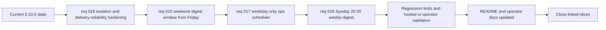

## task_023_day_captain_weekend_window_and_reliability_orchestration - Orchestrate weekend digest horizon, weekday-only ops scheduling, Sunday weekly scheduling, and reliability hardening
> From version: 0.10.0
> Status: Done
> Understanding: 100%
> Confidence: 100%
> Progress: 100%
> Complexity: High
> Theme: Reliability
> Reminder: Update status/understanding/confidence/progress and dependencies/references when you edit this doc.

# Context
- Derived from backlog items `item_015_day_captain_weekend_digest_window_from_friday`, `item_016_day_captain_isolation_and_delivery_reliability_hardening`, `item_017_day_captain_ops_scheduler_weekday_only_delivery`, and `item_018_day_captain_sunday_evening_weekly_digest`.
- Source files:
  - `logics/backlog/item_015_day_captain_weekend_digest_window_from_friday.md`
  - `logics/backlog/item_016_day_captain_isolation_and_delivery_reliability_hardening.md`
  - `logics/backlog/item_017_day_captain_ops_scheduler_weekday_only_delivery.md`
  - `logics/backlog/item_018_day_captain_sunday_evening_weekly_digest.md`
- Related request(s): `req_015_day_captain_weekend_digest_window_from_friday`, `req_016_day_captain_isolation_and_delivery_reliability_hardening`, `req_017_day_captain_ops_scheduler_weekday_only_delivery`, `req_018_day_captain_sunday_evening_weekly_digest`.
- Depends on: `task_022_day_captain_recall_and_delivery_evolution_orchestration`.
- Delivery target: close the newly reviewed reliability gaps first, then align weekend digest fallback behavior with the intended Friday-to-weekend recap, while keeping weekday `morning-digest` auto-send explicitly disabled on weekends, introducing a separate Sunday-evening `weekly digest` schedule, and without leaving README and operator docs behind the implementation.

# Plan
- [x] 1. Fix the isolation and retry-safety defects first so `run_id` actions and partial-failure behavior are trustworthy before expanding weekend digest semantics.
- [x] 2. Implement the weekend first-run digest horizon so Saturday and Sunday fallback windows begin at Friday local midnight while repeated weekend runs stay incremental.
- [x] 3. Freeze and validate the ops scheduler contract so scheduled delivery remains weekday-only even after weekend digest behavior is clarified.
- [x] 4. Add and validate a separate Sunday-evening `weekly digest` scheduler contract at `20:30` without reopening weekend `morning-digest` auto-send.
- [x] 5. Validate the combined behavior through automated regression tests and any needed ops-level scheduler semantics checks.
- [x] 6. Update the README files and the relevant operator/setup docs before closing the task; do not mark this task `Done` while the scheduler semantics and weekend digest horizon remain undocumented in user-facing docs.
- [x] FINAL: Update related Logics docs, statuses, and closure links across the linked requests and backlog items.

# AC Traceability
- Req016 AC1 -> Plan step 1. Proof: task explicitly fixes cross-user `run_id` recall before any product-behavior expansion.
- Req016 AC2 -> Plan step 1. Proof: task explicitly fixes cross-user `run_id` feedback in the same reliability tranche.
- Req016 AC3 -> Plan step 1. Proof: task explicitly hardens send/persist retry safety before closure.
- Req016 AC4 -> Plan step 1. Proof: task explicitly hardens email-command replay behavior under partial persistence failure.
- Req016 AC5 -> Plan steps 5 and 6. Proof: task explicitly validates and documents the chosen scheduler time semantics.
- Req016 AC6 -> Plan step 5. Proof: task explicitly requires regression validation for the reliability fixes.
- Req016 AC7 -> Plan step 6. Proof: task explicitly blocks closure until the README files and docs reflect the chosen production behavior.
- Req015 AC1 -> Plan step 2. Proof: task explicitly changes Saturday first-run fallback to Friday local midnight.
- Req015 AC2 -> Plan step 2. Proof: task explicitly changes Sunday first-run fallback to Friday local midnight.
- Req015 AC3 -> Plan step 2. Proof: task explicitly limits the behavior change to weekend fallback windows.
- Req015 AC4 -> Plan steps 1 and 2. Proof: task sequences continuity safety first, then weekend fallback changes without reopening old windows.
- Req015 AC5 -> Plan step 2. Proof: task explicitly leaves weekend Monday-meeting preview untouched.
- Req015 AC6 -> Plan step 5. Proof: task explicitly requires regression validation for weekend and repeated-run behavior.
- Req015 AC7 -> Plan step 6. Proof: task explicitly blocks completion until weekend horizon behavior is documented in the README files and operator docs.
- Req017 AC1 -> Plan step 3. Proof: task explicitly freezes auto-send to weekdays only in the ops scheduler contract.
- Req017 AC2 -> Plan steps 2 and 3. Proof: task explicitly separates weekend digest content semantics from weekend auto-send policy.
- Req017 AC3 -> Plan step 6. Proof: task explicitly blocks closure until the README files and operator docs describe the weekday-only scheduling policy.
- Req017 AC4 -> Plan steps 3 and 5. Proof: task explicitly requires validation and operator-facing verification of the weekday-only policy.
- Req018 AC1 -> Plan step 4. Proof: task explicitly adds a separate Sunday `20:30` weekly digest scheduler contract.
- Req018 AC2 -> Plan steps 3 and 4. Proof: task explicitly keeps Sunday weekly scheduling distinct from weekend `morning-digest` auto-send.
- Req018 AC3 -> Plan step 6. Proof: task explicitly blocks closure until the README files and docs explain both weekday and Sunday scheduling contracts.
- Req018 AC4 -> Plan steps 4 and 5. Proof: task explicitly requires operator-facing validation of the Sunday weekly scheduler path.
- Documentation closure -> Plan step 6. Proof: task explicitly blocks `Done` until the README files and operator docs are updated.
- Workflow coherence -> Plan step 7. Proof: task explicitly requires linked Logics doc/status closure.

# Links
- Backlog item(s): `item_015_day_captain_weekend_digest_window_from_friday`, `item_016_day_captain_isolation_and_delivery_reliability_hardening`, `item_017_day_captain_ops_scheduler_weekday_only_delivery`, `item_018_day_captain_sunday_evening_weekly_digest`
- Request(s): `req_015_day_captain_weekend_digest_window_from_friday`, `req_016_day_captain_isolation_and_delivery_reliability_hardening`, `req_017_day_captain_ops_scheduler_weekday_only_delivery`, `req_018_day_captain_sunday_evening_weekly_digest`

# Validation
- python3 -m unittest discover -s tests
- python3 logics/skills/logics-doc-linter/scripts/logics_lint.py --require-status
- python3 logics/skills/logics-flow-manager/scripts/workflow_audit.py --group-by-doc

# Definition of Done (DoD)
- [x] Reliability hardening for `run_id` isolation and partial-failure retry safety is implemented and validated.
- [x] Weekend first-run digest fallback starts at Friday local midnight on Saturday and Sunday, while repeated runs remain incremental.
- [x] Ops scheduler remains explicitly weekday-only for automatic sends.
- [x] A separate Sunday `20:30` weekly digest scheduler contract is implemented and validated.
- [x] Scheduler time semantics and weekend digest behavior are documented in the README files and operator docs before status moves to `Done`.
- [x] Linked request/backlog/task docs are updated consistently.
- [x] Status is `Done` and progress is `100%`.

# Report
- Created on Sunday, March 8, 2026 to group the next corrective slice after the latest review plus the newly requested weekend digest behavior.
- The first implementation tranche is now complete and regression-tested:
  - `recall_digest(run_id=...)` no longer falls back to an unscoped cross-user lookup when multiple target users are configured; callers must provide an explicit `target_user_id`
  - `record_feedback(run_id=...)` now uses the same explicit multi-user scoping rule, preventing cross-user preference mutation by omitted target scope
  - digest delivery now persists a `delivery_pending` run before Graph send and only transitions to `completed` afterward, which prevents silent duplicate sends when post-delivery persistence fails
  - `email-command-recall` now persists its inbound command receipt before delivery, and replay against a `delivery_pending` run is blocked for manual reconciliation instead of producing a second reply
  - automated regression coverage now includes explicit multi-user `run_id` guards plus partial-failure retry safety for both `morning-digest` and `email-command-recall`
- Automated validation executed successfully for this tranche:
  - `python3 -m unittest tests.test_app tests.test_storage`
  - `python3 -m unittest tests.test_web tests.test_hosted_jobs tests.test_cli`
  - `python3 -m unittest discover -s tests`
- The weekend and scheduling tranche is now implemented and documented:
  - first weekend `morning-digest` fallback now starts at Friday `00:00` in `DAY_CAPTAIN_DISPLAY_TIMEZONE`, while repeated weekend runs stay incremental
  - a new `weekly-digest` application flow now exists with CLI, hosted HTTP, and hosted trigger support
  - the app repo now includes an example [`weekly-digest-scheduler.yml`](/Users/alexandreagostini/Documents/day-captain/.github/workflows/weekly-digest-scheduler.yml) workflow
  - the ops bootstrap docs now include a dedicated [`day_captain_ops_weekly_digest_scheduler.yml`](/Users/alexandreagostini/Documents/day-captain/docs/day_captain_ops_weekly_digest_scheduler.yml) template
  - the private ops repo now has a separate `.github/workflows/weekly-digest.yml` scheduler, keeping weekday `morning-digest` auto-send distinct from the Sunday-evening weekly recap
  - README and operator docs now describe the split between weekday `morning-digest`, manual weekend access, and Sunday `weekly-digest`
- Remaining closure work:
  - none inside this repo; linked requests and backlog items are now closed
  - optional future operator proof can be recorded separately without reopening this orchestration slice
