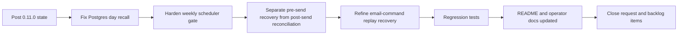

## task_024_day_captain_post_review_reliability_orchestration - Orchestrate post-review recall, scheduler, and recovery hardening
> From version: 0.11.0
> Status: Done
> Understanding: 100%
> Confidence: 100%
> Progress: 100%
> Complexity: High
> Theme: Reliability
> Reminder: Update status/understanding/confidence/progress and dependencies/references when you edit this doc.

# Context
- Derived from backlog items `item_019_day_captain_postgres_day_recall_fix`, `item_020_day_captain_weekly_scheduler_jitter_tolerance`, `item_021_day_captain_pre_send_delivery_state_recovery`, and `item_022_day_captain_email_command_pre_send_recovery`.
- Related request(s): `req_019_day_captain_post_review_reliability_and_scheduler_recovery`.
- Depends on: `task_023_day_captain_weekend_window_and_reliability_orchestration`.
- Delivery target: close the newly reviewed hosted recall, Sunday scheduling, and recovery-model gaps without regressing the protections introduced in `0.11.0`.

# Plan
- [x] 1. Fix the deterministic Postgres day-recall defect first so hosted recall surfaces are trustworthy again.
- [x] 2. Harden the Sunday `weekly-digest` scheduler gate so small GitHub schedule delays do not skip the run entirely.
- [x] 3. Refine digest run-state handling so pre-send failures remain recoverable while post-send uncertainty still blocks duplicate sends.
- [x] 4. Refine `email-command-recall` dedupe/recovery semantics with the same pre-send vs post-send distinction.
- [x] 5. Add regression tests for all four defects and rerun the full suite.
- [x] 6. Update README files and operator docs before closure; do not mark this task `Done` while recovery semantics or scheduler gate behavior remain undocumented.
- [x] FINAL: Update linked Logics docs, statuses, and closure links across the request and backlog items.

# AC Traceability
- Req019 AC1 -> Plan step 1. Proof: task explicitly fixes hosted Postgres day-based recall loading.
- Req019 AC2 -> Plan step 2. Proof: task explicitly hardens Sunday scheduling against GitHub jitter.
- Req019 AC3 -> Plan step 3. Proof: task explicitly separates pre-send recovery from blocking pending states.
- Req019 AC4 -> Plan step 4. Proof: task explicitly applies the same distinction to email-command replay semantics.
- Req019 AC5 -> Plan steps 3 and 4. Proof: task explicitly preserves reconciliation for uncertain post-send outcomes.
- Req019 AC6 -> Plan step 5. Proof: task explicitly requires regression coverage for recall, scheduler, and recovery behavior.
- Req019 AC7 -> Plan step 6. Proof: task explicitly blocks closure until README/operator docs are updated.

# Links
- Backlog item(s): `item_019_day_captain_postgres_day_recall_fix`, `item_020_day_captain_weekly_scheduler_jitter_tolerance`, `item_021_day_captain_pre_send_delivery_state_recovery`, `item_022_day_captain_email_command_pre_send_recovery`
- Request(s): `req_019_day_captain_post_review_reliability_and_scheduler_recovery`

# Validation
- python3 -m unittest discover -s tests
- python3 logics/skills/logics-doc-linter/scripts/logics_lint.py --require-status
- python3 logics/skills/logics-flow-manager/scripts/workflow_audit.py --group-by-doc

# Definition of Done (DoD)
- [x] Postgres day-based recall is fixed and validated.
- [x] Sunday weekly scheduler gating is tolerant to GitHub scheduling jitter.
- [x] Digest pre-send failures remain recoverable without losing post-send reconciliation safety.
- [x] Email-command pre-send failures remain recoverable without duplicating replies.
- [x] README and operator docs are updated before closure.
- [x] Linked request/backlog/task docs are updated consistently.
- [x] Status is `Done` and progress is `100%`.

# Report
- Created on Sunday, March 8, 2026 after a new review of the `0.11.0` state surfaced four remaining reliability defects concentrated around hosted recall, Sunday scheduling, and pre-send recovery semantics.
- This orchestration slice intentionally stays corrective and narrow: it does not reopen the product decisions already made in `task_023`, it only hardens their recovery behavior and the production backend paths.
- First implementation tranche completed:
  - fixed the hosted Postgres `get_latest_completed_run_for_day()` path so day-based recall no longer crashes because of a broken local variable reference
  - introduced a tested scheduler helper for the Sunday weekly gate and updated the `day-captain-ops` weekly workflow to accept delayed runs that still land within the intended Sunday `20:30` local hour
  - refined digest delivery state handling so prerequisite failures and explicit Graph pre-send failures transition to `delivery_failed` instead of leaving a permanently blocking `delivery_pending`
  - refined `email-command-recall` replay semantics so commands tied to a `delivery_failed` run can be retried safely, while `delivery_pending` still blocks duplicates when reconciliation is truly needed
  - added regression coverage for Postgres day recall, weekly scheduler gate tolerance, digest pre-send recovery, uncertain delivery blocking, and email-command pre-send retry
- Validation executed successfully for this tranche:
  - `python3 -m unittest tests.test_app tests.test_storage tests.test_scheduler`
  - `python3 -m unittest discover -s tests`
- Closure tranche completed:
  - updated README and operator docs to describe the Sunday weekly scheduler gate as jitter-tolerant instead of exact-minute
  - documented the final `delivery_failed` vs `delivery_pending` operating model for hosted delivery and inbound email-command replay
  - closed the linked request and backlog items after the code, tests, and docs were aligned
