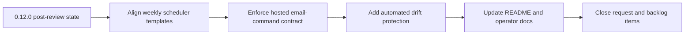

## task_025_day_captain_scheduler_template_and_hosted_contract_orchestration - Orchestrate scheduler template alignment and hosted email-command contract hardening
> From version: 0.12.0
> Status: Done
> Understanding: 100%
> Confidence: 100%
> Progress: 100%
> Complexity: High
> Theme: Reliability
> Reminder: Update status/understanding/confidence/progress and dependencies/references when you edit this doc.

# Context
- Derived from backlog items `item_023_day_captain_weekly_scheduler_template_alignment`, `item_024_day_captain_hosted_email_command_contract_enforcement`, and `item_025_day_captain_scheduler_template_drift_protection`.
- Related request(s): `req_020_day_captain_scheduler_template_and_hosted_email_command_contract_hardening`.
- Depends on: `task_024_day_captain_post_review_reliability_orchestration`.
- Delivery target: close the remaining contract gaps between the hardened production workflow, the shipped weekly scheduler templates, and the hosted `email-command-recall` feature surface.

# Plan
- [x] 1. Align the weekly scheduler templates in the app repo and `docs/` with the supported jitter-tolerant Sunday gate semantics already used in `day-captain-ops`.
- [x] 2. Enforce the hosted `email-command-recall` feature contract so deployments cannot boot "healthy" without the required `graph_send` prerequisites.
- [x] 3. Add automated validation that protects weekly scheduler templates from drifting away from the supported production behavior.
- [x] 4. Update README and operator docs before closure; do not mark this task `Done` while the final scheduler-template and hosted email-command contracts remain undocumented.
- [x] FINAL: Update linked Logics docs, statuses, and closure links across the request and backlog items.

# AC Traceability
- Req020 AC1 -> Plan step 1. Proof: task explicitly aligns both weekly scheduler templates with the supported jitter-tolerant gate.
- Req020 AC2 -> Plan step 2. Proof: task explicitly enforces hosted `email-command-recall` prerequisites.
- Req020 AC3 -> Plan step 3. Proof: task explicitly adds automated validation against template drift.
- Req020 AC4 -> Plan step 4. Proof: task explicitly blocks closure until README and operator docs are updated.

# Links
- Backlog item(s): `item_023_day_captain_weekly_scheduler_template_alignment`, `item_024_day_captain_hosted_email_command_contract_enforcement`, `item_025_day_captain_scheduler_template_drift_protection`
- Request(s): `req_020_day_captain_scheduler_template_and_hosted_email_command_contract_hardening`

# Validation
- python3 -m unittest discover -s tests
- python3 logics/skills/logics-doc-linter/scripts/logics_lint.py --require-status
- python3 logics/skills/logics-flow-manager/scripts/workflow_audit.py --group-by-doc

# Definition of Done (DoD)
- [x] Weekly scheduler templates are aligned with the supported jitter-tolerant gate.
- [x] Hosted `email-command-recall` prerequisites are enforced safely.
- [x] Automated drift protection covers the weekly scheduler templates.
- [x] README and operator docs are updated before closure.
- [x] Linked request/backlog/task docs are updated consistently.
- [x] Status is `Done` and progress is `100%`.

# Report
- Created on Sunday, March 8, 2026 after review findings showed that production and template contracts were no longer aligned for Sunday weekly scheduling and hosted `email-command-recall`.
- This orchestration slice is intentionally narrow: it hardens the contract between supported behavior, copy-ready templates, and hosted validation without reopening the weekly digest or inbound recall product design itself.
- Implementation completed:
  - aligned the repository weekly scheduler template and the copy-ready ops weekly template with the same helper-backed jitter-tolerant Sunday gate used by the supported `day-captain-ops` workflow
  - hardened hosted validation so allowlist-driven `email-command-recall` cannot be treated as enabled without `app_only`, `graph_send`, and exactly one hosted target user
  - added automated template-drift protection through unit tests that assert both shipped weekly templates derive their gate behavior from `day_captain.scheduler.should_run_sunday_weekly_digest`
  - updated README and operator docs to describe the final scheduler-template and hosted inbound-command contracts
- Validation executed successfully:
  - `python3 -m unittest discover -s tests`
  - `python3 -m day_captain morning-digest --now 2026-03-07T08:00:00+00:00 --force`
  - `python3 logics/skills/logics-doc-linter/scripts/logics_lint.py --require-status`
  - `python3 logics/skills/logics-flow-manager/scripts/workflow_audit.py --group-by-doc`
