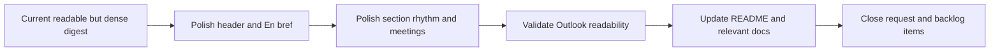

## task_026_day_captain_digest_readability_and_scannability_orchestration - Orchestrate digest readability and scannability polish
> From version: 1.0.0
> Status: Ready
> Understanding: 99%
> Confidence: 98%
> Progress: 0%
> Complexity: Medium
> Theme: UX
> Reminder: Update status/understanding/confidence/progress and dependencies/references when you edit this doc.

# Context
- Derived from backlog items `item_026_day_captain_digest_header_and_executive_summary_polish`, `item_027_day_captain_digest_section_and_meeting_scannability_polish`, and `item_028_day_captain_digest_empty_state_and_outlook_polish_validation`.
- Related request(s): `req_021_day_captain_digest_email_readability_and_scannability_polish`.
- Depends on: `task_025_day_captain_scheduler_template_and_hosted_contract_orchestration`.
- Delivery target: make the digest faster to read in Outlook while preserving the existing product behavior and email-compatible rendering constraints.

# Plan
- [ ] 1. Shorten and simplify the digest header/context and turn `En bref` into a true executive summary block.
- [ ] 2. Improve section rhythm and compact meeting rendering so the digest becomes easier to scan in Outlook.
- [ ] 3. Lighten empty-state presentation and validate the final rendering on a real Outlook mail.
- [ ] 4. Update README and any affected docs before closure; do not mark this task `Done` while the final digest-structure contract remains undocumented.
- [ ] FINAL: Update linked Logics docs, statuses, and closure links across the request and backlog items.

# AC Traceability
- Req021 AC1 -> Plan step 1. Proof: task explicitly shortens and simplifies the digest header/context.
- Req021 AC2 -> Plan step 1. Proof: task explicitly turns `En bref` into a true executive summary block.
- Req021 AC3 -> Plan step 2. Proof: task explicitly improves section rhythm and scan quality.
- Req021 AC4 -> Plan step 2. Proof: task explicitly compacts meeting rendering.
- Req021 AC5 -> Plan step 3. Proof: task explicitly lightens empty-state presentation.
- Req021 AC6 -> Plan step 4. Proof: task explicitly blocks closure until README and impacted docs are updated.

# Links
- Backlog item(s): `item_026_day_captain_digest_header_and_executive_summary_polish`, `item_027_day_captain_digest_section_and_meeting_scannability_polish`, `item_028_day_captain_digest_empty_state_and_outlook_polish_validation`
- Request(s): `req_021_day_captain_digest_email_readability_and_scannability_polish`

# Validation
- python3 -m unittest discover -s tests
- python3 logics/skills/logics-doc-linter/scripts/logics_lint.py --require-status
- python3 logics/skills/logics-flow-manager/scripts/workflow_audit.py --group-by-doc

# Definition of Done (DoD)
- [ ] Header and top summary are materially easier to read.
- [ ] Section rhythm and meeting rendering are more compact and scannable.
- [ ] Empty states are lighter and Outlook rendering is explicitly validated.
- [ ] README and impacted docs are updated before closure.
- [ ] Linked request/backlog/task docs are updated consistently.
- [ ] Status is `Done` and progress is `100%`.

# Report
- Created on Sunday, March 8, 2026 after reviewing the live Outlook rendering of the digest and identifying that the main remaining gap is presentation quality rather than transport or data correctness.
- This slice is intentionally scoped as a readability polish pass, not a redesign of the overall digest product contract.
