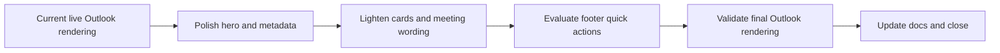

## task_027_day_captain_digest_visual_weight_and_quick_actions_orchestration - Day Captain digest visual weight and quick actions orchestration
> From version: 1.1.0
> Status: In Progress
> Understanding: 98%
> Confidence: 96%
> Progress: 85%
> Complexity: Medium
> Theme: UX
> Reminder: Update status/understanding/confidence/progress and dependencies/references when you edit this doc.

# Context
- Derived from backlog items `item_029_day_captain_digest_hero_background_and_metadata_polish`, `item_030_day_captain_digest_card_weight_and_meeting_wording_polish`, and `item_031_day_captain_digest_quick_actions_and_final_outlook_validation`.
- Related request(s): `req_022_day_captain_digest_visual_weight_and_header_polish`.
- Depends on: `task_026_day_captain_digest_readability_and_scannability_orchestration`.
- Delivery target: keep the digest structure gains from the first readability pass while removing the remaining visual heaviness in Outlook and optionally exposing low-friction footer quick actions.

# Plan
- [x] 1. Lighten the hero/background treatment and give the coverage/perimeter line a more intentional visual treatment.
- [x] 2. Reduce card visual weight and tighten meeting-summary wording without losing scan quality.
- [x] 3. Evaluate and, if acceptable, add footer `mailto:` quick actions for supported recall commands.
- [ ] 4. Validate the final rendering in a real Outlook mailbox and update README/docs if the digest footer or validation contract changes.
- [ ] FINAL: Update related Logics docs

# AC Traceability
- Req022 AC1/AC3 -> Plan step 1. Proof: task explicitly lightens the hero area and restyles the perimeter line.
- Req022 AC2/AC4 -> Plan step 2. Proof: task explicitly lightens cards and improves meeting wording.
- Req022 AC4 supporting option -> Plan step 3. Proof: task explicitly evaluates or implements `mailto:` quick actions without changing the command contract.
- Req022 AC5 -> Plan step 4. Proof: task explicitly requires live Outlook validation and docs updates before closure.

# Links
- Backlog item(s): `item_029_day_captain_digest_hero_background_and_metadata_polish`, `item_030_day_captain_digest_card_weight_and_meeting_wording_polish`, `item_031_day_captain_digest_quick_actions_and_final_outlook_validation`
- Request(s): `req_022_day_captain_digest_visual_weight_and_header_polish`

# Validation
- python3 -m unittest discover -s tests
- python3 logics/skills/logics-doc-linter/scripts/logics_lint.py --require-status
- python3 logics/skills/logics-flow-manager/scripts/workflow_audit.py --group-by-doc

# Definition of Done (DoD)
- [x] Hero/background and metadata treatment are materially lighter in Outlook.
- [x] Section cards are lighter and meeting wording is more natural.
- [x] Footer quick actions are either shipped with `mailto:` links or explicitly rejected with documented reasoning.
- [ ] Final live Outlook validation is completed.
- [ ] Validation commands executed and results captured.
- [ ] Linked request/backlog/task docs updated.
- [ ] Status is `Done` and progress is `100%`.

# Report
- Created on Sunday, March 8, 2026 as a follow-up to the first readability pass after live Outlook review showed that the remaining issue is mostly visual weight rather than summary density.
- Implementation in progress:
  - removed the heavy hero-style background treatment in favor of a lighter top block with a styled perimeter line
  - reduced card visual weight and tightened meeting wording toward natural day references such as tomorrow or Monday
  - refined the perimeter/window copy away from the raw arrow format toward a more intentional localized range line
  - hardened the footer quick-action prototype so the same command is prefilled in both subject and body, plus helper copy clarifying that the links open a draft
- Remaining before closure:
  - validate the final rendering in a real Outlook mailbox
  - then update closure links and promote the request/backlog/task chain to `Done`
