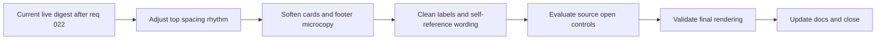

## task_028_day_captain_digest_spacing_and_content_cleanup_orchestration - Day Captain digest spacing and content cleanup orchestration
> From version: 1.2.0
> Status: Done
> Understanding: 100%
> Confidence: 99%
> Progress: 100%
> Complexity: Medium
> Theme: UX
> Reminder: Update status/understanding/confidence/progress and dependencies/references when you edit this doc.

# Context
- Derived from backlog items `item_032_day_captain_digest_top_spacing_and_summary_rhythm_polish`, `item_033_day_captain_digest_card_weight_and_footer_microcopy_polish`, `item_034_day_captain_digest_identity_aware_wording_and_label_cleanup`, and `item_035_day_captain_digest_source_open_controls`.
- Related request(s): `req_023_day_captain_digest_spacing_and_content_cleanup_polish`.
- Depends on: `task_027_day_captain_digest_visual_weight_and_quick_actions_orchestration`.
- Delivery target: ship a final micro-polish pass that improves spacing, softens remaining visual roughness, removes awkward self-reference wording, and evaluates bounded source-opening controls without reopening digest architecture.
- Latest direction: the remaining work is now mainly copy-heuristic cleanup rather than further layout work.

# Plan
- [x] 1. Increase spacing around `Périmètre`, `En bref`, and the first detailed section.
- [x] 2. Slightly soften card border weight and shorten footer helper copy.
- [x] 3. Finish bounded cleanup rules for awkward labels, self-reference wording, `En bref`, and meeting-summary fallbacks.
- [x] 4. Evaluate lightweight source-opening controls for meeting and mail cards where stable links are available.
- [x] 5. Validate the final rendering in Outlook and update README/docs if needed.
- [x] FINAL: Update related Logics docs

# AC Traceability
- Req023 AC1/AC2 -> Plan step 1. Proof: task explicitly improves top spacing around `En bref`.
- Req023 AC3/AC4 -> Plan step 2. Proof: task explicitly softens cards and tightens footer helper copy.
- Req023 AC5/AC6/AC7 -> Plan step 3. Proof: task explicitly adds bounded cleanup, identity-aware wording guards, and better overview/meeting fallback phrasing.
- Req023 AC9 -> Plan step 4. Proof: task explicitly evaluates bounded open-source controls for mail and meeting cards.
- Req023 AC8 -> Plan step 5. Proof: task explicitly requires final validation without regressions.

# Links
- Backlog item(s): `item_032_day_captain_digest_top_spacing_and_summary_rhythm_polish`, `item_033_day_captain_digest_card_weight_and_footer_microcopy_polish`, `item_034_day_captain_digest_identity_aware_wording_and_label_cleanup`, `item_035_day_captain_digest_source_open_controls`
- Request(s): `req_023_day_captain_digest_spacing_and_content_cleanup_polish`

# Validation
- python3 -m unittest discover -s tests
- python3 logics/skills/logics-doc-linter/scripts/logics_lint.py --require-status
- python3 logics/skills/logics-flow-manager/scripts/workflow_audit.py --group-by-doc

# Definition of Done (DoD)
- [x] Top spacing around `En bref` is improved in Outlook.
- [x] Card borders and footer helper copy are visibly lighter.
- [x] Self-reference meeting wording no longer implies the target user meets themselves.
- [x] `En bref` and meeting-summary fallbacks read naturally after the identity-aware cleanup.
- [x] Source-opening controls are either implemented cleanly where links are stable or explicitly documented as limited.
- [x] Final live Outlook validation is completed.
- [x] Validation commands executed and results captured.
- [x] Linked request/backlog/task docs updated.
- [x] Status is `Done` and progress is `100%`.

# Report
- Created on Monday, March 9, 2026 after live Outlook review showed that the remaining gaps are now mainly micro-spacing, content cleanup, and self-reference wording polish rather than structural layout issues.
- Implementation in progress:
  - increased spacing around the top summary transition so `Périmètre`, `En bref`, and the first detailed section breathe more cleanly
  - softened card border treatment slightly and shortened the footer helper copy
  - added bounded cleanup for rough labels and a first identity-aware meeting wording guard so the target user is not framed as meeting with themselves
- Latest live review conclusion:
  - layout is no longer the primary issue
  - the next implementation slice should focus on `En bref`, meeting-summary fallbacks, and section-card summary heuristics
- Current local implementation progress on that slice:
  - tightened the LLM prompts for both item summaries and top summary wording
  - added bounded post-processing to strip repeated title prefixes from rewritten summaries
  - improved self-organized meeting fallback to prefer a real attendee when one is available
  - tightened compaction rules so long rewritten summaries keep their `Suivi` / `Next step` cue instead of truncating away the action
  - compacted the item summaries passed into the overview LLM path so `En bref` sees cleaner, shorter source material
  - added bounded candidate/profile compression and light phrase cleanup for vague top-summary formulations
- Newly added scope:
  - evaluate whether meeting cards can expose existing normalized `join_url` / `webLink` data as lightweight open controls
  - determine whether message cards can expose a stable Outlook open link or must remain read-only for now
- Current local implementation on that scope:
  - `DigestEntry` now carries a bounded `source_url`
  - Graph mail collection now requests `webLink` so message cards can expose an Outlook open control when Graph provides one
  - meeting cards now prefer an Outlook `webLink` and otherwise fall back to the normalized meeting link already present in the ingestion layer
  - renderer output stays intentionally light by using small secondary links instead of adding another heavy action row
- Final validation:
  - `python3 -m unittest discover -s tests`
  - `python3 logics/skills/logics-doc-linter/scripts/logics_lint.py --require-status`
  - `python3 logics/skills/logics-flow-manager/scripts/workflow_audit.py --group-by-doc`
  - live Render deploy `a80e222980d2628f20aa42aece944837101a79da` validated in Outlook on Monday, March 9, 2026
- Outcome:
  - the final micro-polish slice is accepted
  - the digest remains visually lighter
  - wording cleanup is acceptable
  - the new source-opening controls are acceptable for closure
