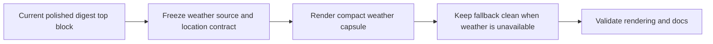

## task_029_day_captain_digest_weather_capsule_orchestration - Orchestrate the digest weather capsule slice
> From version: 1.3.0
> Status: Done
> Understanding: 100%
> Confidence: 99%
> Progress: 100%
> Complexity: Medium
> Theme: UX
> Reminder: Update status/understanding/confidence/progress and dependencies/references when you edit this doc.

# Context
- Derived from backlog items `item_036_day_captain_digest_weather_source_and_location_contract`, `item_037_day_captain_digest_weather_capsule_rendering_and_copy`, and `item_038_day_captain_digest_weather_fallback_and_docs_validation`.
- Related request(s): `req_024_day_captain_digest_daily_weather_capsule`.
- Depends on: `task_028_day_captain_digest_spacing_and_content_cleanup_orchestration`.
- Delivery target: add one compact weather capsule before `En bref` without regressing the digest top block, while keeping the weather dependency optional and closure-safe.

# Plan
- [x] 1. Define the bounded weather source and location contract needed by one digest run.
- [x] 2. Render a compact weather capsule before `En bref` with short copy and a warmer/cooler delta versus yesterday.
- [x] 3. Keep the digest top layout clean when weather data is missing and document any new config/provider contract.
- [x] FINAL: Update linked Logics docs, statuses, and closure links.

# AC Traceability
- Req024 AC1 -> Plan step 2. Proof: task explicitly adds the capsule before `En bref`.
- Req024 AC2 -> Plan step 2. Proof: task explicitly keeps the weather copy brief and assistant-like.
- Req024 AC3 -> Plan step 2. Proof: task explicitly adds the warmer/cooler comparison.
- Req024 AC4 -> Plan step 3. Proof: task explicitly requires a clean no-weather fallback.
- Req024 AC5 -> Plan step 2. Proof: task explicitly preserves the lighter top-block feel.
- Req024 AC6 -> Plan step 3. Proof: task explicitly blocks closure until config/docs are updated.

# Links
- Backlog item(s): `item_036_day_captain_digest_weather_source_and_location_contract`, `item_037_day_captain_digest_weather_capsule_rendering_and_copy`, `item_038_day_captain_digest_weather_fallback_and_docs_validation`
- Request(s): `req_024_day_captain_digest_daily_weather_capsule`

# Validation
- python3 -m unittest discover -s tests
- python3 logics/skills/logics-doc-linter/scripts/logics_lint.py --require-status
- python3 logics/skills/logics-flow-manager/scripts/workflow_audit.py --group-by-doc

# Definition of Done (DoD)
- [x] The weather source/location contract is explicit.
- [x] The digest renders a compact weather capsule before `En bref`.
- [x] The capsule includes a bounded warmer/cooler comparison when weather data is available.
- [x] Missing weather data does not break the top layout.
- [x] Any new config/provider contract is documented.
- [x] Linked request/backlog/task docs are updated consistently.
- [x] Status is `Done` and progress is `100%`.

# Report
- Created on Monday, March 9, 2026 from direct product feedback requesting a weather capsule before `En bref`.
- This slice is intentionally bounded to one small top-of-mail context block with graceful degradation, not a broad weather feature expansion.
- Implemented in the `1.3.0` line with an optional Open-Meteo provider, explicit location config, deterministic rendering before `En bref`, and persisted recall-safe weather snapshots.
- Closed on Monday, March 9, 2026 after full test-suite validation plus a live Render/Outlook weather-mail check.
