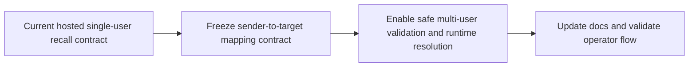

## task_030_day_captain_multi_user_email_command_recall_orchestration - Orchestrate hosted multi-user email-command recall
> From version: 1.3.0
> Status: Ready
> Understanding: 99%
> Confidence: 97%
> Progress: 0%
> Complexity: Medium
> Theme: Operations
> Reminder: Update status/understanding/confidence/progress and dependencies/references when you edit this doc.

# Context
- Derived from backlog items `item_039_day_captain_multi_user_email_command_mapping_contract`, `item_040_day_captain_multi_user_email_command_validation_and_runtime`, and `item_041_day_captain_multi_user_email_command_ops_docs_and_validation`.
- Related request(s): `req_025_day_captain_multi_user_email_command_recall`.
- Depends on: `task_019_day_captain_tenant_scoped_multi_user_validation_and_ops_documentation`, `task_022_day_captain_recall_and_delivery_evolution_orchestration`.
- Delivery target: allow a hosted Day Captain service to support bounded multi-user email-command recall safely, without regressing the current single-user path.

# Plan
- [ ] 1. Define the explicit sender-to-target mapping contract for hosted multi-user email-command recall.
- [ ] 2. Implement safe hosted validation and runtime resolution for the new contract while preserving single-user behavior.
- [ ] 3. Update operator docs and validate the new multi-user recall flow.
- [ ] FINAL: Update linked Logics docs, statuses, and closure links.

# AC Traceability
- Req025 AC1 -> Plan step 2. Proof: task explicitly enables valid hosted multi-user boot/runtime behavior.
- Req025 AC2 -> Plan step 1. Proof: task explicitly defines one sender-to-one-target routing contract.
- Req025 AC3 -> Plan step 2. Proof: task explicitly rejects ambiguous routing rather than guessing.
- Req025 AC4 -> Plan step 2. Proof: task explicitly preserves single-user behavior.
- Req025 AC5 -> Plan step 3. Proof: task explicitly updates docs and validation for operators.

# Links
- Backlog item(s): `item_039_day_captain_multi_user_email_command_mapping_contract`, `item_040_day_captain_multi_user_email_command_validation_and_runtime`, `item_041_day_captain_multi_user_email_command_ops_docs_and_validation`
- Request(s): `req_025_day_captain_multi_user_email_command_recall`

# Validation
- python3 -m unittest discover -s tests
- python3 logics/skills/logics-doc-linter/scripts/logics_lint.py --require-status
- python3 logics/skills/logics-flow-manager/scripts/workflow_audit.py --group-by-doc

# Definition of Done (DoD)
- [ ] The sender-to-target mapping contract is explicit.
- [ ] Hosted validation accepts safe multi-user recall config.
- [ ] Runtime sender resolution targets exactly one user or fails explicitly.
- [ ] Existing single-user hosted recall behavior remains supported.
- [ ] Operator docs explain the new config and its failure modes.
- [ ] Linked request/backlog/task docs are updated consistently.
- [ ] Status is `Done` and progress is `100%`.

# Report
- Created on Monday, March 9, 2026 after a live hosted failure exposed the incompatibility between multi-user target configuration and `DAY_CAPTAIN_EMAIL_COMMAND_ALLOWED_SENDERS`.
- This slice is intentionally bounded to hosted contract/safety and should reuse the existing multi-user delivery model wherever possible.
