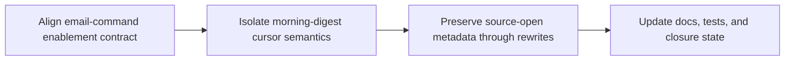

## task_031_day_captain_runtime_contract_and_digest_cursor_reliability_orchestration - Orchestrate runtime contract and digest cursor reliability fixes
> From version: 1.3.1
> Status: Done
> Understanding: 100%
> Confidence: 99%
> Progress: 100%
> Complexity: Medium
> Theme: Reliability
> Reminder: Update status/understanding/confidence/progress and dependencies/references when you edit this doc.

# Context
- Derived from backlog items `item_042_day_captain_email_command_enablement_contract_alignment`, `item_043_day_captain_morning_digest_cursor_run_type_isolation`, and `item_044_day_captain_llm_source_open_control_preservation`.
- Related request(s): `req_026_day_captain_runtime_contract_and_digest_cursor_reliability`.
- Depends on: `task_023_day_captain_weekend_window_and_reliability_orchestration`, `task_030_day_captain_multi_user_email_command_recall_orchestration`.
- Delivery target: restore contract consistency, cursor correctness, and source-open control reliability without broadening the feature surface.

# Plan
- [x] 1. Align hosted email-command enablement behavior across runtime, validation, and docs.
- [x] 2. Isolate the `morning-digest` incremental cursor from unrelated run types.
- [x] 3. Preserve source-open metadata through LLM rewrite paths and verify renderer behavior.
- [x] FINAL: Update linked Logics docs, statuses, and closure links.

# AC Traceability
- Req026 AC1 -> Plan step 1. Proof: task explicitly fixes runtime enablement behavior when recall is meant to be off.
- Req026 AC2 -> Plan step 1. Proof: task explicitly aligns runtime, validation, and docs.
- Req026 AC3 -> Plan step 2. Proof: task explicitly stops weekly/recall runs from moving the morning cursor.
- Req026 AC4 -> Plan step 3. Proof: task explicitly preserves `source_url` through rewrite paths.
- Req026 AC5 -> Plan steps 1 through 3. Proof: task closure depends on automated coverage and consistent documentation.

# Links
- Backlog item(s): `item_042_day_captain_email_command_enablement_contract_alignment`, `item_043_day_captain_morning_digest_cursor_run_type_isolation`, `item_044_day_captain_llm_source_open_control_preservation`
- Request(s): `req_026_day_captain_runtime_contract_and_digest_cursor_reliability`

# Validation
- python3 -m unittest discover -s tests
- python3 logics/skills/logics-doc-linter/scripts/logics_lint.py --require-status
- python3 logics/skills/logics-flow-manager/scripts/workflow_audit.py --group-by-doc

# Definition of Done (DoD)
- [x] Hosted email-command enablement behavior matches the documented contract.
- [x] `morning-digest` uses the correct incremental cursor semantics.
- [x] Rewritten digest items preserve Outlook source-open controls.
- [x] Regression tests cover the fixed runtime paths.
- [x] Linked request/backlog/task docs are updated consistently.
- [x] Status is `Done` and progress is `100%`.

# Report
- Created on Monday, March 9, 2026 from the runtime review findings after the `1.3.1` multi-user recall work and the `1.3.0` weather/digest presentation slices.
- This task is intentionally a bounded reliability follow-up, not a new product expansion slice.
- Closed on Monday, March 9, 2026 after fixing the hosted email-command gating contract, isolating the morning cursor from weekly/recall runs, and preserving source-open metadata through LLM rewrite paths.
