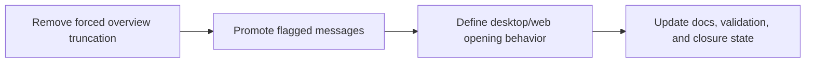

## task_032_day_captain_overview_flagged_signal_and_desktop_opening_orchestration - Orchestrate overview, flagged-signal, and Outlook-opening follow-up
> From version: 1.3.1
> Status: Ready
> Understanding: 99%
> Confidence: 97%
> Progress: 0%
> Complexity: Medium
> Theme: Product
> Reminder: Update status/understanding/confidence/progress and dependencies/references when you edit this doc.

# Context
- Derived from backlog items `item_045_day_captain_overview_length_policy_without_truncation`, `item_046_day_captain_flagged_mail_signal_and_rendering_prominence`, and `item_047_day_captain_outlook_desktop_opening_behavior_and_fallbacks`.
- Related request(s): `req_027_day_captain_overview_flagged_signal_and_desktop_opening`.
- Depends on: `task_028_day_captain_digest_spacing_and_content_cleanup_orchestration`, `task_031_day_captain_runtime_contract_and_digest_cursor_reliability_orchestration`.
- Delivery target: improve digest usefulness by preserving full summaries, promoting flagged items, and clarifying source opening behavior.

# Plan
- [ ] 1. Remove forced top-summary truncation and lock the new overview-length policy.
- [ ] 2. Promote flagged emails more clearly in scoring and rendering.
- [ ] 3. Define and validate the supported Outlook desktop opening behavior with fallback.
- [ ] FINAL: Update linked Logics docs, statuses, and closure links.

# AC Traceability
- Req027 AC1 -> Plan step 1. Proof: task explicitly changes the top-summary length contract.
- Req027 AC2 -> Plan step 2. Proof: task explicitly promotes flagged mail as a stronger signal.
- Req027 AC3 -> Plan step 3. Proof: task explicitly defines desktop-versus-web opening behavior.
- Req027 AC4 -> Plan steps 1 through 3. Proof: closure depends on docs and validation matching the implemented behavior.

# Links
- Backlog item(s): `item_045_day_captain_overview_length_policy_without_truncation`, `item_046_day_captain_flagged_mail_signal_and_rendering_prominence`, `item_047_day_captain_outlook_desktop_opening_behavior_and_fallbacks`
- Request(s): `req_027_day_captain_overview_flagged_signal_and_desktop_opening`

# Validation
- python3 -m unittest discover -s tests
- python3 logics/skills/logics-doc-linter/scripts/logics_lint.py --require-status
- python3 logics/skills/logics-flow-manager/scripts/workflow_audit.py --group-by-doc

# Definition of Done (DoD)
- [ ] `En bref` / `In brief` is no longer forcibly truncated by app policy.
- [ ] Flagged mail is promoted clearly and remains bounded.
- [ ] The supported Outlook opening behavior is explicit and has a reliable fallback path.
- [ ] Tests and docs match the implemented product behavior.
- [ ] Linked request/backlog/task docs are updated consistently.
- [ ] Status is `Done` and progress is `100%`.

# Report
- Created on Monday, March 9, 2026 from product feedback on digest completeness, flagged-message prominence, and Outlook opening behavior.
- This task is intentionally a focused product-utility follow-up rather than a broad redesign slice.
