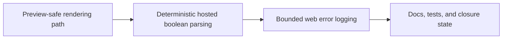

## task_033_day_captain_preview_safety_and_web_runtime_observability_orchestration - Orchestrate preview safety, hosted input hardening, and web observability fixes
> From version: 1.4.0
> Status: Done
> Understanding: 100%
> Confidence: 99%
> Progress: 100%
> Complexity: Medium
> Theme: Reliability
> Reminder: Update status/understanding/confidence/progress and dependencies/references when you edit this doc.

# Context
- Derived from backlog items `item_048_day_captain_preview_safe_rendering_contract`, `item_049_day_captain_hosted_http_boolean_input_hardening`, and `item_050_day_captain_web_runtime_error_logging_and_docs_alignment`.
- Related request(s): `req_028_day_captain_preview_safety_and_web_runtime_observability`.
- Depends on: `task_031_day_captain_runtime_contract_and_digest_cursor_reliability_orchestration`, `task_032_day_captain_overview_flagged_signal_and_desktop_opening_orchestration`.
- Delivery target: make preview workflows safe, hosted inputs deterministic, and web runtime failures easier to diagnose.

# Plan
- [x] 1. Implement and document a preview-safe rendering path that does not send mail.
- [x] 2. Harden hosted boolean input parsing for job payloads such as `force`.
- [x] 3. Add bounded web runtime error logging and align docs with the corrected contracts.
- [x] FINAL: Update linked Logics docs, statuses, and closure links.

# AC Traceability
- Req028 AC1 -> Plan step 1. Proof: task explicitly creates a no-send preview path.
- Req028 AC2 -> Plan steps 1 and 3. Proof: preview safety depends on both behavior and docs.
- Req028 AC3 -> Plan step 2. Proof: task explicitly fixes hosted boolean parsing.
- Req028 AC4 -> Plan step 3. Proof: task explicitly adds actionable runtime logging while preserving bounded responses.
- Req028 AC5 -> Plan steps 1 through 3. Proof: closure depends on automated coverage and aligned docs.

# Links
- Backlog item(s): `item_048_day_captain_preview_safe_rendering_contract`, `item_049_day_captain_hosted_http_boolean_input_hardening`, `item_050_day_captain_web_runtime_error_logging_and_docs_alignment`
- Request(s): `req_028_day_captain_preview_safety_and_web_runtime_observability`

# Validation
- python3 -m unittest discover -s tests
- python3 logics/skills/logics-doc-linter/scripts/logics_lint.py --require-status
- python3 logics/skills/logics-flow-manager/scripts/workflow_audit.py --group-by-doc

# Definition of Done (DoD)
- [x] A preview-safe render path exists and does not trigger Graph send.
- [x] Hosted boolean inputs such as `force` are parsed deterministically.
- [x] Unexpected web runtime failures emit actionable logs while keeping bounded HTTP responses.
- [x] Tests and docs match the implemented preview/runtime contracts.
- [x] Linked request/backlog/task docs are updated consistently.
- [x] Status is `Done` and progress is `100%`.

# Report
- Created on Monday, March 9, 2026 from review findings on preview safety, hosted input parsing, and runtime observability.
- This task is intentionally a bounded reliability follow-up rather than a product-surface expansion.
- Closed on Monday, March 9, 2026 after shipping the `--preview` no-send path, deterministic hosted boolean parsing, bounded web 500 logging, and aligned docs/tests.
