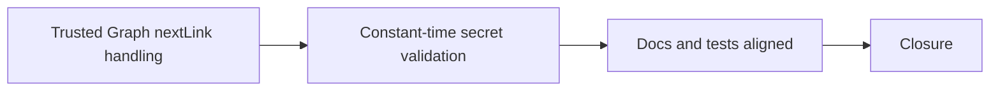

## task_034_day_captain_hosted_graph_boundary_and_job_secret_hardening_orchestration - Orchestrate hosted Graph trust-boundary enforcement, job-secret hardening, and validation closure
> From version: 1.4.1
> Status: Ready
> Understanding: 100%
> Confidence: 95%
> Progress: 0%
> Complexity: Medium
> Theme: Security
> Reminder: Update status/understanding/confidence/progress and dependencies/references when you edit this doc.

# Context
- Derived from backlog items `item_051_day_captain_graph_nextlink_trust_boundary_enforcement`, `item_052_day_captain_hosted_job_secret_constant_time_validation`, and `item_053_day_captain_hosted_security_docs_and_validation_alignment`.
- Related request(s): `req_029_day_captain_hosted_graph_boundary_and_job_secret_hardening`.
- Depends on: `task_033_day_captain_preview_safety_and_web_runtime_observability_orchestration`.
- Delivery target: harden the hosted production boundary without changing the visible job contract.

# Plan
- [ ] 1. Enforce a trusted-origin policy for Graph absolute pagination links.
- [ ] 2. Replace raw hosted job-secret equality with a constant-time comparison primitive.
- [ ] 3. Align tests and operator docs with the hardened hosted security contract.
- [ ] FINAL: Update linked Logics docs, statuses, and closure links.

# AC Traceability
- Req029 AC1 -> Plan step 1. Proof: task explicitly constrains bearer-token forwarding to trusted Graph origins only.
- Req029 AC2 -> Plan step 1. Proof: task explicitly handles bounded rejection of untrusted absolute `nextLink` values.
- Req029 AC3 -> Plan step 2. Proof: task explicitly hardens `X-Day-Captain-Secret` comparison.
- Req029 AC4 -> Plan steps 1 through 3. Proof: tests are part of the orchestrated delivery target.
- Req029 AC5 -> Plan step 3. Proof: closure requires accurate operator-facing documentation.

# Links
- Backlog item(s): `item_051_day_captain_graph_nextlink_trust_boundary_enforcement`, `item_052_day_captain_hosted_job_secret_constant_time_validation`, `item_053_day_captain_hosted_security_docs_and_validation_alignment`
- Request(s): `req_029_day_captain_hosted_graph_boundary_and_job_secret_hardening`

# Validation
- python3 -m unittest discover -s tests
- python3 logics/skills/logics-doc-linter/scripts/logics_lint.py --require-status
- python3 logics/skills/logics-flow-manager/scripts/workflow_audit.py --group-by-doc

# Definition of Done (DoD)
- [ ] Graph pagination never forwards the bearer token to an unexpected host.
- [ ] Hosted job-secret validation uses a constant-time comparison primitive.
- [ ] Tests and operator docs match the implemented hosted hardening contract.
- [ ] Linked request/backlog/task docs are updated consistently.
- [ ] Status is `Done` and progress is `100%`.

# Report
- Created on Monday, March 9, 2026 from a production-priority security review.
- This task intentionally focuses on hosted runtime boundary hardening rather than local developer token-cache storage.
