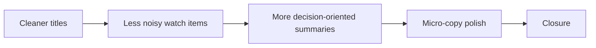

## task_035_day_captain_digest_editorial_relevance_and_copy_quality_orchestration - Orchestrate title cleanup, watch-item filtering, summary wording, and micro-copy polish
> From version: 1.4.1
> Status: Done
> Understanding: 100%
> Confidence: 96%
> Progress: 100%
> Complexity: Medium
> Theme: Product Quality
> Reminder: Update status/understanding/confidence/progress and dependencies/references when you edit this doc.

# Context
- Derived from backlog items `item_054_day_captain_digest_card_title_cleanup_heuristics`, `item_055_day_captain_digest_watch_item_noise_reduction`, `item_056_day_captain_digest_decision_oriented_summary_wording`, and `item_057_day_captain_digest_microcopy_and_cta_polish`.
- Related request(s): `req_030_day_captain_digest_editorial_relevance_and_copy_quality`.
- Depends on: `task_034_day_captain_hosted_graph_boundary_and_job_secret_hardening_orchestration`.
- Delivery target: make the digest feel more curated, assistant-like, and product-polished without reopening layout work.

# Plan
- [x] 1. Tighten digest card title cleanup heuristics for subject-derived titles.
- [x] 2. Reduce low-signal watch-item noise with bounded scoring/filtering changes.
- [x] 3. Improve summary wording so cards read more decisionally and less literally.
- [x] 4. Apply bounded micro-copy and CTA polish.
- [x] FINAL: Update linked Logics docs, statuses, and closure links.

# AC Traceability
- Req030 AC1 -> Plan step 1. Proof: task explicitly includes title cleanup heuristics.
- Req030 AC2 -> Plan step 2. Proof: task explicitly includes watch-item noise reduction.
- Req030 AC3 -> Plan step 3. Proof: task explicitly includes summary wording improvements.
- Req030 AC4 -> Plan step 4. Proof: task explicitly includes micro-copy polish without reopening layout.
- Req030 AC5 -> Plan steps 1 through 4. Proof: closure depends on aligned tests and docs across the whole editorial slice.

# Links
- Backlog item(s): `item_054_day_captain_digest_card_title_cleanup_heuristics`, `item_055_day_captain_digest_watch_item_noise_reduction`, `item_056_day_captain_digest_decision_oriented_summary_wording`, `item_057_day_captain_digest_microcopy_and_cta_polish`
- Request(s): `req_030_day_captain_digest_editorial_relevance_and_copy_quality`

# Validation
- python3 -m unittest discover -s tests
- python3 logics/skills/logics-doc-linter/scripts/logics_lint.py --require-status
- python3 logics/skills/logics-flow-manager/scripts/workflow_audit.py --group-by-doc

# Definition of Done (DoD)
- [x] Digest titles avoid obvious raw-email awkwardness where safe cleanup is possible.
- [x] `watch_items` is visibly less noisy in representative samples.
- [x] Summaries are more assistant-style and less literal while staying grounded.
- [x] User-visible copy polish is aligned and stable in Outlook-safe rendering.
- [x] Linked request/backlog/task docs are updated consistently.
- [x] Status is `Done` and progress is `100%`.

# Report
- Created on Monday, March 9, 2026 from live Outlook review after the `1.4.x` digest polish slices.
- This task intentionally focuses on editorial usefulness and credibility rather than CSS/layout changes.
- Closed on Monday, March 9, 2026 after shipping editorial title cleanup, stricter watch-item filtering, decision-oriented preview cleanup, and bounded French copy polish.
