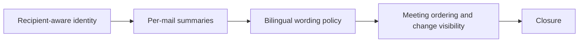

## task_036_day_captain_recipient_aware_digest_logic_and_meeting_correctness_orchestration - Orchestrate recipient-aware digest identity, per-mail summaries, bilingual wording, and meeting correctness
> From version: 1.4.2
> Status: Done
> Understanding: 100%
> Confidence: 98%
> Progress: 100%
> Complexity: Medium
> Theme: Product Quality
> Reminder: Update status/understanding/confidence/progress and dependencies/references when you edit this doc.

# Context
- Derived from backlog items `item_058_day_captain_recipient_aware_digest_identity_and_direct_address_relevance`, `item_059_day_captain_per_mail_assistant_summaries`, `item_060_day_captain_french_digest_bilingual_term_preservation`, and `item_061_day_captain_meeting_chronology_and_overnight_change_highlighting`.
- Related request(s): `req_031_day_captain_recipient_aware_digest_identity_mail_summaries_language_coherence_and_meeting_chronology`.
- Synchronization target: overlapping summary-system and meeting-interpretation execution now continues primarily through `req_033_day_captain_per_thread_and_per_meeting_assistant_briefings_with_confidence_scoring` and `task_038_day_captain_assistant_briefings_confidence_and_overview_orchestration`.
- Depends on: `task_035_day_captain_digest_editorial_relevance_and_copy_quality_orchestration`.
- Delivery target: make the digest feel correctly addressed, easier to understand per item, linguistically safer for English-source content, and trustworthy on meeting chronology.

# Plan
- [x] 1. Tighten recipient-aware identity handling and direct-address relevance.
- [x] 2. Improve French digest language coherence for English-source content.
- [x] 3. Keep `req_031` aligned with the newer execution path in `task_038` so overlapping summary and meeting work is not implemented twice.
- [x] FINAL: Update linked Logics docs, statuses, and closure links.

# AC Traceability
- Req031 AC1 -> Plan step 1. Proof: task explicitly includes recipient-aware identity behavior.
- Req031 AC2 -> Plan step 3 in coordination with `task_038`. Proof: overlapping mail-summary execution is synchronized rather than duplicated.
- Req031 AC3 -> Plan step 2. Proof: task explicitly includes bilingual wording coherence.
- Req031 AC4 -> Plan step 3 in coordination with `task_038`. Proof: overlapping meeting-interpretation work is synchronized rather than duplicated.
- Req031 AC5 -> Plan steps 1 through 3. Proof: closure depends on aligned docs and tests across both the remaining unique scope here and the synchronized execution path.

# Links
- Backlog item(s): `item_058_day_captain_recipient_aware_digest_identity_and_direct_address_relevance`, `item_059_day_captain_per_mail_assistant_summaries`, `item_060_day_captain_french_digest_bilingual_term_preservation`, `item_061_day_captain_meeting_chronology_and_overnight_change_highlighting`
- Request(s): `req_031_day_captain_recipient_aware_digest_identity_mail_summaries_language_coherence_and_meeting_chronology`, `req_033_day_captain_per_thread_and_per_meeting_assistant_briefings_with_confidence_scoring`

# Validation
- python3 -m unittest discover -s tests
- python3 logics/skills/logics-doc-linter/scripts/logics_lint.py --require-status
- python3 logics/skills/logics-flow-manager/scripts/workflow_audit.py --group-by-doc

# Definition of Done (DoD)
- [x] Digest wording is recipient-aware where target-user identity is available.
- [x] Surfaced mail cards include short, grounded assistant summaries.
- [x] French digests preserve English-source meaning with intentional bilingual wording where needed.
- [x] Upcoming meetings are chronologically correct and important overnight changes are clearly visible.
- [x] Linked request/backlog/task docs are updated consistently.
- [x] Status is `Done` and progress is `100%`.

# Report
- Created on Tuesday, March 10, 2026 from direct feedback on the delivered digest for the target digest user.
- This task intentionally focuses on product logic and assistant correctness rather than layout redesign.
- Synchronization note: this task now mainly carries the remaining recipient-aware and bilingual wording work, while overlapping summary-system replacement execution is coordinated through `task_038`.
- Completed on Tuesday, March 10, 2026 after shipping recipient-aware direct-address handling, synchronized per-thread and per-meeting briefings, bounded bilingual fallback wording, and meeting chronology/change-visibility validation.
