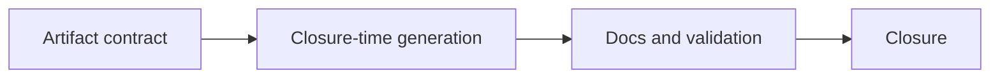

## task_037_day_captain_versioned_changelog_generation_and_delivery_alignment - Orchestrate changelog artifact conventions and delivery-closure alignment
> From version: 1.4.2
> Status: Draft
> Understanding: 96%
> Confidence: 93%
> Progress: 0%
> Complexity: Medium
> Theme: Delivery Quality
> Reminder: Update status/understanding/confidence/progress and dependencies/references when you edit this doc.

# Context
- Derived from backlog items `item_062_day_captain_versioned_changelog_artifact_contract` and `item_063_day_captain_changelog_generation_delivery_closure_process_alignment`.
- Related request(s): `req_032_day_captain_versioned_changelog_generation_and_delivery_closure_alignment`.
- Depends on: `task_036_day_captain_recipient_aware_digest_logic_and_meeting_correctness_orchestration`.
- Delivery target: give Day Captain a stable `changelogs/` convention and make changelog generation part of delivery closure using the actual current project version.

# Plan
- [ ] 1. Define the `changelogs/` artifact contract and versioned filename strategy.
- [ ] 2. Align delivery closure guidance so shipped work generates a changelog using the real current version at completion time.
- [ ] 3. Update docs/process guidance and add any bounded validation needed for the changelog workflow.
- [ ] FINAL: Update linked Logics docs, statuses, and closure links.

# AC Traceability
- Req032 AC1 -> Plan step 1. Proof: task explicitly defines the root changelog artifact convention.
- Req032 AC2 -> Plan steps 1 and 2. Proof: task explicitly ties changelog generation to the real current project version at closure time.
- Req032 AC3 -> Plan step 2. Proof: task explicitly adds closure-time generation to delivery workflow.
- Req032 AC4 -> Plan step 3. Proof: task explicitly includes docs/process alignment and validation.

# Links
- Backlog item(s): `item_062_day_captain_versioned_changelog_artifact_contract`, `item_063_day_captain_changelog_generation_delivery_closure_process_alignment`
- Request(s): `req_032_day_captain_versioned_changelog_generation_and_delivery_closure_alignment`

# Validation
- python3 logics/skills/logics-doc-linter/scripts/logics_lint.py --require-status
- python3 logics/skills/logics-flow-manager/scripts/workflow_audit.py --group-by-doc

# Definition of Done (DoD)
- [ ] Day Captain has a documented `changelogs/` artifact convention.
- [ ] Delivery closure guidance includes changelog generation using the real current project version.
- [ ] Linked request/backlog/task docs are updated consistently.
- [ ] Status is `Done` and progress is `100%`.

# Report
- Created on Tuesday, March 10, 2026 from process direction to add versioned changelog generation to Day Captain.
- This task intentionally scopes only repository artifacts and delivery workflow alignment, not a changelog UI.
