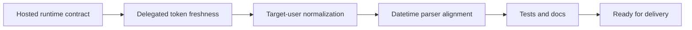

## task_039_day_captain_hosted_runtime_reliability_and_normalization_orchestration - Day Captain hosted runtime reliability and normalization orchestration
> From version: 1.5.0
> Status: Done
> Understanding: 100%
> Confidence: 98%
> Progress: 100%
> Complexity: High
> Theme: Reliability
> Reminder: Update status/understanding/confidence/progress and dependencies/references when you edit this doc.

# Context
- Derived from backlog items `item_069_day_captain_hosted_fail_fast_and_durable_runtime_contract`, `item_070_day_captain_delegated_token_freshness_and_explicit_auth_failures`, and `item_071_day_captain_target_user_normalization_and_entrypoint_datetime_alignment`.
- Related request(s): `req_034_day_captain_hosted_runtime_fail_fast_and_identity_normalization`.
- The goal of this task is not product-surface expansion; it is runtime trust. Hosted execution, delegated auth, multi-user identity handling, and CLI/web entrypoints should all behave explicitly and consistently under real conditions.

# Plan
- [x] 1. Tighten hosted runtime bootstrap and validation so Graph-backed hosted execution fails explicitly instead of silently falling back to stub behavior.
- [x] 2. Harden delegated auth so expired cached tokens are never reused as if they were valid when refresh cannot proceed.
- [x] 3. Normalize target-user resolution and email-command routing consistently across config and runtime.
- [x] 4. Align CLI and hosted web datetime parsing with the shared model behavior, including standard `Z`-suffixed UTC timestamps.
- [x] FINAL: Update regression tests and operational docs

# AC Traceability
- Req034 AC1 -> Plan step 1. Proof: the hosted runtime contract is explicitly tightened to remove misleading stub fallback.
- Req034 AC2 -> Plan step 2. Proof: delegated auth freshness and explicit failure behavior are isolated as a dedicated implementation step.
- Req034 AC3 -> Plan step 1. Proof: durable hosted execution expectations are part of the runtime-contract step.
- Req034 AC4 -> Plan step 3. Proof: target-user normalization is isolated as a dedicated implementation step.
- Req034 AC5 -> Plan step 4. Proof: parser alignment across model, CLI, and web entrypoints is isolated as a dedicated implementation step.
- Req034 AC6 -> Plan steps 1 through 4 plus FINAL. Proof: tests are part of the required closure path.
- Req034 AC7 -> FINAL. Proof: docs and runtime guidance must be updated alongside implementation.

# Links
- Backlog item(s): `item_069_day_captain_hosted_fail_fast_and_durable_runtime_contract`, `item_070_day_captain_delegated_token_freshness_and_explicit_auth_failures`, `item_071_day_captain_target_user_normalization_and_entrypoint_datetime_alignment`
- Request(s): `req_034_day_captain_hosted_runtime_fail_fast_and_identity_normalization`

# Validation
- python3 -m unittest discover -s tests
- python3 logics/skills/logics-doc-linter/scripts/logics_lint.py --require-status
- python3 logics/skills/logics-flow-manager/scripts/workflow_audit.py --group-by-doc

# Definition of Done (DoD)
- [x] Hosted runtime can no longer silently run in misleading Graph-free fallback modes where hosted Graph execution is expected.
- [x] Delegated auth does not reuse expired cached tokens without a valid refresh path.
- [x] Target-user normalization is consistent across config, runtime, and email-command flows.
- [x] CLI and hosted web datetime parsing are aligned with shared model parsing for standard ISO inputs.
- [x] Validation commands executed and results captured.
- [x] Linked request/backlog/task docs updated.
- [x] Status is `Done` and progress is `100%`.

# Report
- Created on Tuesday, March 10, 2026 from a project-wide runtime review focused on fail-fast behavior, durable hosted execution, auth clarity, and cross-entrypoint consistency.
- Completed on Tuesday, March 10, 2026 after shipping hosted fail-fast validation, durable-storage enforcement, explicit delegated-token expiry failures, mailbox-case normalization, parser alignment, and regression coverage across settings, auth, app, CLI, web, and hosted-job validation.
