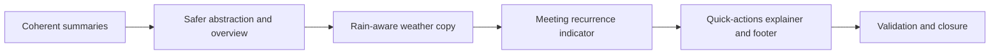

## task_040_day_captain_digest_editorial_privacy_weather_and_footer_orchestration - Orchestrate summary coherence, privacy-safe wording, weather rain copy, and footer microcopy
> From version: 1.5.1
> Status: Done
> Understanding: 100%
> Confidence: 96%
> Progress: 100%
> Complexity: Medium
> Theme: Product Quality
> Reminder: Update status/understanding/confidence/progress and dependencies/references when you edit this doc.

# Context
- Derived from backlog items `item_072_day_captain_digest_summary_coherence_length_and_short_message_handling`, `item_073_day_captain_digest_privacy_safe_abstraction_and_action_oriented_overview`, `item_074_day_captain_digest_weather_rain_signal_copy`, `item_075_day_captain_digest_quick_actions_explainer_and_footer_microcopy`, and `item_076_day_captain_digest_meeting_recurrence_indicator`.
- Related request(s): `req_035_day_captain_digest_summary_coherence_privacy_weather_and_footer_polish`.
- Related earlier work: `req_024_day_captain_digest_daily_weather_capsule`, `req_030_day_captain_digest_editorial_relevance_and_copy_quality`, and `req_033_day_captain_per_thread_and_per_meeting_assistant_briefings_with_confidence_scoring`.
- Delivery target: keep the current digest structure, but make the visible copy more coherent, more discreet, more useful on weather, and more polished at the bottom of the mail.
- Delivery target also includes keeping the repository itself clean of real business examples while implementing the editorial improvements.

# Plan
- [x] 1. Fix fragmented summaries, relax abrupt hard stops, improve very short direct-message rendering, use older thread context by default, and apply variable bounded length by item type.
- [x] 2. Make visible digest wording more privacy-safe and action-oriented, including lighter confidence reasons and synthetic-only repo fixtures/examples.
- [x] 3. Extend the weather line with a nuanced rain expectation signal when forecast data allows it.
- [x] 4. Add a discreet visible recurrence indicator on meeting cards when calendar metadata supports it, with frequency-aware labels when available.
- [x] 5. Replace the quick-actions intro copy with slightly explanatory wording and add a small linked `Day Captain © YEAR` footer line.
- [x] FINAL: Update regression tests and linked Logics docs.

# AC Traceability
- Req035 AC1 -> Plan step 1. Proof: task explicitly targets summary coherence and bounded length behavior.
- Req035 AC1 supporting rule -> Plan step 1. Proof: variable item-type bounds belong to the same summary step.
- Req035 AC2 -> Plan step 1. Proof: very short direct-message rendering is part of the same summary step.
- Req035 AC2 supporting rule -> Plan step 1. Proof: thread-aware synthesis is part of the same summary-quality implementation step.
- Req035 AC3 -> Plan step 2. Proof: task explicitly targets privacy-safe abstraction and a more action-oriented overview.
- Req035 AC3 supporting rule -> Plan step 2. Proof: synthetic-only repo examples belong to the same privacy-safe implementation step.
- Req035 AC4 -> Plan step 2. Proof: lighter confidence reason wording is part of the same visible-copy pass.
- Req035 AC5 -> Plan step 3. Proof: weather rain indication is isolated as a dedicated implementation step.
- Req035 AC5 supporting nuance -> Plan step 3. Proof: nuanced rain wording belongs to the same weather-copy step.
- Req035 AC6 -> Plan step 4. Proof: the recurrence indicator is isolated as a dedicated meeting-metadata implementation step.
- Req035 AC6 supporting rule -> Plan step 4. Proof: discreet badge/frequency-aware rendering belongs to the same meeting step.
- Req035 AC7 -> Plan step 5. Proof: quick-actions helper text and footer line are isolated as the bottom-of-mail microcopy step.
- Req035 AC8 -> Plan steps 1 through 5 plus FINAL. Proof: closure depends on aligned coverage and docs across all slices.

# Links
- Backlog item(s): `item_072_day_captain_digest_summary_coherence_length_and_short_message_handling`, `item_073_day_captain_digest_privacy_safe_abstraction_and_action_oriented_overview`, `item_074_day_captain_digest_weather_rain_signal_copy`, `item_075_day_captain_digest_quick_actions_explainer_and_footer_microcopy`, `item_076_day_captain_digest_meeting_recurrence_indicator`
- Request(s): `req_035_day_captain_digest_summary_coherence_privacy_weather_and_footer_polish`

# Validation
- python3 -m unittest discover -s tests
- python3 logics/skills/logics-doc-linter/scripts/logics_lint.py --require-status
- python3 logics/skills/logics-flow-manager/scripts/workflow_audit.py --group-by-doc

# Definition of Done (DoD)
- [x] Summaries avoid obvious fragment starts/stops and handle very short direct messages more naturally.
- [x] Summary bounds can vary by item type while remaining bounded and readable.
- [x] Visible digest wording is more abstract and action-oriented without overexposing raw business fragments, and repo fixtures/examples remain synthetic.
- [x] Weather copy indicates nuanced rain expectation when supported by the data.
- [x] Meeting cards expose a discreet recurrence indicator when supported by calendar metadata.
- [x] Bottom quick-actions copy and footer line are updated in stable text and HTML rendering.
- [x] Validation commands executed and results captured.
- [x] Linked request/backlog/task docs updated.
- [x] Status is `Done` and progress is `100%`.

# Report
- Created on Wednesday, March 11, 2026 from live Outlook review of the `1.5.1` digest output.
- Completed on Wednesday, March 11, 2026.
- Validation:
  - `python3 -m unittest discover -s tests`
  - `python3 logics/skills/logics-doc-linter/scripts/logics_lint.py --require-status`
  - `python3 logics/skills/logics-flow-manager/scripts/workflow_audit.py --group-by-doc`
