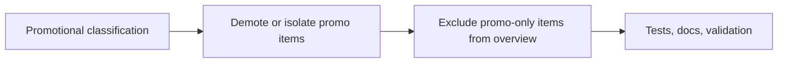

## task_041_day_captain_promotional_mail_handling_orchestration - Orchestrate promotional mail classification, demotion, and overview exclusion
> From version: 1.5.2
> Status: Ready
> Understanding: 99%
> Confidence: 96%
> Progress: 0%
> Complexity: Medium
> Theme: Product Quality
> Reminder: Update status/understanding/confidence/progress and dependencies/references when you edit this doc.

# Context
- Derived from backlog items `item_077_day_captain_bounded_promotional_mail_classification`, `item_078_day_captain_promotional_digest_demotion_and_neutral_rendering`, and `item_079_day_captain_promotional_overview_exclusion_and_fallbacks`.
- Related request(s): `req_036_day_captain_promotional_mail_detection_and_digest_deprioritization`.
- Related earlier work: `req_030_day_captain_digest_editorial_relevance_and_copy_quality`, `req_033_day_captain_per_thread_and_per_meeting_assistant_briefings_with_confidence_scoring`, and `req_035_day_captain_digest_summary_coherence_privacy_weather_and_footer_polish`.
- Delivery target: stop promotional false positives from appearing as assistant-endorsed actions or top priorities while keeping the digest bounded, explainable, and resilient when LLM output is unavailable.

# Plan
- [ ] 1. Add a bounded promotional-signal contract with deterministic heuristics first and optional structured LLM classification only for ambiguous surfaced or borderline mail candidates.
- [ ] 2. Use the promotional signal to demote or isolate promotional items in digest rendering and neutralize action-forward recommendation wording by default.
- [ ] 3. Exclude promotional-only items from `En bref` unless an explicit stronger non-promotional override applies, while preserving deterministic fallback behavior.
- [ ] FINAL: Update regression tests, docs, and linked Logics artifacts.

# AC Traceability
- Req036 AC1 -> Plan step 2. Proof: visible action-section demotion belongs to the rendering step.
- Req036 AC2 -> Plan step 3. Proof: top-summary exclusion is isolated as its own overview step.
- Req036 AC3 -> Plan step 1. Proof: bounded heuristic-first plus optional LLM classification belongs to the classification step.
- Req036 AC4 -> Plan step 2. Proof: low-prominence handling and neutral wording belong to the rendering step.
- Req036 AC5 -> Plan steps 1 and 3. Proof: both classification fallback and overview fallback must remain deterministic.
- Req036 AC6 -> Plan steps 1 through 3 plus FINAL. Proof: closure depends on aligned coverage and docs across all slices.

# Links
- Backlog item(s): `item_077_day_captain_bounded_promotional_mail_classification`, `item_078_day_captain_promotional_digest_demotion_and_neutral_rendering`, `item_079_day_captain_promotional_overview_exclusion_and_fallbacks`
- Request(s): `req_036_day_captain_promotional_mail_detection_and_digest_deprioritization`

# Validation
- python3 -m unittest discover -s tests
- python3 logics/skills/logics-doc-linter/scripts/logics_lint.py --require-status
- python3 logics/skills/logics-flow-manager/scripts/workflow_audit.py --group-by-doc

# Definition of Done (DoD)
- [ ] Promotional classification is bounded, explainable, and resilient when LLM output is missing.
- [ ] Promotional items no longer read like assistant-endorsed actions in digest rendering.
- [ ] Promotional-only items no longer feed `En bref` by default.
- [ ] Tests and docs cover representative false positives and fallback behavior.
- [ ] Validation commands executed and results captured.
- [ ] Linked request/backlog/task docs updated.
- [ ] Status is `Done` and progress is `100%`.

# Report
- Created on Wednesday, March 11, 2026 from live digest feedback showing a promotional false positive in both the action section and the overview.
