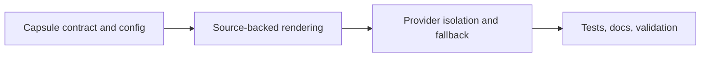

## task_043_day_captain_external_news_capsule_orchestration - Orchestrate the external-news capsule contract, rendering, and runtime fallback
> From version: 1.8.0
> Status: Ready
> Understanding: 100%
> Confidence: 96%
> Progress: 0%
> Complexity: Medium
> Theme: UX
> Reminder: Update status/understanding/confidence/progress and dependencies/references when you edit this doc.

# Context
- Derived from backlog items `item_081_day_captain_bounded_external_news_capsule_contract`, `item_082_day_captain_external_news_source_attribution_and_linked_rendering`, and `item_083_day_captain_external_news_provider_fallback_and_runtime_isolation`.
- Related request(s): `req_038_day_captain_external_news_capsule_in_daily_digest`.
- Delivery target: add a small, source-backed external-news capsule to the daily digest without diluting the current action-oriented sections or introducing a new runtime failure path.

# Plan
- [ ] 1. Define the external-news capsule contract in the digest model and configuration surface, including bounded item count and omit behavior.
- [ ] 2. Add text and HTML rendering for a clearly labeled external-news capsule with visible source attribution and links.
- [ ] 3. Integrate a bounded provider path with clean timeout, empty-result, and malformed-result fallback behavior so the core digest still completes normally.
- [ ] FINAL: Add regression coverage, update docs, and sync linked Logics artifacts.

# AC Traceability
- Req038 AC1 -> Plan steps 1 and 2. Proof: the separate capsule contract is defined first and then rendered.
- Req038 AC2 -> Plan step 1. Proof: bounded item count belongs to the contract definition.
- Req038 AC3 -> Plan step 2. Proof: source attribution and links are part of rendering.
- Req038 AC4 -> Plan step 3. Proof: the provider integration remains strictly external.
- Req038 AC5 -> Plan step 3. Proof: omit-on-failure behavior belongs to the runtime step.
- Req038 AC6 -> Plan steps 1 and 3. Proof: bounded output and bounded runtime behavior are split across contract and provider work.
- Req038 AC7 -> FINAL. Proof: tests and docs are explicit closure requirements.

# Links
- Backlog item(s): `item_081_day_captain_bounded_external_news_capsule_contract`, `item_082_day_captain_external_news_source_attribution_and_linked_rendering`, `item_083_day_captain_external_news_provider_fallback_and_runtime_isolation`
- Request(s): `req_038_day_captain_external_news_capsule_in_daily_digest`

# Validation
- python3 -m unittest discover -s tests
- python3 logics/skills/logics-doc-linter/scripts/logics_lint.py --require-status
- python3 logics/skills/logics-flow-manager/scripts/workflow_audit.py --group-by-doc

# Definition of Done (DoD)
- [ ] External-news capsule contract is implemented and bounded.
- [ ] Source-backed rendering works in both text and HTML output.
- [ ] Provider failure does not break the core digest path.
- [ ] Tests and docs cover the new contract and fallback behavior.
- [ ] Linked request/backlog/task docs updated.
- [ ] Status is `Done` and progress is `100%`.

# Report
- Created on Monday, March 23, 2026 from product direction requesting a short external-news recap inside the daily digest.

