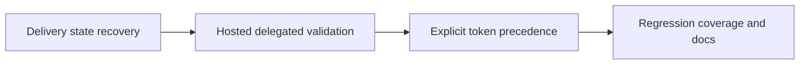

## task_044_day_captain_delivery_recovery_and_delegated_auth_contract_orchestration - Orchestrate delivery recovery and delegated-auth contract corrections
> From version: 1.8.0
> Status: Ready
> Understanding: 100%
> Confidence: 97%
> Progress: 0%
> Complexity: Medium
> Theme: Reliability
> Reminder: Update status/understanding/confidence/progress and dependencies/references when you edit this doc.

# Context
- Derived from backlog items `item_084_day_captain_pre_send_delivery_failure_state_recovery`, `item_085_day_captain_hosted_delegated_auth_validation_hardening`, and `item_086_day_captain_explicit_delegated_token_scope_and_identity_precedence`.
- Related request(s): `req_039_day_captain_delivery_recovery_and_delegated_auth_contract_corrections`.
- Related earlier work: `req_034_day_captain_hosted_runtime_fail_fast_and_identity_normalization`.
- Delivery target: remove the stale pending-run trap on clearly pre-send delivery failures, tighten hosted delegated validation, and make explicit delegated tokens authoritative over stale cache metadata.

# Plan
- [ ] 1. Correct hosted delivery-state transitions so clearly pre-send Graph failures become `delivery_failed` and no longer block the next digest run.
- [ ] 2. Tighten hosted delegated-auth validation so production-like configs must include a real unattended delegated token path.
- [ ] 3. Fix delegated explicit-token versus cache precedence so stale cached scopes or user identity cannot shadow the configured runtime token.
- [ ] FINAL: Add focused regression tests, update docs, and sync linked Logics artifacts.

# AC Traceability
- Req039 AC1 -> Plan step 1. Proof: pre-send failure classification belongs to the delivery recovery step.
- Req039 AC2 -> Plan step 1. Proof: later-run recovery depends on the corrected run-state transition.
- Req039 AC3 -> Plan step 2. Proof: hosted delegated validation hardening is isolated as its own step.
- Req039 AC4 -> Plan step 3. Proof: explicit-token precedence is isolated as its own step.
- Req039 AC5 -> Plan steps 2 and 3. Proof: validation and precedence both need clear operator-facing behavior.
- Req039 AC6 -> FINAL. Proof: regression coverage is an explicit closure requirement.

# Links
- Backlog item(s): `item_084_day_captain_pre_send_delivery_failure_state_recovery`, `item_085_day_captain_hosted_delegated_auth_validation_hardening`, `item_086_day_captain_explicit_delegated_token_scope_and_identity_precedence`
- Request(s): `req_039_day_captain_delivery_recovery_and_delegated_auth_contract_corrections`

# Validation
- python3 -m unittest discover -s tests
- python3 logics/skills/logics-doc-linter/scripts/logics_lint.py --require-status
- python3 logics/skills/logics-flow-manager/scripts/workflow_audit.py --group-by-doc

# Definition of Done (DoD)
- [ ] Clearly pre-send Graph delivery failures no longer leave stale `delivery_pending` runs.
- [ ] Hosted delegated validation rejects non-runnable production-like auth shapes.
- [ ] Explicit delegated tokens no longer inherit stale cached identity or scope metadata.
- [ ] Tests and docs cover the new recovery and auth contracts.
- [ ] Linked request/backlog/task docs updated.
- [ ] Status is `Done` and progress is `100%`.

# Report
- Created on Monday, March 23, 2026 from a project audit focused on delivery recovery and delegated-auth correctness.
