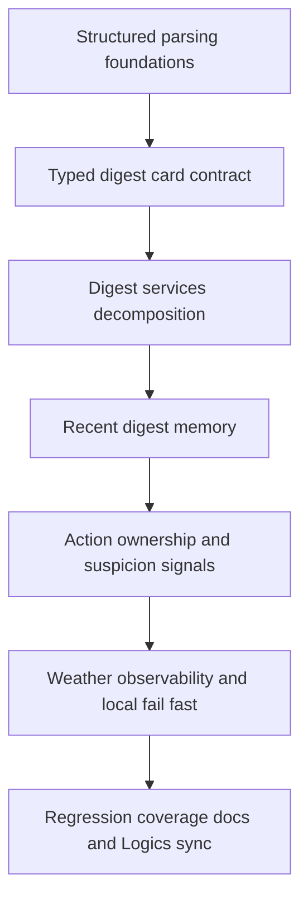

## task_045_day_captain_mail_intelligence_and_runtime_clarity_orchestration - Orchestrate mail intelligence foundations and runtime clarity improvements
> From version: 1.8.0
> Schema version: 1.0
> Status: Done
> Understanding: 97%
> Confidence: 94%
> Progress: 100%
> Complexity: High
> Theme: Architecture
> Reminder: Update status/understanding/confidence/progress and dependencies/references when you edit this doc.

# Context
- Derived from backlog items `item_087_day_captain_structured_mail_thread_and_agenda_parsing_foundations`, `item_088_day_captain_typed_digest_card_contract_and_renderer_migration`, `item_089_day_captain_digest_services_decomposition_and_pipeline_seams`, `item_090_day_captain_recent_digest_memory_and_cross_day_continuity_signals`, `item_091_day_captain_mail_action_ownership_and_non_owner_wording`, `item_092_day_captain_mail_suspicion_risk_signals_and_conservative_rendering`, `item_093_day_captain_weather_degraded_path_observability`, and `item_094_day_captain_local_graph_fail_fast_and_explicit_stub_runtime_contract`.
- Related request(s): `req_040_day_captain_structured_mail_and_calendar_parsing_and_digest_presentation`, `req_041_day_captain_recent_digest_memory_for_cross_day_context`, `req_042_day_captain_mail_action_ownership_and_non_owner_handling`, `req_043_day_captain_mail_anti_scam_and_phishing_risk_signals`, `req_046_day_captain_typed_digest_contract_and_services_decomposition`, `req_047_day_captain_weather_failure_observability_and_degraded_path_logging`, and `req_048_day_captain_explicit_local_fail_fast_instead_of_stub_runtime_fallback`.
- Related existing runtime work: `task_044_day_captain_delivery_recovery_and_delegated_auth_contract_orchestration` already covers the pre-existing auth items `085` and `086`, so this orchestration intentionally focuses on the newly consolidated backlog items.
- Delivery target: establish better mail and agenda interpretation foundations, migrate digest semantics toward typed contracts, add bounded cross-day and trust-aware intelligence, and close the observability and local-runtime clarity gaps identified in the audit.

# Plan
- [x] 1. Introduce structured mail-thread and agenda parsing foundations so the digest pipeline no longer depends directly on flat raw source records for core interpretation.
- [x] 2. Define and migrate toward a typed digest-card contract for renderer-critical semantics, reducing reliance on ad hoc `context_metadata` keys.
- [x] 3. Decompose the digest services concentration along coherent seams so scoring, rendering, and overview behavior no longer live in one oversized module.
- [x] 4. Add bounded recent digest memory and cross-day continuity signals using the last 2 to 3 completed runs as structured secondary context.
- [x] 5. Add bounded mail action-ownership interpretation and suspicious-mail risk signals so wording, confidence, and handling become more conservative when ownership or trust is weak.
- [x] 6. Improve runtime clarity around non-fatal weather degradation and local Graph-backed execution so failures are observable and stub runtime remains explicit rather than accidental.
- [x] FINAL: Run focused and broad regression coverage, update docs and linked Logics artifacts, and capture the final orchestration report.

# Delivery checkpoints
- Each completed wave should leave the repository in a coherent, commit-ready state.
- Update the linked Logics docs during the wave that changes the behavior, not only at final closure.
- Prefer a reviewed commit checkpoint at the end of each meaningful wave instead of accumulating several undocumented partial states.

# AC Traceability
- Req040 AC1, AC2, AC3 -> Plan step 1. Proof: the parsing layer, thread-first mail interpretation, and earlier agenda typing belong to the foundations wave.
- Req040 AC4, AC5 and Req046 AC1, AC3 -> Plan step 2. Proof: the typed digest-card contract is the explicit bridge between richer semantics and safer presentation.
- Req040 AC6 and Req046 AC4 -> Plan steps 2 and 3. Proof: typed-contract migration and seam extraction are both explicitly staged as incremental and regression-safe rather than a big-bang rewrite.
- Req046 AC2, AC4 -> Plan step 3. Proof: decomposition of the oversized services module is isolated as its own architecture wave with regression-safe extraction.
- Req041 AC1, AC2, AC3, AC4, AC5, AC6 -> Plan step 4. Proof: recent-run loading, conservative matching, and bounded recent-memory behavior all belong to the cross-day memory wave.
- Req042 AC1, AC2, AC3, AC4 and Req043 AC1, AC2, AC3, AC4, AC5 -> Plan step 5. Proof: ownership attribution and suspicious-mail posture are both bounded mail-intelligence layers that depend on improved interpretation contracts.
- Req043 AC6 -> Plan step 5. Proof: suspicious-mail analysis must stay heuristic-first and bounded in cost within the same mail-intelligence wave.
- Req047 AC1, AC2, AC3 and Req048 AC1, AC2, AC3 -> Plan step 6. Proof: degraded-path observability and explicit local fail-fast behavior are the runtime-clarity wave.
- Req040 AC7, Req041 AC7, Req042 AC6, Req043 AC7, Req046 AC4, Req047 AC4, Req048 AC4 -> FINAL. Proof: coverage, docs, and synchronized Logics updates are explicit closure requirements across the whole workstream.

# Decision framing
- Product framing: Existing requests already provide enough product framing for this orchestration.
- Product signals: Better mail interpretation, bounded continuity, safer suspicious-mail handling, and clearer assistant-card rendering.
- Product follow-up: Keep product decisions synchronized through linked request and backlog docs as the implementation slices land.
- Architecture framing: Recommended.
- Architecture signals: Typed digest contracts, structured parsing layer, module-seam extraction, and runtime clarity changes span several layers of the application.
- Architecture follow-up: Create an ADR if the final typed digest-card contract or decomposition seams introduce a non-trivial long-term architecture decision.

# Links
- Product brief(s): None yet.
- Architecture decision(s): Recommended during execution if typed contract or decomposition choices become non-trivial.
- Backlog item: `item_087_day_captain_structured_mail_thread_and_agenda_parsing_foundations`, `item_088_day_captain_typed_digest_card_contract_and_renderer_migration`, `item_089_day_captain_digest_services_decomposition_and_pipeline_seams`, `item_090_day_captain_recent_digest_memory_and_cross_day_continuity_signals`, `item_091_day_captain_mail_action_ownership_and_non_owner_wording`, `item_092_day_captain_mail_suspicion_risk_signals_and_conservative_rendering`, `item_093_day_captain_weather_degraded_path_observability`, `item_094_day_captain_local_graph_fail_fast_and_explicit_stub_runtime_contract`
- Request(s): `req_040_day_captain_structured_mail_and_calendar_parsing_and_digest_presentation`, `req_041_day_captain_recent_digest_memory_for_cross_day_context`, `req_042_day_captain_mail_action_ownership_and_non_owner_handling`, `req_043_day_captain_mail_anti_scam_and_phishing_risk_signals`, `req_046_day_captain_typed_digest_contract_and_services_decomposition`, `req_047_day_captain_weather_failure_observability_and_degraded_path_logging`, `req_048_day_captain_explicit_local_fail_fast_instead_of_stub_runtime_fallback`

# AI Context
- Summary: Orchestrate the new audit-driven workstream covering structured parsing, typed digest contracts, services decomposition, recent digest memory, mail ownership and suspicion signals, and runtime clarity improvements.
- Keywords: orchestration, structured parsing, typed digest card, services decomposition, recent memory, action ownership, suspicious mail, weather observability, local fail fast
- Use when: The implementation spans several newly created backlog items that need sequencing across parsing, rendering, runtime, and documentation layers.
- Skip when: The work is only a single narrow bug fix or one isolated backlog item with no cross-cutting dependencies.

# References
- Main digest orchestration path: [src/day_captain/app.py](/Users/alexandreagostini/Documents/day-captain/src/day_captain/app.py)
- Main digest logic concentration: [src/day_captain/services.py](/Users/alexandreagostini/Documents/day-captain/src/day_captain/services.py)
- Protocol boundaries: [src/day_captain/ports.py](/Users/alexandreagostini/Documents/day-captain/src/day_captain/ports.py)
- Existing auth/runtime orchestration task: [logics/tasks/task_044_day_captain_delivery_recovery_and_delegated_auth_contract_orchestration.md](/Users/alexandreagostini/Documents/day-captain/logics/tasks/task_044_day_captain_delivery_recovery_and_delegated_auth_contract_orchestration.md)

# Validation
- python3 -m pytest -q
- python3 logics/skills/logics-doc-linter/scripts/logics_lint.py --require-status
- python3 logics/skills/logics-flow-manager/scripts/workflow_audit.py --group-by-doc

# Definition of Done (DoD)
- [x] Scope implemented and acceptance criteria covered.
- [x] Validation commands executed and results captured.
- [x] Linked request/backlog/task docs updated during completed waves and at closure.
- [x] Each completed wave left a commit-ready checkpoint or an explicit exception is documented.
- [x] Status is `Done` and progress is `100%`.

# Report
- Created on Saturday, March 28, 2026 after consolidating the new audit-driven requests into a coherent backlog workstream.
- Completed on Saturday, March 28, 2026 with typed digest cards, structured parsing helpers, recent-memory continuity, ownership and suspicion handling, weather observability, and explicit local runtime fail-fast behavior.
