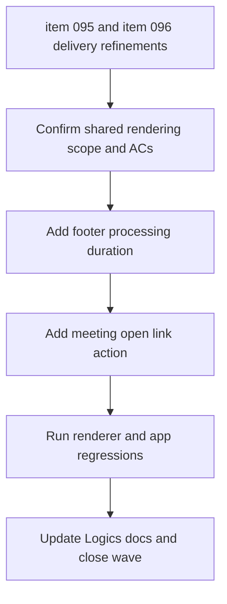

## task_046_day_captain_footer_timing_and_meeting_open_link_orchestration - Orchestrate footer timing and meeting open-link delivery refinements
> From version: 1.8.0
> Schema version: 1.0
> Status: Done
> Understanding: 98%
> Confidence: 95%
> Progress: 100%
> Complexity: Low
> Theme: Delivery
> Reminder: Update status/understanding/confidence/progress and dependencies/references when you edit this doc.

# Context
- Derived from backlog items `item_095_day_captain_footer_processing_duration_in_delivered_digest_emails` and `item_096_day_captain_meeting_cards_direct_open_link_in_digest`.
- Related request(s): `req_049_day_captain_footer_processing_duration_in_delivered_digest_emails` and `req_050_day_captain_meeting_cards_direct_open_link_in_digest`.
- Delivery target: improve digest delivery affordances in two small but coherent ways:
  - show the digest generation duration in the footer under `Day Captain © 2026`
  - expose a direct open action for calendar meetings, aligned with the existing mail open-link behavior
- Both changes belong to the same renderer-facing slice because they affect operator-facing delivery metadata and actionability in the final digest output.

# Plan
- [x] 1. Confirm the shared renderer and payload scope for footer timing metadata and meeting open-link rendering, including the acceptance-criteria mapping for both backlog items.
- [x] 2. Add bounded timing capture for the current digest generation run, propagate it through the delivery payload, and render it below `Day Captain © 2026` in both text and HTML footers.
- [x] 3. Make meeting cards render an explicit open action when a reliable calendar source URL exists, with wording aligned to the existing mail open-link affordance and safe omission otherwise.
- [x] 4. Validate the renderer and app paths together, then update the linked Logics docs so both backlog items and both requests reference the shared orchestration task.
- [x] CHECKPOINT: leave the current wave commit-ready and update the linked Logics docs before continuing.
- [x] FINAL: Capture validation results, close the related docs if delivery is complete, and leave a report that covers both delivery refinements.

# Delivery checkpoints
- Each completed wave should leave the repository in a coherent, commit-ready state.
- Update the linked Logics docs during the wave that changes the behavior, not only at final closure.
- Prefer a reviewed commit checkpoint at the end of each meaningful wave instead of accumulating several undocumented partial states.

# AC Traceability
- Req049 AC1, AC2, AC3, AC4, AC5 -> Plan step 2 and step 4. Proof: timing capture, payload propagation, footer rendering, and regression tests all belong to the footer-timing wave and shared validation.
- Req050 AC1, AC2, AC3, AC4 -> Plan step 3 and step 4. Proof: meeting open-link rendering, safe omission, wording consistency, and coverage belong to the meeting-action wave and shared validation.

# Decision framing
- Product framing: Not needed.
- Product signals: Small operator-facing delivery affordances already bounded by the source requests.
- Product follow-up: No separate product brief is needed for this orchestration.
- Architecture framing: Not needed.
- Architecture signals: Renderer and payload changes remain small and reversible.
- Architecture follow-up: No ADR is expected unless implementation reveals a broader timing or instrumentation contract.

# Links
- Product brief(s): (none yet)
- Architecture decision(s): (none yet)
- Backlog item: `item_095_day_captain_footer_processing_duration_in_delivered_digest_emails`, `item_096_day_captain_meeting_cards_direct_open_link_in_digest`
- Request(s): `req_049_day_captain_footer_processing_duration_in_delivered_digest_emails`, `req_050_day_captain_meeting_cards_direct_open_link_in_digest`

# AI Context
- Summary: Orchestrate two small delivery refinements together: footer generation timing below the signature and direct open links for meeting cards in the digest.
- Keywords: footer duration, digest generation timing, meeting open link, calendar card action, renderer delivery refinement
- Use when: The work touches the delivered digest footer and meeting-card actionability in the same renderer-oriented slice.
- Skip when: The work expands into broader performance instrumentation, meeting workflow redesign, or unrelated digest intelligence changes.

# References
- Footer and card rendering: [services.py](/Users/alexandreagostini/Documents/day-captain/src/day_captain/services.py)
- Application orchestration and run lifecycle: [app.py](/Users/alexandreagostini/Documents/day-captain/src/day_captain/app.py)
- Digest payload and entry contract: [models.py](/Users/alexandreagostini/Documents/day-captain/src/day_captain/models.py)

# Validation
- python3 -m pytest -q tests/test_app.py tests/test_digest_renderer.py
- python3 logics/skills/logics-doc-linter/scripts/logics_lint.py --require-status
- python3 logics/skills/logics-flow-manager/scripts/workflow_audit.py --group-by-doc --refs req_049_day_captain_footer_processing_duration_in_delivered_digest_emails req_050_day_captain_meeting_cards_direct_open_link_in_digest item_095_day_captain_footer_processing_duration_in_delivered_digest_emails item_096_day_captain_meeting_cards_direct_open_link_in_digest task_046_day_captain_footer_timing_and_meeting_open_link_orchestration

# Definition of Done (DoD)
- [x] Scope implemented and acceptance criteria covered.
- [x] Validation commands executed and results captured.
- [x] Linked request/backlog/task docs updated during completed waves and at closure.
- [x] Each completed wave left a commit-ready checkpoint or an explicit exception is documented.
- [x] Status is `Done` and progress is `100%`.

# Report
- Created on Saturday, March 28, 2026 by consolidating the footer-timing and meeting open-link delivery refinements into one shared orchestration task.
- Completed on Saturday, March 28, 2026.
- Wave 1 commit: `78c6a39` - add bounded digest-generation timing metadata, render the footer duration in text and HTML, and extend renderer/app coverage including the no-link meeting fallback path.
- Validation:
  - `python3 -m pytest -q tests/test_digest_renderer.py tests/test_app.py`
  - `python3 -m pytest -q`
  - `python3 logics/skills/logics-doc-linter/scripts/logics_lint.py --require-status`
  - `python3 logics/skills/logics-flow-manager/scripts/workflow_audit.py --group-by-doc --refs req_049_day_captain_footer_processing_duration_in_delivered_digest_emails req_050_day_captain_meeting_cards_direct_open_link_in_digest item_095_day_captain_footer_processing_duration_in_delivered_digest_emails item_096_day_captain_meeting_cards_direct_open_link_in_digest task_046_day_captain_footer_timing_and_meeting_open_link_orchestration`
