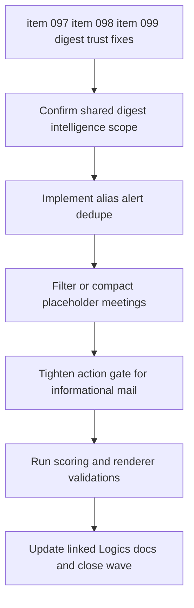

## task_047_day_captain_remaining_digest_trust_fixes_orchestration - Day Captain remaining digest trust fixes orchestration
> From version: 1.9.0
> Schema version: 1.0
> Status: Done
> Understanding: 100%
> Confidence: 98%
> Progress: 100%
> Complexity: Medium
> Theme: Product Quality
> Reminder: Update status/understanding/confidence/progress and dependencies/references when you edit this doc.

# Context
- Derived from backlog items `item_097_day_captain_alias_level_operational_alert_dedupe`, `item_098_day_captain_placeholder_meeting_filtering_and_compact_rendering`, and `item_099_day_captain_stronger_action_gating_for_informational_mail`.
- Related request(s): `req_051_day_captain_digest_alias_dedupe_placeholder_meeting_filtering_and_action_signal_tightening`.
- Delivery target: remove the last trust regressions still visible in live digests after the recent promotional and transactional-alert fixes:
  - collapse duplicate alias copies of the same operational alert
  - filter or compact placeholder meetings so they do not read like normal agenda items
  - require stronger evidence before informational mail enters `Actions to take`
- These three slices belong to the same digest-intelligence wave because they all adjust ranking and presentation trust without expanding the product surface or enabling new providers.

# Plan
- [x] 1. Confirm the shared digest-intelligence scope for alias dedupe, placeholder-meeting handling, and stronger action gating, including AC mapping across backlog items `097` to `099`.
- [x] 2. Add a conservative alias-level dedupe key for repeated operational alerts and render grouped duplicates without hiding distinct incidents.
- [x] 3. Filter or compact placeholder meetings using bounded metadata and preview signals, while preserving normal handling for non-placeholder meetings.
- [x] 4. Tighten `Actions to take` / `Actions a mener` routing so direct-recipient presence alone is not enough for informational mail, while preserving valid operational and transactional alerts.
- [x] 5. Validate the scoring and rendering paths together, then update the linked Logics docs so the request and backlog items reference this orchestration task.
- [x] CHECKPOINT: leave the current wave commit-ready and update the linked Logics docs before continuing.
- [x] FINAL: Capture validation results, close related docs if delivery is complete, and leave a report covering the three trust fixes.

# Delivery checkpoints
- Each completed wave should leave the repository in a coherent, commit-ready state.
- Update the linked Logics docs during the wave that changes the behavior, not only at final closure.
- Prefer a reviewed commit checkpoint at the end of each meaningful wave instead of accumulating several undocumented partial states.

# AC Traceability
- Req051 AC1 and AC2 -> Plan step 2. Proof: alias-level grouping and conservative non-merge behavior belong to the dedupe wave.
- Req051 AC3 -> Plan step 3. Proof: placeholder meeting suppression or compact rendering and confidence handling belong to the meeting-filter wave.
- Req051 AC4 -> Plan step 4. Proof: stricter action routing for informational mail is isolated in the action-gating wave.
- Req051 AC5 -> Plan step 2 and step 4. Proof: both grouped alerts and stricter action routing must keep true operational and transactional signals visible.
- Req051 AC6 -> Plan steps 2 through 4 plus step 5 and FINAL. Proof: closure requires aligned regression coverage and updated Logics docs across all three slices.

# Decision framing
- Product framing: Not needed
- Product signals: (none detected)
- Product follow-up: No product brief follow-up is expected based on current signals.
- Architecture framing: Not needed
- Architecture signals: (none detected)
- Architecture follow-up: No architecture decision follow-up is expected based on current signals.

# Links
- Product brief(s): (none yet)
- Architecture decision(s): (none yet)
- Backlog item: `item_097_day_captain_alias_level_operational_alert_dedupe`, `item_098_day_captain_placeholder_meeting_filtering_and_compact_rendering`, `item_099_day_captain_stronger_action_gating_for_informational_mail`
- Request(s): `req_051_day_captain_digest_alias_dedupe_placeholder_meeting_filtering_and_action_signal_tightening`

# AI Context
- Summary: Orchestrate the remaining digest trust fixes together: alias-level operational alert dedupe, placeholder-meeting filtering, and stronger action gating for informational mail.
- Keywords: digest trust, alias dedupe, placeholder meeting, action gating, informational mail, operational alert, orchestration
- Use when: Use when the work touches these three remaining digest-trust slices in one coherent scoring and rendering wave.
- Skip when: Skip when the work is limited to news configuration, deployment, or unrelated renderer polish.

# Validation
- python3 -m unittest tests.test_scoring tests.test_digest_renderer tests.test_llm
- python3 logics/skills/logics-doc-linter/scripts/logics_lint.py --require-status
- python3 logics/skills/logics-flow-manager/scripts/workflow_audit.py --group-by-doc --refs req_051_day_captain_digest_alias_dedupe_placeholder_meeting_filtering_and_action_signal_tightening item_097_day_captain_alias_level_operational_alert_dedupe item_098_day_captain_placeholder_meeting_filtering_and_compact_rendering item_099_day_captain_stronger_action_gating_for_informational_mail task_047_day_captain_remaining_digest_trust_fixes_orchestration

# Definition of Done (DoD)
- [x] Scope implemented and acceptance criteria covered.
- [x] Validation commands executed and results captured.
- [x] Linked request/backlog/task docs updated during completed waves and at closure.
- [x] Each completed wave left a commit-ready checkpoint or an explicit exception is documented.
- [x] Status is `Done` and progress is `100%`.

# Report
- Created on Saturday, March 28, 2026 by consolidating the three remaining digest-trust backlog items into one shared orchestration task.
- Completed on Saturday, March 28, 2026.
- Wave 1 commit: `7844cf8` - add conservative alias-level operational alert dedupe, filter placeholder meetings, and require `direct_follow_up_signal` before informational mail can enter the action section.
- Validation:
  - `PYTHONPATH=src python3 -m unittest tests.test_scoring tests.test_digest_renderer tests.test_llm`
  - `PYTHONPATH=src python3 -m unittest discover -s tests`
  - `python3 logics/skills/logics-doc-linter/scripts/logics_lint.py --require-status`
  - `python3 logics/skills/logics-flow-manager/scripts/workflow_audit.py --group-by-doc --refs req_051_day_captain_digest_alias_dedupe_placeholder_meeting_filtering_and_action_signal_tightening item_097_day_captain_alias_level_operational_alert_dedupe item_098_day_captain_placeholder_meeting_filtering_and_compact_rendering item_099_day_captain_stronger_action_gating_for_informational_mail task_047_day_captain_remaining_digest_trust_fixes_orchestration`
