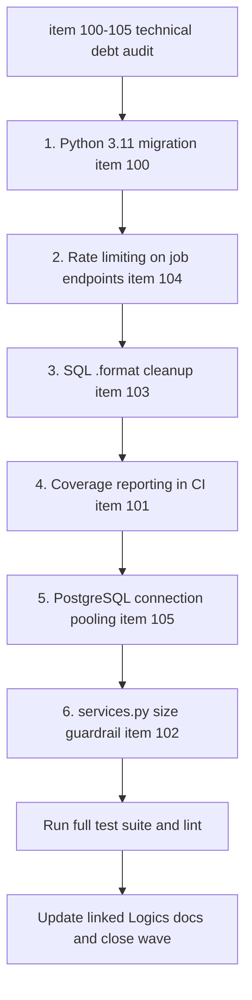

## task_048_day_captain_technical_debt_hardening_orchestration - Day Captain technical debt hardening orchestration
> From version: 1.9.3
> Schema version: 1.0
> Status: Done
> Understanding: 100
> Confidence: 98
> Progress: 100%
> Complexity: Medium
> Theme: Engineering Quality
> Reminder: Update status/understanding/confidence/progress and dependencies/references when you edit this doc.
> Owner: codex-work6

# Context
- Derived from backlog items `item_100` through `item_105`, all owned by `req_053_day_captain_technical_debt_and_runtime_hardening`.
- Six independent engineering quality improvements identified in the April 2026 codebase audit. Re-review on 2026-07-12 kept the useful items but downgraded the services.py decomposition into a small function-size guardrail.
- Recommended delivery order:
  1. Python 3.11 migration (`item_100`) — removes EOL runtime support first
  2. Rate limiting (`item_104`) — protects the now-live Power Automate job endpoints
  3. SQL pattern cleanup (`item_103`) — mechanical, low behavioral risk
  4. Coverage reporting (`item_101`) — CI tooling addition
  5. Connection pooling (`item_105`) — storage lifecycle change, medium complexity
  6. services.py function-size guardrail (`item_102`) — optional cleanup, do opportunistically

# Plan
- [x] 1. Python 3.11 migration (`item_100`): raise `requires-python` in `pyproject.toml`, drop Python 3.9 from CI matrix, verify CI passes on 3.11 and 3.12.
- [x] CHECKPOINT: commit Python version bump.
- [x] 2. Rate limiting (`item_104`): implement in-memory fixed-window limiter in `web.py`, add env var config and `.env.example` entries, add tests for 429 and window-reset paths. Defaults must allow current four-user Power Automate fan-out.
- [x] CHECKPOINT: commit rate limiting wave.
- [x] 3. SQL `.format()` cleanup (`item_103`): locate SQL-construction `.format()` calls in `storage.py`, replace with explicit constants or literal clause builders, verify all tests pass.
- [x] CHECKPOINT: commit SQL cleanup wave.
- [x] 4. Coverage reporting (`item_101`): integrate `coverage.py` into CI test run, emit summary, define minimum threshold in `pyproject.toml`.
- [x] CHECKPOINT: commit CI coverage integration.
- [x] 5. PostgreSQL connection pooling (`item_105`): implement connection reuse within a job run in `storage.py`, add lifecycle tests, verify SQLite is unaffected.
- [x] CHECKPOINT: commit connection pooling wave.
- [x] 6. services.py function-size guardrail (`item_102`): trim or justify only the few functions over 150 lines; avoid broad decomposition churn.
- [x] CHECKPOINT: commit services guardrail wave if code changes are actually needed.
- [x] FINAL: Run full validation suite, update all linked Logics docs, close backlog items and request.

# Delivery checkpoints
- Each wave should leave the repository in a coherent, commit-ready state.
- Update the linked Logics docs during the wave that changes the behavior, not only at final closure.
- Prefer a reviewed commit checkpoint at the end of each meaningful wave instead of accumulating several undocumented partial states.

# AC Traceability
- Req053 AC1 → Plan step 2. Proof: Python version gate and CI matrix are owned by item_100.
- Req053 AC2 → Plan step 3. Proof: coverage reporting is owned by item_101.
- Req053 AC3 → Plan step 6. Proof: services.py decomposition contract is owned by item_102.
- Req053 AC4 → Plan step 1. Proof: SQL pattern safety is owned by item_103.
- Req053 AC5 → Plan step 4. Proof: rate limiting contract is owned by item_104.
- Req053 AC6 → Plan step 5. Proof: connection lifecycle contract is owned by item_105.

# Decision framing
- Product framing: Not needed
- Architecture framing: Not needed — all six items are implementation-level improvements within existing module and deployment boundaries.

# Links
- Product brief(s): (none yet)
- Architecture decision(s): (none yet)
- Backlog item: `item_100_day_captain_python_3_9_eol_migration_to_3_11`, `item_101_day_captain_ci_coverage_reporting`, `item_102_day_captain_services_decomposition_large_functions`, `item_103_day_captain_replace_format_based_sql_construction_in_storage`, `item_104_day_captain_rate_limiting_on_job_endpoints`, `item_105_day_captain_postgresql_connection_pooling_in_storage_adapter`
- Request(s): `req_053_day_captain_technical_debt_and_runtime_hardening`

# AI Context
- Summary: Orchestrate the six technical debt and runtime hardening items from the April 2026 audit in a single wave: SQL cleanup, Python 3.11, coverage reporting, rate limiting, connection pooling, and services.py decomposition.
- Keywords: technical debt, python 3.11, coverage, SQL format, rate limiting, connection pooling, services decomposition, orchestration
- Use when: Use when executing any of the six engineering quality improvements from req_053.
- Skip when: Skip when the work targets product features, digest logic, or delivery behavior.

# Validation
- `PYTHONPATH=src python3 -m unittest discover -s tests`
- `python3 logics/skills/logics-doc-linter/scripts/logics_lint.py --require-status`
- Validation passed: 283 pytest tests, 80% branch-aware coverage above 79% floor, Logics lint OK, workflow audit OK, and git diff check clean.
- Finish workflow executed on 2026-07-12.
- Linked backlog/request close verification passed.

# Definition of Done (DoD)
- [x] Scope implemented and acceptance criteria covered.
- [x] Validation commands executed and results captured.
- [x] Linked request/backlog/task docs updated during completed waves and at closure.
- [x] Each completed wave left a commit-ready checkpoint or an explicit exception is documented.
- [x] Status is `Done` and progress is `100%`.

# Report
- 2026-07-12: wave 1 implemented. Package metadata now requires Python 3.11+ and CI targets 3.11/3.12 instead of EOL 3.9. Existing `Optional[...]` annotations were retained as ordinary typing style, not runtime compatibility shims.
- 2026-07-12: wave 2 implemented. Authenticated `/jobs/*` requests use a standard-library per-endpoint fixed-window limiter, defaulting to 20 requests per 60 seconds. Excess requests return 429 with `Retry-After`; window reset is covered by tests.
- 2026-07-12: wave 3 implemented. All SQL-building `.format()` calls were removed from `adapters/storage.py`; scoped table counts use an explicit allow-list and dynamic WHERE clauses use one literal-only join helper while preserving bound placeholders.
- 2026-07-12: wave 4 implemented. CI runs unittest through branch-aware coverage.py and prints a missing-lines summary. Current measured coverage is 80%; `pyproject.toml` enforces a 79% floor to block significant regression without failing on rounding noise.
- 2026-07-12: wave 5 implemented. PostgreSQL storage instances share the official psycopg process-local pool per DSN (max four connections); every existing operation checks out a connection context and returns it on success or error. SQLite remains unchanged.
- 2026-07-12: wave 6 completed without decomposition churn. The only functions above 150 lines remain narrowly over budget (164/157/151), each has a local `ponytail:` cohesion justification, and an AST regression test rejects future unjustified oversized functions.
- Finished on 2026-07-12.
- Linked backlog item(s): `item_100_day_captain_python_3_9_eol_migration_to_3_11`, `item_101_day_captain_ci_coverage_reporting`, `item_102_day_captain_services_decomposition_large_functions`, `item_103_day_captain_replace_format_based_sql_construction_in_storage`, `item_104_day_captain_rate_limiting_on_job_endpoints`, `item_105_day_captain_postgresql_connection_pooling_in_storage_adapter`
- Related request(s): `req_053_day_captain_technical_debt_and_runtime_hardening`
